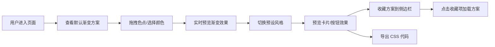

## 1. 产品概述

ColorScape 是一款面向设计师和前端开发者的渐变配色方案生成与管理工具。用户可以通过拖拽色点、调节滑块和选择预设风格来自主创建、预览和保存多种配色渐变方案，并能实时预览应用到网页组件上的效果。

- 核心价值：降低渐变配色的创作门槛，提供直观的可视化编辑体验
- 目标用户：UI 设计师、前端开发者、创意工作者
- 市场定位：轻量级、高品质的在线渐变配色工具

## 2. 核心功能

### 2.1 功能模块

1. **调色板模块**：线性渐变条（最多 6 个色点），色点拖拽调整位置，HSL 颜色选择器，16 进制色值实时显示
2. **预设风格模块**：5 种以上配色模板（日落、极光、赛博朋克、马卡龙、森林），平滑过渡动画
3. **预览应用模块**：模拟手机卡片和按钮组件，明暗主题切换，hover 动效，移动端响应式
4. **收藏与导出模块**：侧边栏收藏列表（最多 20 个），渐变色缩略图，CSS 代码一键导出

### 2.2 页面详情

| 页面名称 | 模块名称 | 功能描述 |
|---------|---------|---------|
| 主页面 | 调色板模块 | 线性渐变条、色点拖拽、HSL 颜色选择器、16进制色值列表 |
| 主页面 | 预设风格模块 | 预设模板卡片列表、点击切换、平滑过渡动画 |
| 主页面 | 预览应用模块 | 模拟卡片/按钮预览、明暗主题切换、hover 交互效果 |
| 主页面 | 收藏与导出模块 | 侧边栏收藏列表、缩略图显示、CSS 代码导出 |

## 3. 核心流程

用户打开页面后看到默认渐变方案，可以通过拖拽色点或点击色点打开 HSL 颜色选择器来调整颜色。可选择预设风格快速应用模板，在预览区查看卡片和按钮的实际效果。满意后可收藏到侧边栏或导出 CSS 代码。

## 4. 用户界面设计

### 4.1 设计风格

- **主色调**：深紫色到靛蓝色的渐变 (#581c87 → #4f46e5)
- **背景**：全屏深色背景，毛玻璃效果（backdrop-blur: 10px）
- **卡片**：半透明背景 + 细边框 + 背景虚化，通透质感
- **侧边栏**：半透明深灰 (rgba(30, 30, 40, 0.8))
- **文字**：亮白色标题和按钮文字
- **按钮**：悬浮阴影 + 点击缩放反馈

### 4.2 排版与动效

- **字体**：现代无衬线字体，清晰易读
- **动效**：色点弹簧回弹（0.2s）、预设切换平滑过渡（1s）、按钮 hover 缩放（0.3s，放大 1.05 倍）
- **性能要求**：色点拖拽和渐变预览 ≥ 55FPS，CSS 导出响应 < 200ms

### 4.3 页面设计概览

| 页面名称 | 模块名称 | UI 元素 |
|---------|---------|---------|
| 主页面 | 调色板模块 | 渐变条、色点滑块、HSL 颜色选择器（色相环+饱和度亮度矩形）、色值列表 |
| 主页面 | 预设风格模块 | 预设卡片网格、渐变缩略图、名称标签 |
| 主页面 | 预览应用模块 | 手机模拟卡片、按钮组件、主题切换开关 |
| 主页面 | 收藏与导出模块 | 侧边栏滑出、收藏项列表、导出按钮、代码展示 |

### 4.4 响应式

- 桌面端：左侧收藏栏 + 中间主编辑区 + 右侧预览区三栏布局
- 平板端：顶部工具栏 + 中间编辑区 + 底部预览区
- 移动端：单列布局，模块垂直堆叠，触摸优化的色点拖拽区域
