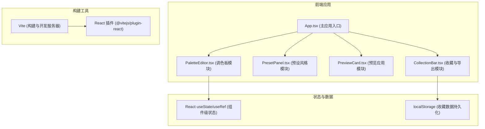
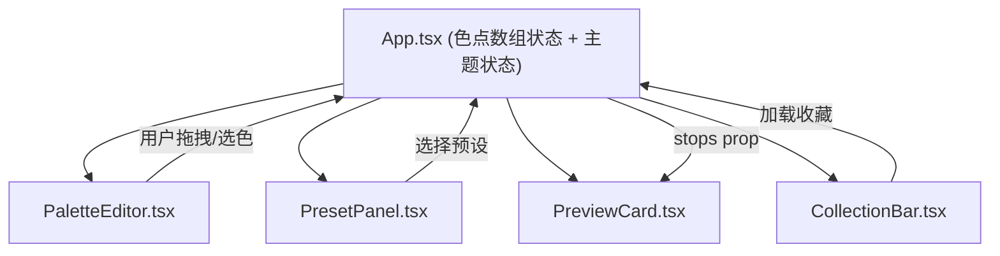

## 1. 架构设计



## 2. 技术描述

- **前端框架**：React 18 + TypeScript
- **构建工具**：Vite 5.x
- **React 插件**：@vitejs/plugin-react
- **样式方案**：原生 CSS（CSS Modules / 内联样式），毛玻璃效果使用 backdrop-filter
- **状态管理**：React Hooks（useState、useRef、useEffect、useCallback）
- **数据持久化**：localStorage 存储收藏方案
- **动画方案**：CSS transitions + requestAnimationFrame 实现弹簧动画和帧动画

## 3. 核心数据结构

### 3.1 色点数据类型

```typescript
interface ColorStop {
  id: string;
  position: number; // 0-100 百分比
  color: string;    // hex 颜色值
}
```

### 3.2 预设方案类型

```typescript
interface Preset {
  id: string;
  name: string;
  stops: ColorStop[];
}
```

### 3.3 收藏方案类型

```typescript
interface CollectionItem {
  id: string;
  name: string;
  stops: ColorStop[];
  createdAt: number;
}
```

## 4. 组件层级与数据流



- 色点数组（stops）作为单一数据源存储在 App 组件
- 子组件通过 props 接收数据，通过回调函数向上传递变更
- 预览组件和收藏组件被动响应色点数据变化

## 5. 性能优化策略

- 色点拖拽使用 useRef 直接操作 DOM，避免 React 重渲染瓶颈
- 渐变预览使用 CSS linear-gradient，由浏览器硬件加速
- 预设切换动画使用 requestAnimationFrame 逐帧插值，确保 60FPS
- CSS 导出为纯计算函数，无 DOM 操作，响应时间 < 200ms
- 收藏列表使用 CSS transform 实现平滑过渡动画

## 6. 文件结构

```
.
├── index.html           # 入口页面
├── package.json         # 项目依赖与脚本
├── tsconfig.json        # TypeScript 配置
├── vite.config.js       # Vite 构建配置
└── src/
    ├── main.tsx         # React 入口
    ├── App.tsx          # 主应用组件
    ├── PaletteEditor.tsx   # 调色板模块
    ├── PresetPanel.tsx     # 预设风格模块
    ├── PreviewCard.tsx     # 预览应用模块
    └── CollectionBar.tsx   # 收藏与导出模块
```
