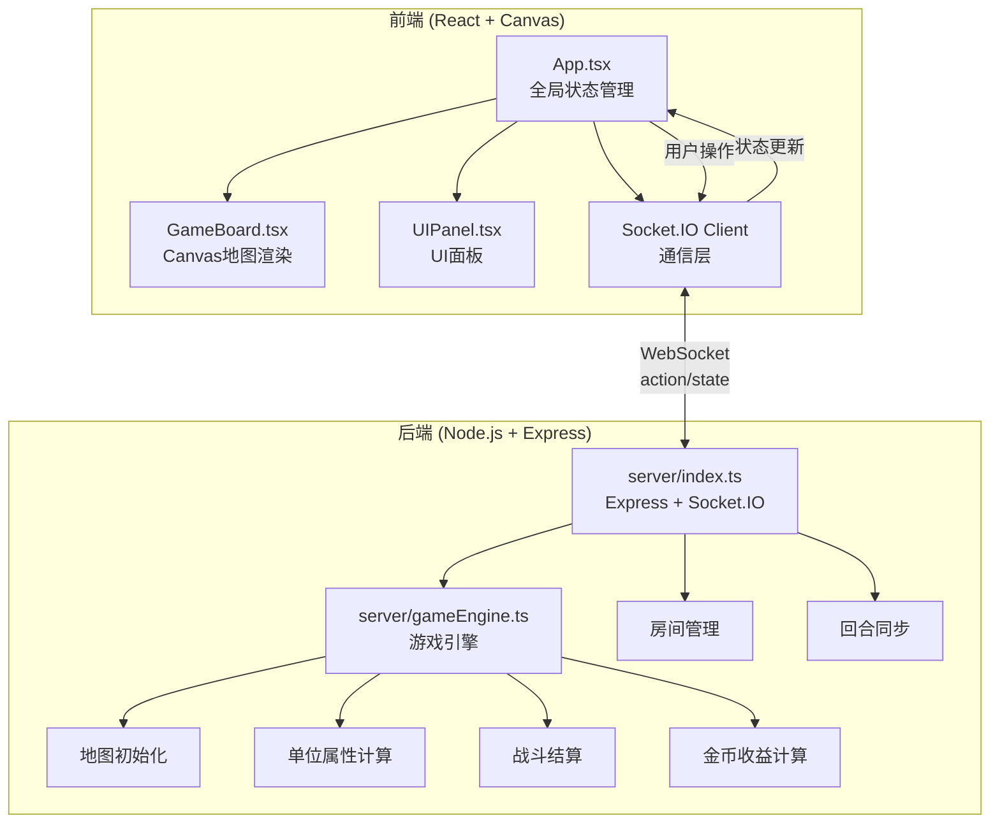
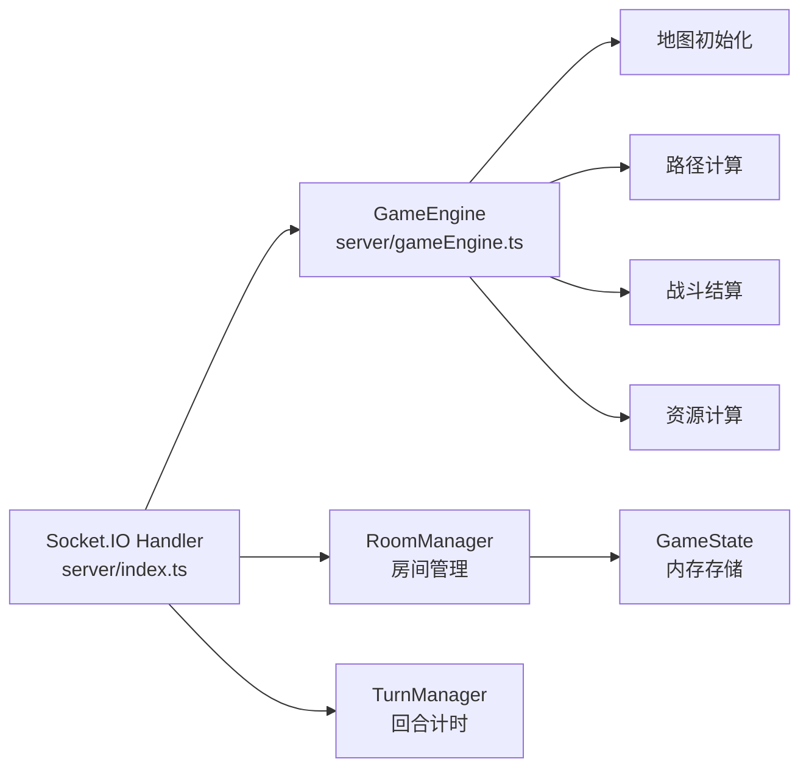
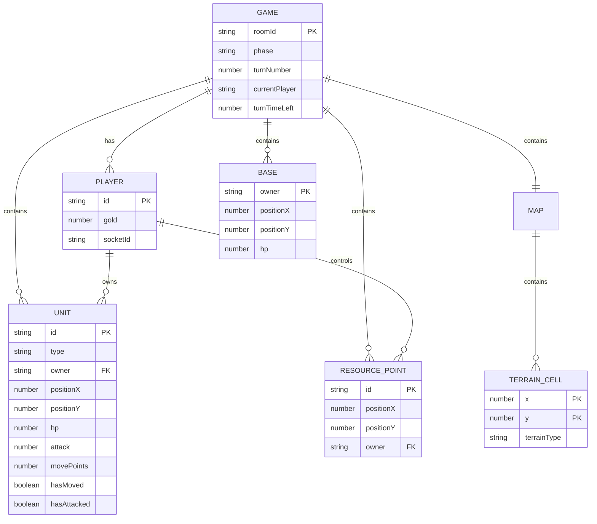

## 1. 架构设计



### 数据流向

1. **用户操作流**：用户点击Canvas → GameBoard处理点击事件 → 回调onAction → App.tsx通过Socket.IO发送action到后端
2. **状态同步流**：后端接收action → gameEngine验证并计算 → 更新游戏状态 → Socket.IO广播给双方 → App.tsx更新状态 → GameBoard重新渲染
3. **回合切换流**：玩家点击结束回合/超时 → 后端验证 → 切换回合 → 广播新回合状态 → 前端更新UI

## 2. 技术说明

- 前端：React@18 + TypeScript + Vite + Canvas API
- 状态管理：Zustand
- 构建工具：Vite（配置代理到后端3001端口）
- 后端：Node.js + Express@4 + Socket.IO + TypeScript
- 通信：WebSocket (Socket.IO)
- 数据持久化：内存存储（游戏状态），可扩展为数据库

## 3. 路由定义

| 路由 | 用途 |
|------|------|
| / | 游戏大厅，创建/加入房间 |
| /game | 对战主页面，地图和操作界面 |

## 4. API定义

### 4.1 Socket.IO 事件定义

```typescript
interface ServerToClientEvents {
  "game:state": (state: GameState) => void;
  "game:start": (state: GameState) => void;
  "game:action_result": (result: ActionResult) => void;
  "game:turn_change": (data: { currentPlayer: PlayerId; timeLeft: number }) => void;
  "game:over": (data: { winner: PlayerId; reason: string }) => void;
  "room:created": (data: { roomId: string }) => void;
  "room:joined": (data: { roomId: string; players: string[] }) => void;
  "room:player_joined": (data: { playerId: string }) => void;
  "error": (message: string) => void;
}

interface ClientToServerEvents {
  "room:create": () => void;
  "room:join": (data: { roomId: string }) => void;
  "game:action": (action: GameAction) => void;
  "game:end_turn": () => void;
  "game:deploy_unit": (data: { unitType: UnitType; position: Position }) => void;
}

interface GameState {
  roomId: string;
  map: TerrainCell[][];
  units: Unit[];
  resourcePoints: ResourcePoint[];
  bases: Base[];
  currentPlayer: PlayerId;
  turnNumber: number;
  players: PlayerState[];
  turnTimeLeft: number;
  gameLog: LogEntry[];
  phase: GamePhase;
}

interface TerrainCell {
  position: Position;
  terrain: TerrainType;
}

interface Unit {
  id: string;
  type: UnitType;
  owner: PlayerId;
  position: Position;
  hp: number;
  maxHp: number;
  attack: number;
  movePoints: number;
  maxMovePoints: number;
  hasMoved: boolean;
  hasAttacked: boolean;
}

interface ResourcePoint {
  id: string;
  position: Position;
  owner: PlayerId | null;
}

interface Base {
  owner: PlayerId;
  position: Position;
  hp: number;
}

interface PlayerState {
  id: PlayerId;
  gold: number;
  socketId: string;
}

interface GameAction {
  type: "move" | "attack" | "move_and_attack";
  unitId: string;
  targetPosition: Position;
}

interface ActionResult {
  success: boolean;
  damage?: number;
  killed?: boolean;
  goldEarned?: number;
  message: string;
}

interface LogEntry {
  timestamp: number;
  player: PlayerId;
  action: string;
  detail: string;
}

type PlayerId = "player1" | "player2";
type TerrainType = "plain" | "forest" | "mountain" | "river" | "desert";
type UnitType = "infantry" | "archer" | "knight";
type GamePhase = "lobby" | "playing" | "ended";
```

### 4.2 单位属性定义

```typescript
interface UnitConfig {
  type: UnitType;
  name: string;
  cost: number;
  attack: number;
  hp: number;
  movePoints: number;
  special?: string;
}

const UNIT_CONFIGS: Record<UnitType, UnitConfig> = {
  infantry: { type: "infantry", name: "步兵", cost: 50, attack: 10, hp: 50, movePoints: 4 },
  archer: { type: "archer", name: "弓箭手", cost: 80, attack: 15, hp: 30, movePoints: 3, special: "ranged" },
  knight: { type: "knight", name: "骑士", cost: 120, attack: 12, hp: 60, movePoints: 5, special: "charge" },
};
```

### 4.3 地形效果定义

```typescript
interface TerrainEffect {
  moveCost: number;
  attackBonus: number;
  defenseBonus: number;
  dodgeBonus: number;
  flyingIgnore: boolean;
}

const TERRAIN_EFFECTS: Record<TerrainType, TerrainEffect> = {
  plain: { moveCost: 1, attackBonus: 0, defenseBonus: 0, dodgeBonus: 0, flyingIgnore: false },
  forest: { moveCost: 2, attackBonus: 0, defenseBonus: 0.2, dodgeBonus: 0, flyingIgnore: false },
  mountain: { moveCost: 3, attackBonus: 0.3, defenseBonus: 0, dodgeBonus: 0, flyingIgnore: true },
  river: { moveCost: 99, attackBonus: 0, defenseBonus: 0, dodgeBonus: 0.15, flyingIgnore: false },
  desert: { moveCost: 0.5, attackBonus: 0, defenseBonus: 0, dodgeBonus: 0, flyingIgnore: false },
};
```

## 5. 服务器架构图



## 6. 数据模型

### 6.1 核心实体关系



## 7. 文件结构与调用关系

```
TerrainTactics/
├── package.json                    # 依赖管理，启动脚本
├── vite.config.ts                  # Vite构建配置，代理到3001端口
├── tsconfig.json                   # TypeScript严格模式，ES2020
├── index.html                      # 入口页面，Canvas容器+React挂载点
├── server/
│   ├── index.ts                    # 后端入口：Express+Socket.IO，房间/回合/动作处理
│   │                               # 调用：gameEngine.ts，数据流：接收action→验证→更新→广播
│   └── gameEngine.ts               # 游戏引擎：地图初始化、属性计算、战斗结算、金币计算
│                                   # 被调用：server/index.ts，返回计算结果
├── src/
│   ├── App.tsx                     # React入口：全局状态(Zustand)，Socket监听，渲染GameBoard+UIPanel
│   │                               # 数据流：监听Socket→更新store，用户操作→Socket发送
│   ├── GameBoard.tsx               # Canvas地图组件：渲染8x8网格、地形、单位、高亮，处理点击
│   │                               # 数据流：接收store→渲染，点击→onAction回调
│   ├── UIPanel.tsx                 # UI面板：回合信息、金币、单位卡片、购买、日志、结束回合
│   │                               # 数据流：从store读取，触发endTurn
│   ├── store.ts                    # Zustand状态管理：GameState、actions
│   ├── types.ts                    # TypeScript类型定义
│   ├── socket.ts                   # Socket.IO客户端封装
│   ├── constants.ts                # 常量：单位配置、地形效果、颜色
│   ├── canvas/
│   │   ├── renderer.ts             # Canvas渲染器：地图、地形纹理、单位图标
│   │   ├── animations.ts           # Canvas动画：光环、闪烁、冲刺、碎裂、伤害数字
│   │   └── textures.ts             # 地形纹理绘制函数
│   ├── components/
│   │   ├── Lobby.tsx               # 游戏大厅组件
│   │   ├── UnitCard.tsx            # 单位卡片组件
│   │   ├── TimerBar.tsx            # 倒计时进度条组件
│   │   └── GameLog.tsx             # 游戏日志组件
│   └── utils/
│       └── pathfinding.ts          # 移动力路径计算（BFS）
└── shared/
    └── types.ts                    # 前后端共享类型定义
```
