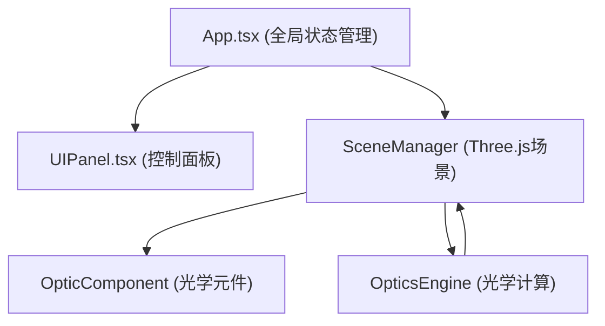

## 1. 架构设计



## 2. 技术说明

- 前端：React 18 + TypeScript + Vite
- 3D渲染：Three.js
- 状态管理：React useState/useRef 管理局部状态，无需额外状态库
- 无后端、无数据库

## 3. 文件结构

```
src/
├── App.tsx              # 主组件，状态与UI布局协调
├── sceneManager.ts      # Three.js场景管理，渲染循环
├── opticsEngine.ts      # 光学物理模拟引擎
├── opticComponent.ts    # 光学元件几何体与材质
├── uiPanel.tsx          # UI控制面板组件
```

## 4. 模块职责

| 模块 | 职责 |
|------|------|
| App.tsx | 管理全局元件列表、光线参数、UI状态，协调数据流向 |
| sceneManager.ts | Three.js初始化、轨道控制、添加/更新/移除元件、渲染循环 |
| opticsEngine.ts | 斯涅尔定律、反射定律、色散计算、聚焦点检测 |
| opticComponent.ts | 透镜/棱镜/反射镜的几何体、金属材质、发光轮廓、交互控制 |
| uiPanel.tsx | 元件选择、参数滑块、光线配置、显示控制、重置按钮 |

## 5. 关键数据结构

```typescript
// 光学元件
interface OpticalElement {
  id: string;
  type: 'convexLens' | 'concaveLens' | 'prism' | 'planeMirror' | 'concaveMirror' | 'convexMirror';
  position: [number, number, number];
  rotation: [number, number, number];
  params: { focalLength?: number; radius?: number; apexAngle?: number };
}

// 光线
interface LightRay {
  origin: [number, number, number];
  direction: [number, number, number];
  color: string;
}

// 光线路径段
interface RaySegment {
  start: [number, number, number];
  end: [number, number, number];
  color: string;
}
```

## 6. 性能策略

- 限制最大追踪反射/折射次数为10次，防止无限递归
- 光线使用LineSegments + BufferGeometry高效渲染
- 粒子使用Points + 透明度衰减
- 元件材质复用，减少draw call
