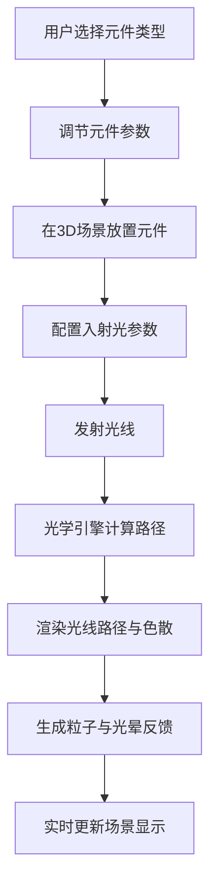

## 1. 产品概述

LensFlow是一个交互式三维光线追踪折射与反射模拟器，用户可以在虚拟3D空间中放置不同形状的透镜和反射镜，发射可调节的入射光，实时观察光线的折射、反射、色散和汇聚效果。

- 目标用户：物理学爱好者、光学教学者、学生和创意开发者
- 产品价值：提供直观的3D可视化光学实验平台，让抽象的光学原理变得可交互、可观察

## 2. 核心功能

### 2.1 功能模块

1. **主界面**：左侧控制面板 + 右侧3D视口
2. **光学元件模块**：透镜（凸/凹透镜、棱镜）、反射镜（平/凹/凸面镜）的放置与参数调节
3. **光线模拟模块**：入射光发射、斯涅尔定律折射计算、反射定律计算、棱镜色散、光线路径可视化
4. **交互反馈模块**：光线接触闪烁光晕、聚焦光斑、粒子流动效果、选中元件发光轮廓

### 2.3 页面详情

| 页面名称 | 模块名称 | 功能描述 |
|-----------|-------------|---------------------|
| 主界面 | 控制面板 | 元件选择、参数滑块、光线配置、显示开关、重置按钮 |
| 主界面 | 3D视口 | 光学元件渲染、光线追踪显示、轨道控制视角、粒子效果 |

## 3. 核心流程

用户从左侧面板选择光学元件类型，设置参数后在3D场景中点击放置。通过拖拽可旋转元件位置。配置入射光的颜色与角度后发射光线，系统实时计算并渲染光线路径、折射、反射、色散效果，同时生成粒子流动和交互反馈。

## 4. 用户界面设计

### 4.1 设计风格

- 主色调：深色太空渐变背景（#0A0E27 → #1A1E3F）
- 强调色：鲜艳光线色（饱和度80%-100%），毛玻璃UI（背景模糊12px，半透明白色）
- 元件质感：金属拉丝质感（法线贴图模拟），选中时发光轮廓脉冲（1Hz）
- 字体：Inter或系统无衬线字体

### 4.2 页面设计概述

| 页面名称 | 模块名称 | UI元素 |
|-----------|-------------|-------------|
| 主界面 | 控制面板 | 毛玻璃卡片、滑块、下拉选择、开关、按钮 |
| 主界面 | 3D视口 | 渐变背景、3D元件、光线路径、粒子、光晕光斑 |

### 4.3 响应式

- 桌面优先设计，最小支持1024x768分辨率
- 控制面板宽度自适应，3D视口占据剩余空间

### 4.4 3D场景指引

- 环境：深色太空渐变背景，微弱环境光 + 方向光
- 相机：轨道控制器，支持旋转、缩放、平移
- 动画：元件放置0.3秒淡入、选中发光脉冲、粒子沿路径流动
- 后期：辉光效果增强光线视觉
