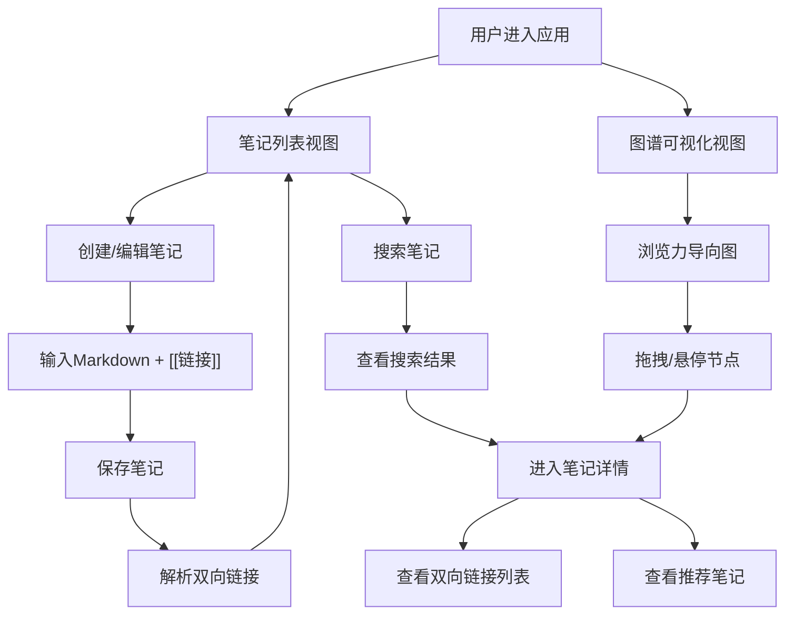

## 1. 产品概述

知识图谱笔记应用——"第二大脑"，帮助知识工作者将碎片化笔记通过双向链接和图谱可视化构建为可沉淀、可复用的知识网络。解决传统笔记工具中笔记孤立、缺乏关联导致知识无法有效检索和复用的核心痛点。

## 2. 核心功能

### 2.1 用户角色
| 角色 | 注册方式 | 核心权限 |
|------|----------|----------|
| 知识工作者 | 无需注册 | 创建、编辑、删除笔记，浏览图谱，搜索笔记 |

### 2.2 功能模块
1. **笔记列表页**：侧边栏笔记列表、新建笔记入口、笔记搜索
2. **笔记详情页**：Markdown编辑、双向链接、推荐面板
3. **图谱可视化页**：力导向图、节点交互、关联展示

### 2.3 页面详情
| 页面名称 | 模块名称 | 功能描述 |
|----------|----------|----------|
| 主页面 | 笔记列表 | 左侧边栏展示所有笔记（标题、最近编辑时间戳、字数统计），中间区域为欢迎/引导界面，支持新建笔记 |
| 主页面 | 搜索功能 | 搜索框带0.3秒平滑展开动画，输入后500ms内实时显示结果，匹配词高亮黄色标记，按相关性排序 |
| 笔记详情页 | 编辑器 | Markdown编辑器，支持[[笔记标题]]语法创建双向链接，保存时触发1秒卡片翻页动画过渡到列表视图 |
| 笔记详情页 | 双向链接列表 | 顶部显示笔记标题、创建时间、双向链接数，文中引用的笔记和引用该笔记的笔记均可点击跳转 |
| 笔记详情页 | 推荐面板 | 右侧面板推荐3篇相关笔记（毛玻璃效果卡片），基于标签相似度和引用关系综合得分排序，显示推荐理由 |
| 图谱页面 | 力导向图 | D3.js渲染力导向图，节点大小由引用次数决定（30-100px），TOP3高亮金色脉冲呼吸（1.5秒周期），未引用节点灰色半透明 |
| 图谱页面 | 节点交互 | 拖拽移动节点，鼠标悬停显示标题和预览摘要（前50字），点击跳转笔记详情 |

## 3. 核心流程

1. 用户创建笔记 → 使用Markdown编写 → 用[[标题]]引用其他笔记 → 保存时系统自动建立双向链接
2. 用户浏览图谱 → 查看笔记关联关系 → 点击节点跳转详情 → 查看推荐笔记
3. 用户搜索 → 输入关键词 → 实时匹配标题和正文 → 高亮显示结果 → 点击进入笔记

## 4. 用户界面设计

### 4.1 设计风格
- 主背景色：#1a1a2e
- 卡片背景色：#16213e
- 强调色：#0f3460
- 圆角：12px
- 投影：rgba(0,0,0,0.3)
- 页面切换：0.3秒淡入过渡
- 字体：思源黑体/Noto Sans SC（中文），Source Code Pro（代码）
- 布局：左侧边栏 + 中间内容 + 右侧推荐面板（查看笔记时）
- 按钮：圆角12px，hover时亮度提升
- 图标：Lucide图标库

### 4.2 页面设计概览
| 页面名称 | 模块名称 | UI元素 |
|----------|----------|--------|
| 主页面 | 笔记列表 | 深色侧边栏，卡片列表，时间戳，字数统计，搜索框（0.3s展开动画） |
| 笔记详情页 | 编辑区 | 深色卡片，顶部元信息栏，Markdown编辑器，[[链接]]可点击高亮 |
| 笔记详情页 | 推荐面板 | 毛玻璃卡片，3个推荐项，推荐理由文字，hover缩放效果 |
| 图谱页面 | 力导向图 | 深色背景，D3力导向图，金色脉冲TOP3节点，灰色半透明未引用节点，悬停tooltip |

### 4.3 响应式设计
- 桌面端优先（≥1024px）：三栏布局（侧边栏+内容+推荐面板）
- 平板端（768-1023px）：侧边栏收窄，推荐面板折叠为底部抽屉
- 移动端（<768px）：侧边栏自动收起为图标式导航，推荐面板隐藏在抽屉中

### 4.4 动效设计
- 笔记保存：1秒卡片翻页动画过渡到列表视图
- 页面切换：0.3秒淡入过渡
- 搜索框：0.3秒平滑展开动画
- 图谱TOP3节点：1.5秒周期脉冲呼吸动画
- 卡片hover：轻微上浮+阴影增强
