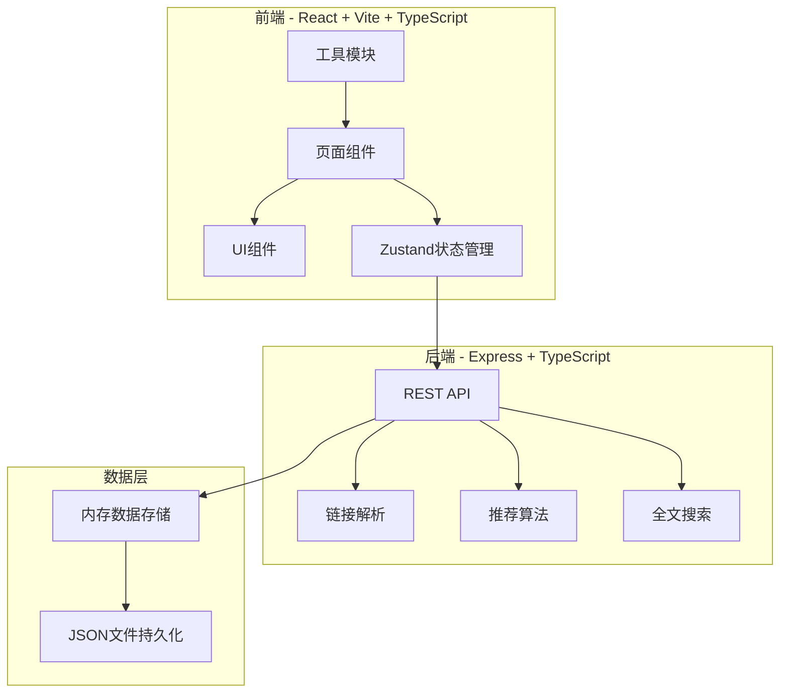
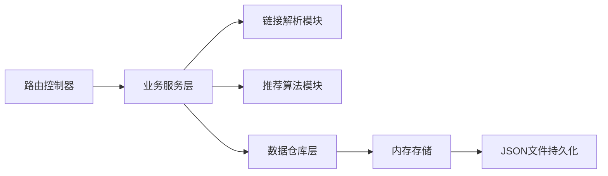
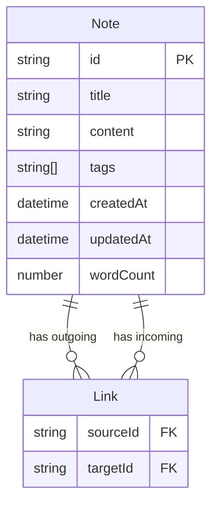

## 1. 架构设计



## 2. 技术说明
- 前端：React@18 + TypeScript + Vite + Tailwind CSS + Zustand + D3.js
- 初始化工具：vite-init (react-express-ts 模板)
- 后端：Express@4 + TypeScript + cors + body-parser
- 数据库：内存数据存储 + JSON文件持久化
- 图谱可视化：D3.js力导向图模块
- 状态管理：Zustand

## 3. 路由定义
| 路由 | 用途 |
|------|------|
| / | 主页面，笔记列表与欢迎界面 |
| /notes/:id | 笔记详情页，编辑/查看笔记内容 |
| /graph | 图谱可视化页面 |

## 4. API定义

### 4.1 笔记CRUD API
```typescript
interface Note {
  id: string;
  title: string;
  content: string;
  tags: string[];
  createdAt: string;
  updatedAt: string;
  wordCount: number;
}

// GET /api/notes - 获取所有笔记列表
// GET /api/notes/:id - 获取单个笔记详情（含双向链接信息）
// POST /api/notes - 创建新笔记
// PUT /api/notes/:id - 更新笔记
// DELETE /api/notes/:id - 删除笔记
```

### 4.2 搜索API
```typescript
interface SearchResult {
  note: Note;
  relevance: number;
  matchedFields: string[];
}

// GET /api/search?q=keyword - 全文搜索笔记
```

### 4.3 推荐API
```typescript
interface Recommendation {
  note: Note;
  score: number;
  reason: string;
}

// GET /api/notes/:id/recommendations - 获取笔记推荐
```

### 4.4 链接API
```typescript
interface LinkInfo {
  outgoing: Note[];
  incoming: Note[];
  outgoingCount: number;
  incomingCount: number;
}

// GET /api/notes/:id/links - 获取双向链接信息
```

## 5. 服务端架构图



## 6. 数据模型

### 6.1 数据模型定义



### 6.2 数据定义

笔记存储结构（JSON文件）：
```json
{
  "notes": [
    {
      "id": "uuid",
      "title": "笔记标题",
      "content": "Markdown正文内容，包含[[其他笔记]]链接",
      "tags": ["标签1", "标签2"],
      "createdAt": "2026-06-13T12:00:00Z",
      "updatedAt": "2026-06-13T12:00:00Z",
      "wordCount": 256
    }
  ]
}
```

链接关系在运行时通过 linkParser 模块从笔记正文中动态解析，无需单独存储。
