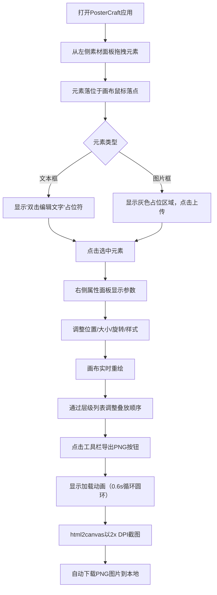

## 1. 产品概述
PosterCraft是一款面向设计师的浏览器端图文混排海报排版工具，支持自由拖拽、实时编辑和高分辨率导出，解决设计师快速制作海报原型的需求。
- 核心价值：零安装、即开即用的轻量级海报设计工具，降低创意表达门槛
- 目标用户：平面设计师、新媒体运营、营销人员及创意工作者

## 2. 核心功能

### 2.1 用户角色
| 角色 | 注册方式 | 核心权限 |
|------|----------|----------|
| 设计师用户 | 无需注册，直接使用 | 素材拖入、元素编辑、层级管理、导出图片 |

### 2.2 功能模块
1. **主编辑界面**：素材面板、画布区域、属性面板、顶部工具栏、层级列表
2. **素材拖入模块**：从左侧面板拖拽文本框/图片框至画布
3. **元素编辑模块**：选中元素、调整位置/大小/旋转、修改样式属性
4. **层级管理模块**：右侧层叠列表、拖拽调整Z轴顺序、选中高亮
5. **导出模块**：2倍DPI分辨率导出PNG、加载动画、自动下载

### 2.3 页面详情
| 页面名称 | 模块名称 | 功能描述 |
|----------|----------|----------|
| 主编辑页 | 左侧素材面板 | 深灰背景窄条面板，提供文本框和图片框两种可拖拽素材 |
| 主编辑页 | 中间画布区域 | A4竖版比例浅灰画布，四周10px内阴影，渲染所有可交互元素 |
| 主编辑页 | 右侧属性面板 | 同素材面板色系，展示选中元素详细参数（文本/图片属性） |
| 主编辑页 | 顶部工具栏 | 白色背景带浅灰分割线，含字体/字号/颜色/背景色控制及导出按钮 |
| 主编辑页 | 层级列表面板 | 展示元素层叠列表，支持拖拽排序和选中高亮联动 |

## 3. 核心流程
用户从左侧素材面板拖拽文本框或图片框到画布上，选中元素后通过右侧属性面板或顶部工具栏调整样式参数，可通过层级列表调整叠放顺序，完成设计后点击导出按钮生成并下载高分辨率PNG图片。

## 4. 用户界面设计

### 4.1 设计风格
- 主色调：#2B3A4D（深冷灰蓝），辅助色：#4A6B8C（中冷灰蓝），背景色：#E8ECF0（浅冷灰）
- 按钮风格：扁平直角，冷色调填充，hover态轻微加深
- 字体：系统默认无衬线体（-apple-system, BlinkMacSystemFont, "Segoe UI", sans-serif）
- 布局风格：三栏固定+自适应布局，左右面板280px固定宽度，画布区域居中自适应
- 交互细节：选中元素8个半透明蓝色控点（5px），拖拽0.1s弹性缓动，面板动画0.2s平滑展开

### 4.2 页面设计概述
| 页面名称 | 模块名称 | UI元素 |
|----------|----------|--------|
| 主编辑页 | 素材面板 | 深灰#2B3A4D背景，白色图标+文字卡片，拖拽hover高亮，固定宽度280px |
| 主编辑页 | 画布区域 | 浅灰#E8ECF0容器，A4竖版（595x842比例）白色画布，四周10px内阴影，居中显示 |
| 主编辑页 | 属性面板 | 深灰#2B3A4D背景，白色标签，滑块+输入框+色板控件，平滑0.2s展开动画 |
| 主编辑页 | 工具栏 | 白色#FFFFFF背景，底部1px #D0D7DF分割线，下拉选择器+色板+主按钮 |
| 主编辑页 | 层级列表 | 白色列表项，拖拽排序指示器，选中项蓝色虚线边框高亮，与画布双向联动 |

### 4.3 响应式
- 桌面端优先设计，适配1280px以上宽屏
- 宽屏下左右面板固定宽度280px，画布区域自适应居中
- 画布保持A4竖版固定比例，按容器宽度等比缩放
- 最小支持宽度1280px，低于此宽度出现水平滚动条

### 4.4 动效设计
- 元素拖拽：transition: transform 0.1s ease-out 弹性缓动
- 面板展开/收起：0.2s平滑过渡动画
- 导出加载：CSS圆环旋转动画，0.6秒完成一次循环
- 选中高亮：2px蓝色虚线边框，transition 0.15s淡入
