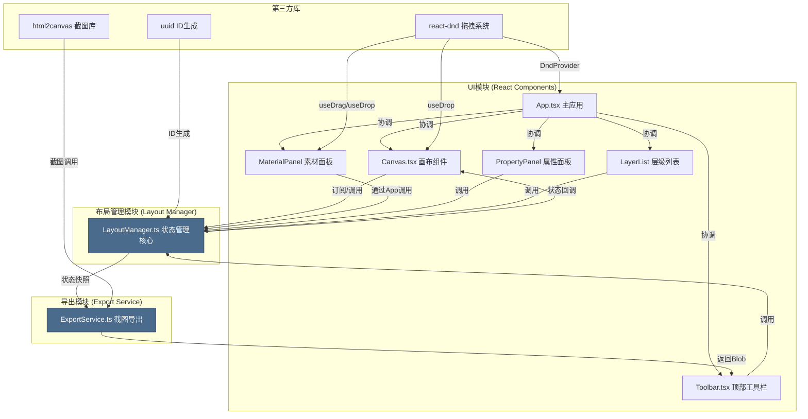

## 1. 架构设计



## 2. 技术描述
- 前端框架：React@18 + TypeScript@5（严格模式）
- 构建工具：Vite@5 + @vitejs/plugin-react@4
- 拖拽系统：react-dnd@16 + react-dnd-html5-backend@16
- 截图导出：html2canvas@1
- 工具库：uuid@9
- 初始化方式：Vite react-ts 模板
- 无后端服务，纯前端单页应用

## 3. 模块调用关系与数据流向

### 3.1 文件间调用关系
| 调用方 | 被调用方 | 调用方式 | 数据流向 |
|--------|----------|----------|----------|
| App.tsx | LayoutManager | 实例化持有引用 | 初始化 → 传递给子组件 |
| Canvas.tsx | LayoutManager | subscribe订阅 + 方法调用 | 状态变更 ← LayoutManager；用户交互 → 更新方法 |
| Toolbar.tsx | LayoutManager | 方法调用 | 样式变更 → updateElement；导出 → getSnapshot |
| MaterialPanel | App.tsx | react-dnd拖拽事件 | 拖拽ITEM → onDrop回调 |
| App.tsx | Canvas.tsx | onDrop属性传递 | DROP事件 → addElement |
| PropertyPanel | LayoutManager | 方法调用 | 属性编辑 → updateElement |
| LayerList | LayoutManager | 方法调用 + subscribe | 层级变更 → reorderElements；选中 → selectElement |
| Toolbar.tsx | ExportService | 静态方法调用 | snapshot数据 → exportToPng → Blob下载 |
| ExportService | html2canvas | 库函数调用 | canvas DOM → 2x scale截图 → PNG Blob |

### 3.2 核心数据流
```
用户拖拽素材 → MaterialPanel(useDrag) → Canvas(useDrop)
    → App.onDrop → LayoutManager.addElement()
    → LayoutManager触发回调 → Canvas重绘渲染

用户点击元素 → Canvas元素clickHandler → LayoutManager.selectElement()
    → 触发回调 → Canvas渲染选中边框/控点
                → PropertyPanel显示选中元素属性
                → LayerList高亮对应列表项

用户编辑属性 → PropertyPanel/Toolbar控件change
    → LayoutManager.updateElement(id, patch)
    → 回调通知 → Canvas/PropertyPanel/LayerList同步更新

用户层级拖拽 → LayerList拖拽排序
    → LayoutManager.reorderElements(from, to)
    → 回调 → Canvas重排z-index；LayerList重渲染

用户导出 → Toolbar导出按钮 → LayoutManager.getSnapshot()
    → ExportService.exportToPng(canvasRef, snapshot)
    → html2canvas(scale:2) → Blob → URL.createObjectURL → a.click下载
```

## 4. 核心数据模型

### 4.1 元素类型定义

```typescript
enum ElementType {
  TEXT = 'text',
  IMAGE = 'image',
}

interface BaseElement {
  id: string;           // uuid生成
  type: ElementType;
  x: number;            // 画布内绝对X坐标
  y: number;            // 画布内绝对Y坐标
  width: number;
  height: number;
  rotation: number;     // 旋转角度（度）
  zIndex: number;       // 层级顺序（0开始递增）
}

interface TextElement extends BaseElement {
  type: ElementType.TEXT;
  content: string;
  fontFamily: string;
  fontSize: number;     // px
  color: string;        // #RRGGBB
  lineHeight: number;   // 倍数，如1.5
  textAlign: 'left' | 'center' | 'right';
}

interface ImageElement extends BaseElement {
  type: ElementType.IMAGE;
  src: string;          // base64或空（占位）
  objectFit: 'contain' | 'cover';
}

type PosterElement = TextElement | ImageElement;
```

### 4.2 LayoutManager内部状态

```typescript
interface LayoutState {
  elements: PosterElement[];
  selectedId: string | null;
  backgroundColor: string;   // 画布背景色，默认#FFFFFF
}
```

### 4.3 LayoutManager公开接口

| 方法 | 参数 | 返回值 | 说明 |
|------|------|--------|------|
| constructor() | - | 实例 | 初始化空状态 |
| subscribe(callback) | (state: LayoutState) => void | unsubscribe函数 | 订阅状态变化，用于Canvas重绘 |
| addTextElement(x, y) | 画布坐标 | TextElement | 添加文本框，默认"双击编辑文字" |
| addImageElement(x, y) | 画布坐标 | ImageElement | 添加图片占位框 |
| updateElement(id, patch) | id+Partial属性 | void | 合并更新指定元素 |
| deleteElement(id) | id | void | 删除指定元素 |
| selectElement(id) | id或null | void | 设置选中状态 |
| moveElement(id, x, y) | id+新坐标 | void | 更新位置 |
| resizeElement(id, w, h) | id+新尺寸 | void | 按比例调整大小 |
| rotateElement(id, angle) | id+角度 | void | 更新旋转 |
| reorderElements(fromIdx, toIdx) | 两索引 | void | 调整zIndex顺序 |
| setBackgroundColor(color) | #色值 | void | 设置画布背景 |
| getSnapshot() | - | LayoutState深拷贝 | 获取当前状态快照供导出使用 |
| getElements() | - | PosterElement[]只读 | 获取所有元素 |
| getSelectedElement() | - | PosterElement\|null | 获取选中元素 |

## 5. 性能设计

### 5.1 渲染优化
- Canvas使用React.memo包裹，仅当LayoutState浅对比变更时重渲染
- 单个元素组件使用memo，通过id精准订阅而非全量重渲染
- 拖拽移动使用transform: translate而非left/top，触发GPU合成层
- 旋转/缩放同样使用CSS transform属性

### 5.2 交互性能
- mousemove事件节流至每帧一次（requestAnimationFrame包装）
- 状态更新批量合并，连续拖拽仅触发一次subscribe回调
- 属性面板input使用onChange+local state，onBlur时提交到LayoutManager（或debounce 50ms）

### 5.3 导出性能
- html2canvas配置scale: 2实现2x DPI，useCORS: true处理图片跨域
- 对10个以内元素承诺3秒内完成，超时提示重试
- 导出时临时移除选中控点和虚线边框，导出完成恢复

## 6. 项目文件结构

```
auto30/
├── package.json
├── vite.config.js
├── tsconfig.json
├── index.html
└── src/
    ├── App.tsx                 # 主应用，整体布局+模块协调
    ├── main.tsx                # 入口，DndProvider包裹
    ├── index.css               # 全局样式
    ├── types/
    │   └── index.ts            # 类型定义（ElementType, PosterElement等）
    ├── components/
    │   ├── Canvas.tsx          # 画布组件，渲染+交互
    │   ├── CanvasElement.tsx   # 单个可编辑元素组件
    │   ├── Toolbar.tsx         # 顶部工具栏
    │   ├── MaterialPanel.tsx   # 左侧素材面板
    │   ├── PropertyPanel.tsx   # 右侧属性面板
    │   ├── LayerList.tsx       # 层级列表
    │   └── ExportLoader.tsx    # 导出加载动画组件
    ├── layout/
    │   └── LayoutManager.ts    # 布局管理核心
    └── export/
        └── ExportService.ts    # 导出服务
```
