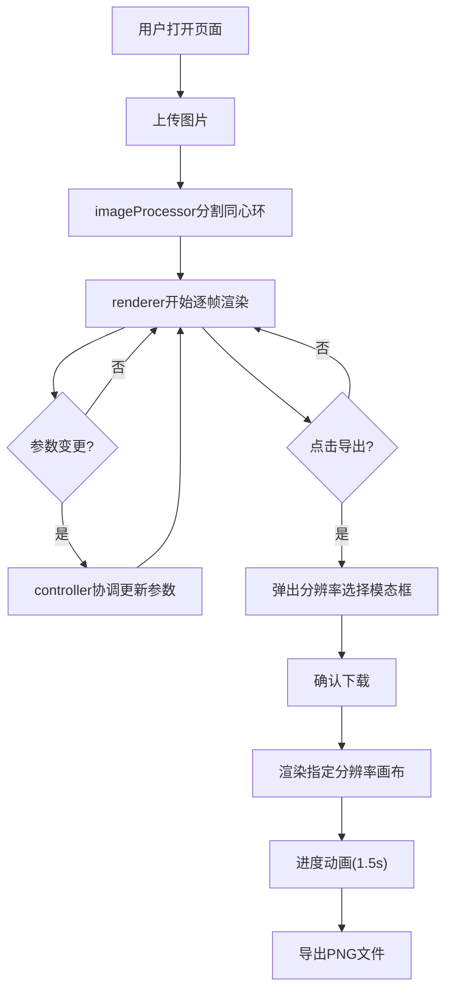

## 1. 产品概述
KaleidoSnap是一款浏览器端交互式视觉万花筒生成器，用户上传图片后可实时生成同心环分割旋转重组的万花筒风格镜像效果，支持参数化调节与高清导出。
- 面向视觉爱好者、设计师、社交媒体创作者，提供零门槛的创意图像生成工具
- 核心价值：将普通图片转化为独特的万花筒艺术作品，支持实时预览、参数微调与无损导出

## 2. 核心特性

### 2.1 用户角色
| 角色 | 注册方式 | 核心权限 |
|------|----------|----------|
| 普通用户 | 无需注册 | 上传图片、调节参数、实时预览、导出PNG |

### 2.2 功能模块
1. **主画布区域**：图片上传区域、万花筒效果实时渲染画布、导出按钮
2. **控制侧边栏**：环数滑块、旋转速度滑块、镜像模式选择、分割线透明度滑块
3. **导出模态框**：分辨率选择、下载确认、进度动画

### 2.3 页面详情
| 页面名称 | 模块名称 | 功能描述 |
|----------|----------|----------|
| 主页面 | 画布区域 | 居中显示万花筒渲染画布，支持拖拽/点击上传图片，左上角固定导出按钮 |
| 主页面 | 控制侧边栏 | 右侧毛玻璃面板，包含4组参数控制器，实时响应 |
| 主页面 | 导出模态框 | 背景模糊遮罩 + 底部滑入模态框，提供分辨率选项与下载进度 |

## 3. 核心流程

用户打开页面 → 点击/拖拽上传图片 → 图片自动分割为同心环并开始旋转渲染 → 拖动滑块/切换模式实时调整效果 → 点击导出按钮 → 选择分辨率 → 确认下载 → 进度动画 → 保存PNG文件

## 4. 用户界面设计

### 4.1 设计风格
- **主色调**：深色渐变背景（#1a1a2e → #16213e），霓虹蓝强调色（#00d2ff）
- **按钮/交互样式**：柔和圆角（8px），霓虹蓝描边/填充，悬停时亮度提升+2px上浮
- **字体**：主字体使用Geist/Space Grotesk风格现代无衬线字体，数字等宽展示
- **布局**：左侧主画布居中，右侧固定侧边栏；移动端侧边栏折叠为底部横条
- **视觉质感**：侧边栏毛玻璃（backdrop-filter: blur(12px)），半透明白色边框

### 4.2 页面设计概览
| 页面名称 | 模块名称 | UI元素 |
|----------|----------|--------|
| 主页面 | 画布区域 | 方形画布(自适应最大尺寸)、上传遮罩提示、左上角导出按钮(固定定位) |
| 主页面 | 控制侧边栏 | 毛玻璃面板(320px宽)、4组参数控制器(标签+滑块/下拉)、实时参数值显示 |
| 主页面 | 导出模态框 | 全屏模糊遮罩、底部滑入卡片(0.4s ease-out)、3个分辨率选项卡、确认按钮、环形进度条(1.5s动画) |

### 4.3 响应式适配
- **桌面端（>768px）**：左侧画布 + 右侧320px固定侧边栏布局
- **移动端（≤768px）**：画布自适应全屏，侧边栏折叠为底部横条，控制项变为可横向滑动的紧凑排列
- **触摸优化**：滑块增大点击热区(≥44px高度)，下拉选项适配原生选择器

### 4.4 动效规范
- 滑块/按钮悬停：0.2s颜色高亮 + translateY(-2px)微上浮
- 镜像模式切换：0.5s缩放旋转过渡动画(scale+rotate缓动)
- 模态框出现：0.4s底部滑入(ease-out) + 背景渐变模糊
- 导出进度：1.5s环形SVG进度条动画 + 完成态脉冲
