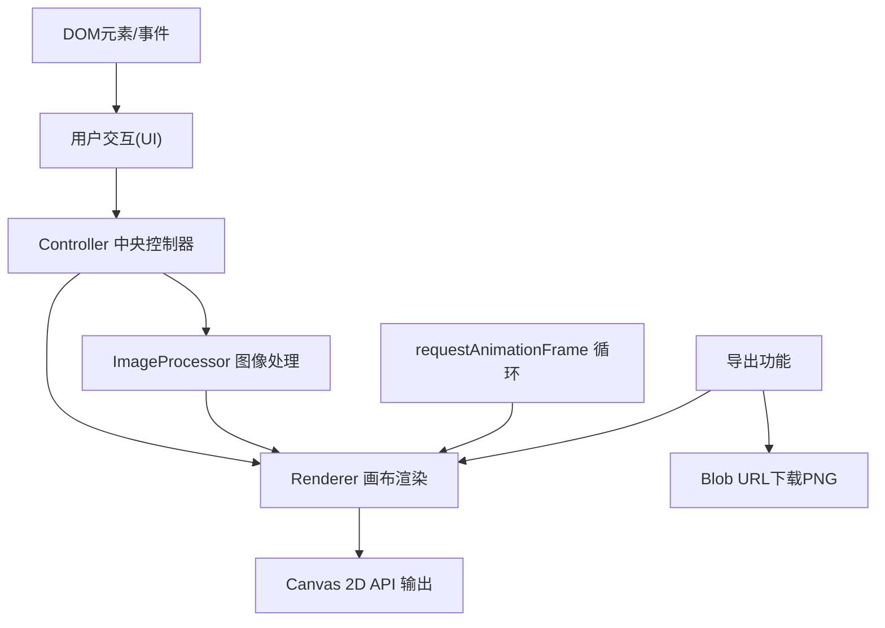

## 1. 架构设计



**模块职责**：
- **Controller**：中央协调者，监听UI事件，维护全局参数状态，调度imageProcessor与renderer协同工作
- **ImageProcessor**：纯逻辑模块，计算同心环几何参数、每帧旋转角度、镜像变换矩阵，不操作DOM
- **Renderer**：Canvas渲染模块，接收渲染参数，使用Canvas 2D API逐帧绘制，负责分割线、截屏导出
- **UI模块**：DOM构建与事件绑定层，生成侧边栏控件、模态框，回调通知Controller

## 2. 技术描述

- **前端框架**：TypeScript 5.x + 原生DOM/Canvas 2D API（无UI框架依赖）
- **构建工具**：Vite 5.x
- **类型系统**：严格模式(strict: true)，ESNext目标
- **开发依赖**：typescript, vite, @types/node
- **启动脚本**：`npm run dev`

## 3. 文件结构

```
项目根目录/
├── package.json
├── index.html
├── tsconfig.json
├── vite.config.js
└── src/
    ├── main.ts              # 入口：创建Controller实例并挂载
    ├── controller.ts        # 中央控制器：协调数据流
    ├── imageProcessor.ts    # 图像处理：环分割、旋转计算、镜像矩阵
    ├── renderer.ts          # Canvas渲染：逐帧绘制、分割线、导出
    └── ui.ts                # UI构建：侧边栏DOM、事件绑定、模态框
```

## 4. 接口定义（模块契约）

```typescript
// 全局参数类型
export interface KaleidoParams {
  ringCount: number;           // 环数 4-12
  rotationSpeedBase: number;   // 速度基准 1x-5x
  mirrorMode: 'none' | 'horizontal' | 'vertical' | 'quad';
  dividerOpacity: number;      // 分割线透明度 0-1
}

// 单个环的渲染数据
export interface RingData {
  index: number;
  innerRadius: number;
  outerRadius: number;
  rotation: number;            // 当前角度(弧度)
  rotationSpeed: number;       // 每帧速度增量
  expandOffset: number;        // 扩散偏移(5%基础)
}

// ImageProcessor 公共接口
interface IImageProcessor {
  setSourceImage(img: HTMLImageElement): void;
  setParams(params: KaleidoParams): void;
  getRingsForFrame(timestamp: number): RingData[];
  getMirrorTransform(): DOMMatrix2DInit;
}

// Renderer 公共接口
interface IRenderer {
  setCanvas(canvas: HTMLCanvasElement): void;
  render(image: HTMLImageElement, rings: RingData[],
         mirrorMode: KaleidoParams['mirrorMode'],
         dividerOpacity: number): void;
  exportPNG(resolution: number): Promise<Blob>;
}

// UI 回调接口
interface UICallbacks {
  onImageUpload: (file: File) => void;
  onParamsChange: (patch: Partial<KaleidoParams>) => void;
  onExportRequest: () => void;
  onExportConfirm: (resolution: number) => void;
  onExportCancel: () => void;
}
```

## 5. 关键实现策略

### 5.1 性能优化（≥30fps@1080p）
- 使用 `requestAnimationFrame` 驱动渲染循环，基于时间戳(dt)计算旋转而非固定帧步长
- 离屏Canvas缓存各环源图像切片，避免每帧重复剪切原图
- `imageSmoothingEnabled = true` + `imageSmoothingQuality = 'high'` 但仅在必要时开启
- 旋转计算使用增量累加，每帧仅做加法，避免三角函数重复计算
- 使用 `clip()` 配合环形路径 + `save()/restore()` 实现高效环形蒙版

### 5.2 同心环分割算法
- 以画布中心为原点，按环数均匀分配半径区间（从中心向外递增）
- 每环额外 +5% 基础扩散（expandOffset），营造层次感
- 相邻环之间预留 1px 黑色分割线间隙（由dividerOpacity控制可见度）

### 5.3 镜像变换
- 无镜像：直接渲染
- 左右镜像：渲染左半后水平翻转复制右半
- 上下镜像：渲染上半后垂直翻转复制下半
- 四重镜像：渲染左上象限后水平+垂直翻转填充其余三象限
- 模式切换通过CSS transform过渡(scale+rotate 0.5s)包裹canvas实现视觉过渡

### 5.4 导出流程
- 创建临时Canvas（目标分辨率），调用一次render()渲染到该画布
- `canvas.toBlob('image/png')` 异步生成Blob → 创建临时a标签触发下载
- 进度动画使用SVG circle + stroke-dashoffset动画（1.5s ease-in-out）

## 6. 响应式断点
- CSS媒体查询 `@media (max-width: 768px)`：
  - 侧边栏 `position: fixed; bottom: 0; left: 0; right: 0; height: auto; width: 100%;`
  - 控制容器 `display: flex; overflow-x: auto; flex-wrap: nowrap; padding: 12px;`
  - 单个控件 `flex-shrink: 0; width: 160px; margin-right: 16px;`
