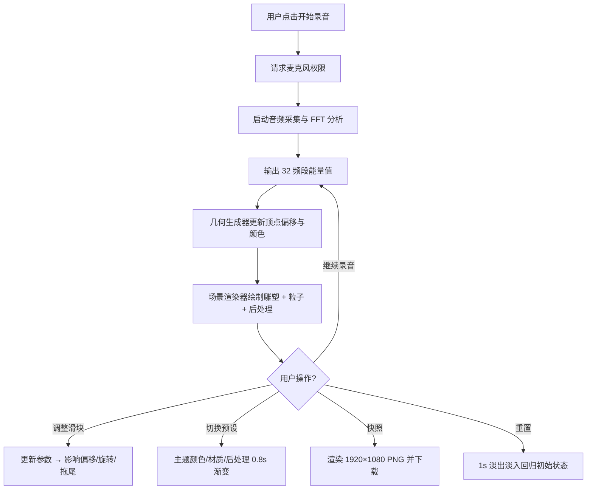

## 1. 产品概述

VoxelSculpt 是一款语音驱动的三维雕塑互动应用，将用户通过麦克风输入的实时语音信号转化为三维空间中的动态几何雕塑。声音的节奏、响度和频率以可视化的凹凸几何结构呈现，叠加粒子拖尾与辉光后处理特效，创造沉浸式的声光交互体验。

- 目标用户：数字艺术家、互动装置创作者、声音可视化爱好者
- 核心价值：将抽象声音信号转化为可感知、可交互、可保存的三维艺术作品

## 2. 核心功能

### 2.1 功能模块

1. **主页面**：3D 雕塑画布 + 控制面板，单页应用

### 2.2 功能详情

| 页面 | 模块 | 功能描述 |
|------|------|----------|
| 主页面 | 麦克风录音 | 点击"开始录音"按钮请求麦克风权限，启动实时音频采集，每帧（约50ms）执行 FFT 输出 32 个频段归一化能量值（0-1） |
| 主页面 | 三维雕塑渲染 | 中心原点球体（256三角面），顶点根据频段能量沿法线偏移（偏移量=能量×最大偏移系数），0.3秒 lerp 平滑过渡 |
| 主页面 | 顶点颜色映射 | 低频（0-8段）蓝→青，中频（9-24段）青→橙，高频（25-31段）橙→红，实时更新自然过渡 |
| 主页面 | 参数调节滑块 | 最大偏移系数（0.5-4.0）、旋转速度（0-2转/秒）、粒子拖尾长度（10-60帧），右下角实时显示参数值 |
| 主页面 | 预设风格切换 | 水晶（高饱和+强辉光）、熔岩（暖色+粗糙+扩散）、海洋（冷色+半透明+波纹），0.8秒渐变过渡 |
| 主页面 | 快照功能 | 导出 1920×1080 PNG 图片，自动下载，按钮 0.5 秒加载动画 |
| 主页面 | 重置功能 | 顶点回归初始球体，旋转归零，粒子清除，1秒淡出淡入渐变 |

## 3. 核心流程

## 4. 用户界面设计

### 4.1 设计风格

- **主题**：赛博朋克风格
- **背景色**：#0a0a1a（深色）
- **主色调**：霓虹蓝 #00ffff + 品红 #ff00ff
- **文字色**：#e0e0ff
- **控件背景**：rgba(0,0,0,0.6) 圆角半透明
- **按钮样式**：圆角半透明背景，点击时 0.2s scale(1.05) + box-shadow glow 动画
- **滑块样式**：霓虹蓝轨道，品红滑块
- **字体**：Rajdhani（赛博朋克风格显示字体）+ Space Mono（等宽数值字体）
- **布局**：左侧 10% 垂直控制栏（霓虹蓝渐变描边 2px）+ 右侧 90% 3D 画布

### 4.2 页面设计概览

| 页面 | 模块 | UI 元素 |
|------|------|---------|
| 主页面 | 控制栏 | 开始/停止录音按钮、3个参数滑块（标签+数值）、3个预设风格按钮、快照按钮、重置按钮 |
| 主页面 | 3D画布 | 全屏 Three.js 渲染区域，柔和阴影边缘过渡 |
| 主页面 | 参数显示 | 右下角实时显示当前参数数值 |

### 4.3 响应式设计

- 桌面优先，支持 1920×1080 和 2560×1440 分辨率
- 控制栏宽度按百分比自适应（10%），不遮挡画布关键区域
- 画布区域占据全屏剩余空间

### 4.4 3D 场景指引

- **环境**：深空背景，微弱星点
- **光照**：环境光 + 点光源（霓虹色调）随音频脉动
- **相机**：透视相机，默认 45° 俯角，支持鼠标拖拽旋转与滚轮缩放
- **构图**：雕塑居中，粒子围绕雕塑扩散
- **交互**：OrbitControls 旋转/缩放，音频驱动形变
- **后处理**：Bloom 辉光 + 景深效果
- **性能预算**：2560×1440 下 ≥45 FPS，1920×1080 下 ≥55 FPS
