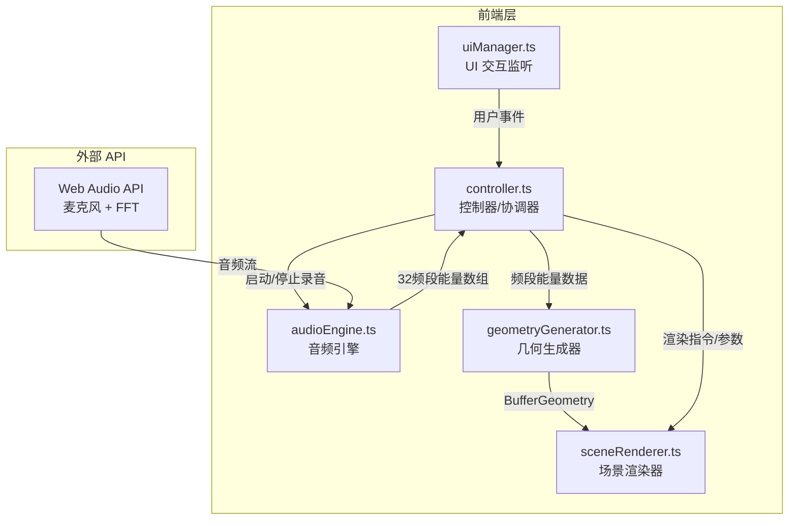

## 1. 架构设计



### 数据流向

```
麦克风 → Web Audio API → audioEngine (FFT) → controller → geometryGenerator (顶点/颜色更新)
                                                                    ↓
                              controller → sceneRenderer (渲染 + 后处理 + 快照)
                              uiManager → controller (用户交互事件)
```

## 2. 技术说明

- **前端**：TypeScript + Three.js + PostProcessing + Vite
- **构建工具**：Vite（含 TypeScript 支持）
- **3D 渲染**：Three.js（场景、相机、光照、BufferGeometry）
- **后处理**：postprocessing 库（Bloom 辉光 + 景深效果）
- **音频处理**：Web Audio API（AnalyserNode + FFT）
- **无后端**：纯前端应用

### 依赖清单

| 依赖 | 版本 | 用途 |
|------|------|------|
| three | ^0.170.0 | 3D 渲染核心 |
| @types/three | ^0.170.0 | Three.js 类型定义 |
| typescript | ^5.7.0 | TypeScript 编译器 |
| vite | ^6.0.0 | 构建开发工具 |
| postprocessing | ^7.0.0 | 后处理效果库 |

## 3. 路由定义

单页应用，无路由。入口为 `index.html`。

## 4. 文件结构

```
/
├── package.json              # 依赖与脚本
├── vite.config.js            # Vite 构建配置
├── tsconfig.json             # TypeScript 严格模式配置
├── index.html                # 入口页面
└── src/
    ├── main.ts               # 应用入口，初始化各模块
    ├── audioEngine.ts        # 音频引擎（FFT 分析）
    ├── geometryGenerator.ts  # 几何生成器（顶点/颜色更新）
    ├── sceneRenderer.ts      # 场景渲染器（Three.js + 后处理）
    ├── controller.ts         # 控制器（数据协调）
    └── uiManager.ts          # UI 管理器（交互监听）
```

### 模块间调用关系

| 调用方 | 被调用方 | 调用内容 |
|--------|----------|----------|
| main.ts | controller.ts | 初始化控制器 |
| main.ts | uiManager.ts | 初始化 UI 管理器 |
| uiManager.ts | controller.ts | 传递用户事件（录音、参数、预设、快照、重置） |
| controller.ts | audioEngine.ts | 启动/停止录音 |
| controller.ts | geometryGenerator.ts | 传递频段能量数据，触发几何更新 |
| controller.ts | sceneRenderer.ts | 传递渲染参数，触发快照/重置 |
| audioEngine.ts | controller.ts | 回调传递 32 频段能量数组 |
| geometryGenerator.ts | sceneRenderer.ts | 输出更新后的 BufferGeometry |

## 5. 核心模块设计

### 5.1 audioEngine.ts

- `AudioEngine` 类
- `start()`: 请求麦克风权限，创建 AudioContext + AnalyserNode，启动 FFT 循环
- `stop()`: 停止音频采集
- `onFrame(callback: (bands: Float32Array) => void)`: 每帧回调，输出 32 频段归一化能量值
- FFT 参数：fftSize=64，frequencyBinCount=32，smoothingTimeConstant=0.8

### 5.2 geometryGenerator.ts

- `GeometryGenerator` 类
- `createBaseSphere()`: 创建 IcosahedronGeometry(1, 3) 作为基础球体（约 256 面）
- `update(bands: Float32Array, maxDisplacement: number)`: 根据频段能量更新顶点位置（法线偏移 + lerp 0.3s）和顶点颜色
- `reset()`: 顶点回归初始位置
- 颜色映射：低频蓝→青，中频青→橙，高频橙→红

### 5.3 sceneRenderer.ts

- `SceneRenderer` 类
- `init(container: HTMLElement)`: 初始化 Three.js 场景、相机、OrbitControls、光照、后处理管线
- `updateGeometry(geometry: BufferGeometry)`: 更新雕塑网格
- `setRotationSpeed(speed: number)`: 设置旋转速度
- `setTrailLength(length: number)`: 设置粒子拖尾长度
- `applyPreset(preset: PresetType)`: 应用预设风格（颜色/材质/后处理 0.8s 渐变）
- `takeSnapshot()`: 导出 1920×1080 PNG
- `reset()`: 1秒淡出淡入重置
- `animate()`: 渲染循环

### 5.4 controller.ts

- `Controller` 类
- 协调 AudioEngine ↔ GeometryGenerator ↔ SceneRenderer 数据流
- `startRecording()` / `stopRecording()`
- `setParameter(name, value)`: 更新参数
- `setPreset(preset)`: 切换预设
- `takeSnapshot()`: 触发快照
- `reset()`: 触发重置
- 动画帧循环：每帧读取音频数据 → 更新几何 → 渲染

### 5.5 uiManager.ts

- `UIManager` 类
- 监听 DOM 事件：录音按钮、3个滑块、3个预设按钮、快照按钮、重置按钮
- 调用 Controller 对应方法
- 更新右下角参数显示
- 按钮动画反馈

### 5.6 预设风格定义

| 预设 | 颜色映射 | 材质 | 后处理 |
|------|----------|------|--------|
| 水晶 | 高饱和蓝→品红渐变 | MeshStandardMaterial(metalness:0.9, roughness:0.1) | Bloom(intensity:2.0, luminanceThreshold:0.2) |
| 熔岩 | 红→橙→黄暖色 | MeshStandardMaterial(metalness:0.3, roughness:0.8) | Bloom(intensity:1.5, luminanceThreshold:0.4) |
| 海洋 | 深蓝→青→白冷色 | MeshStandardMaterial(metalness:0.5, roughness:0.3, opacity:0.8, transparent:true) | Bloom(intensity:1.2, luminanceThreshold:0.3) |
