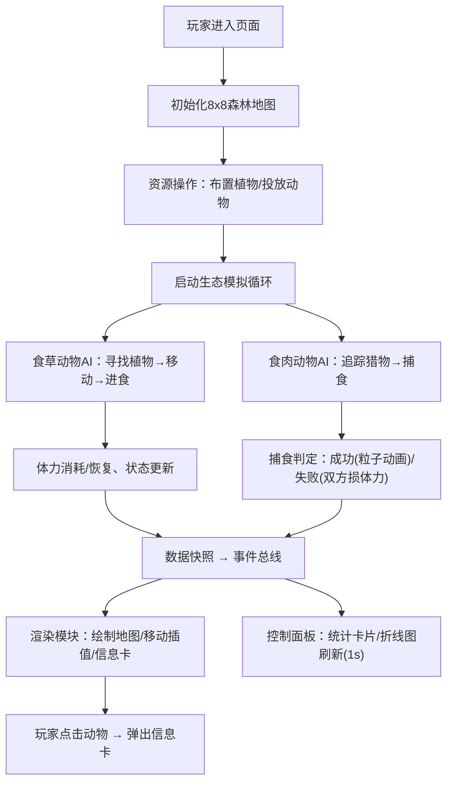

## 1. 产品概述
森林生态系统模拟器是一款面向生态学教学的交互式Web应用，通过可视化的生物链动态模拟，直观展示植物、食草动物与食肉动物之间的种群互动关系与资源竞争策略。
- 解决生态学教学中种群互动关系难以直观演示的问题，帮助学生理解生态平衡原理
- 目标用户：中学生物教师、大学生态学专业学生、自然科学爱好者

## 2. 核心功能

### 2.1 功能模块
1. **主地图模块**：8x8网格森林地图，Canvas 2D渲染，资源格子（水、草、浆果）分布，动物单位实时移动与状态更新
2. **生态模拟模块**：植物生长/消耗、动物觅食/避敌AI、捕食行为与体力消耗、种群自动平衡
3. **资源操作模块**：玩家消耗资源点布置/移除植物（灌木、果树），投放食草动物和食肉动物
4. **数据统计模块**：物种数量、平均寿命、资源存量实时统计，30秒折线图趋势展示
5. **单位信息模块**：点击动物弹出信息卡，显示体力、生命值、当前目标、最近行为记录时间线

### 2.2 页面详情
| 页面名称 | 模块名称 | 功能描述 |
|---------|---------|---------|
| 主页面 | 地图渲染区 | 8x8网格，绘制资源格子和动物单位，支持点击交互，像素级平滑移动插值 |
| 主页面 | 资源操作区 | 资源点显示、植物放置/移除按钮、动物投放按钮，悬停阴影加深效果 |
| 主页面 | 物种统计卡片 | 植物/食草/食肉三类卡片，显示图标、数量、平均寿命，悬停上浮5px |
| 主页面 | 折线图区域 | 30秒种群数量变化趋势，浅色网格背景，0.2秒平滑过渡动画 |
| 主页面 | 单位信息卡 | 从格子位置向上弹出，0.3秒ease-out，体力/生命值/目标/行为时间线 |

## 3. 核心流程
玩家通过资源操作区布置植物和投放动物，系统启动生态模拟循环（30FPS+），食草动物寻找高能量植物进食，食肉动物追踪捕食食草动物，捕食成功触发粒子动画，失败则双方损失体力。数据面板每秒刷新物种统计和折线图。

## 4. 用户界面设计

### 4.1 设计风格
- **主色调**：深绿#2d5a27、浅绿#7ec850、棕土#8b5e3c、水体#3a8bb5（森林大地色系）
- **按钮/滑块**：圆角矩形，悬停阴影加深效果，0.2秒过渡
- **动物图标**：食草动物绿色圆形、食肉动物红色圆形
- **布局结构**：左侧70%主地图区，右侧30%控制面板，桌面优先
- **卡片动效**：统计卡片悬停上浮5px并带阴影

### 4.2 页面设计概述
| 页面名称 | 模块名称 | UI元素 |
|---------|---------|---------|
| 主页面 | 地图渲染区 | Canvas画布，8x8网格线，资源格子渐变色，动物圆形图标平滑移动 |
| 主页面 | 资源操作区 | 资源点数值显示，圆角操作按钮组，工具选中高亮状态 |
| 主页面 | 物种统计卡片 | 三列并排卡片，物种图标+数字+平均寿命，悬停上浮阴影 |
| 主页面 | 折线图区域 | 浅色网格背景，三条彩色折线（植物/食草/食肉），0.2秒平滑过渡 |
| 主页面 | 单位信息卡 | 向上弹出动画，渐变背景，体力/生命进度条，时间线行为记录 |

### 4.3 响应式设计
- 桌面优先，最小支持1024x768分辨率
- 视口缩小时右侧面板宽度自动调整（弹性布局）
- 地图区域保持正方形比例，随容器宽度自适应缩放
- 小屏幕下统计卡片改为垂直排列
