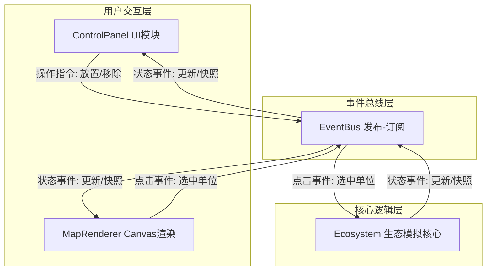
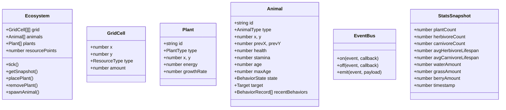

## 1. 架构设计


## 2. 技术描述
- **构建工具**：Vite 5.x
- **语言**：TypeScript 5.x（严格模式）
- **渲染**：Canvas 2D API
- **特效**：canvas-confetti（捕食成功粒子动画）
- **状态同步**：自研事件总线（发布-订阅模式）
- **模块组织**：生态模拟逻辑与界面渲染完全分离，通过事件总线异步通信

## 3. 项目文件结构
```
├── package.json
├── index.html
├── vite.config.js
├── tsconfig.json
└── src/
    ├── core/
    │   └── ecosystem.ts          # 生态模拟核心：生物单位、资源点、AI行为、状态快照
    ├── renderer/
    │   └── mapRenderer.ts        # Canvas渲染：网格绘制、生物移动插值、信息卡弹出
    ├── ui/
    │   └── controlPanel.ts       # 控制面板：资源操作、统计卡片、折线图
    ├── events/
    │   └── eventBus.ts           # 事件总线：发布-订阅机制
    └── main.ts                   # 入口：模块初始化与启动
```

## 4. 数据模型

### 4.1 实体类型定义


## 5. 事件定义
| 事件名 | 发布者 | 订阅者 | 载荷 |
|-------|--------|--------|------|
| ecosystem:tick | Ecosystem | MapRenderer, ControlPanel | StatsSnapshot |
| ecosystem:snapshot | Ecosystem | ControlPanel | StatsSnapshot[] (30s历史) |
| ecosystem:predation | Ecosystem | MapRenderer | {predator, prey, success} |
| ui:placePlant | ControlPanel | Ecosystem | {x, y, plantType} |
| ui:removePlant | ControlPanel | Ecosystem | {x, y} |
| ui:spawnAnimal | ControlPanel | Ecosystem | {x, y, animalType} |
| ui:selectAnimal | MapRenderer | Ecosystem, ControlPanel | {animalId} |
| ecosystem:animalSelected | Ecosystem | ControlPanel | Animal |

## 6. 性能保障方案
- **模拟循环**：使用 requestAnimationFrame，固定时间步长(dt)，目标30FPS+
- **渲染插值**：动物位置基于上一帧/当前帧位置做像素级线性插值，不阻塞主线程
- **数据节流**：统计数据每秒采样一次存入历史队列（最多30条），折线图使用历史数据渲染
- **Canvas优化**：离屏Canvas绘制静态网格，每帧只重绘动态元素（动物、粒子）
- **内存管理**：行为记录只保留最近3条，历史数据定长队列自动淘汰
