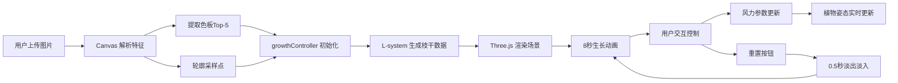

## 1. 产品概述
VirtualBloom 是一个基于 WebGL 的交互式虚拟植物生成器，用户上传植物图片后，系统会解析图片的色彩和轮廓特征，在三维空间中生成一棵动态生长的同风格虚拟植物。

- 核心功能：图片特征提取、L-system 植物生长模拟、物理风力交互
- 目标用户：设计爱好者、艺术创作者、教育工作者
- 产品价值：将现实植物特征转化为数字艺术作品，提供沉浸式的交互体验

## 2. 核心功能

### 2.1 功能模块
1. **图片上传与解析模块**：支持 JPEG/PNG 上传，Canvas 解析主色调 Top-5 和轮廓采样点
2. **植物生长模块**：L-system 算法生成枝干，8 秒生长动画，从种子到盛开
3. **3D 渲染模块**：Three.js 场景构建，环境光 + 定向光源，枝干旋转分叉，叶片摆动
4. **交互控制模块**：风向圆盘控制、风力强度滑块、重置按钮、场景旋转

### 2.3 页面详情
| 页面名称 | 模块名称 | 功能描述 |
|-----------|-------------|---------------------|
| 主页面 | 3D 场景区域 | 全屏 Three.js 渲染，植物生长动画，鼠标拖拽旋转视角 |
| 主页面 | 图片上传区 | 拖拽或点击上传，预览缩略图，显示提取的色板 |
| 主页面 | 控制面板 | 风向圆盘、风力滑块、重置按钮、光源切换 |

## 3. 核心流程
用户上传植物图片 → Canvas 解析色彩和轮廓 → 数据传入生长控制器 → L-system 初始化植物参数 → Three.js 场景逐帧渲染生长动画 → 用户通过控制面板调节风向风力 → 植物姿态实时响应 → 点击重置按钮触发淡出淡入过渡，植物回到种子状态重新生长

## 4. 用户界面设计

### 4.1 设计风格
- 主色调：深色背景 `#1a1a2e`，毛玻璃控制面板
- 按钮风格：圆角 8px，hover 时颜色变亮 10%，渐变动画 0.2s
- 字体：现代无衬线字体，标题 18px，正文 14px
- 布局：全屏 3D 场景，左上角浮动控制面板，底部重置按钮
- 视觉元素：柔和阴影、半透明边框、微妙的噪点纹理

### 4.2 页面设计概述
| 页面名称 | 模块名称 | UI 元素 |
|-----------|-------------|-------------|
| 主页面 | 3D 场景 | 全屏渲染，深色背景，环境光，动态植物 |
| 主页面 | 控制面板 | 毛玻璃效果，风向圆盘（可拖拽），风力滑块（0-10），光源切换开关 |
| 主页面 | 上传区域 | 拖拽框，文件选择按钮，色板预览（5 个色块） |
| 主页面 | 重置按钮 | 底部居中，圆角，hover 动画 |

### 4.3 响应性
- 桌面端：全屏场景，控制面板固定左上角，尺寸 280px
- iPad 横屏：适配 1024px 宽度，控制面板尺寸 240px
- 触摸优化：支持触摸拖拽旋转场景，滑块和圆盘支持触摸操作

### 4.4 3D 场景指引
- 环境：深色星空渐变背景，柔和环境光（0x404060），可切换定向光源（0xffffff）
- 光照：AmbientLight + DirectionalLight，阴影开启，柔和阴影
- 相机：PerspectiveCamera，位置 (0, 2, 5)，lookAt 原点，支持 OrbitControls
- 构图：植物居中生长，地面使用半透明网格平面
- 动画：生长动画 8 秒，叶片摆动物理模拟，枝干弯曲响应风力
- 性能：保持 30FPS 以上，几何体实例化渲染，合理的多边形数量

## 5. 非功能需求
- 性能：生长动画和交互响应保持 30FPS 以上
- 兼容性：支持 Chrome、Firefox、Safari 最新版本
- 可访问性：键盘操作支持，语义化 HTML
