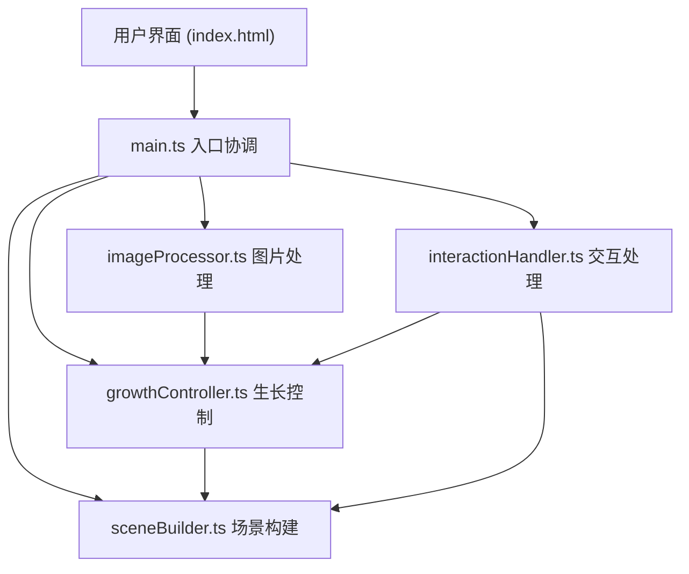

## 1. 架构设计



## 2. 技术描述
- 前端框架：原生 TypeScript + Three.js
- 构建工具：Vite 5.x
- 3D 渲染：Three.js 0.160.x
- 类型定义：@types/three
- 语言：TypeScript 5.x，target ES2020，严格模式

## 3. 文件结构

```
auto35/
├── package.json
├── vite.config.js
├── tsconfig.json
├── index.html
└── src/
    ├── main.ts
    ├── processModule/
    │   ├── imageProcessor.ts
    │   └── growthController.ts
    └── renderModule/
        ├── sceneBuilder.ts
        └── interactionHandler.ts
```

## 4. 模块职责

### 4.1 imageProcessor.ts
- 职责：处理上传图片，提取颜色和轮廓数据
- 核心功能：
  - `extractColors(imageData): string[]` - K-means 提取 Top-5 主色调
  - `extractContourPoints(canvasData): Vector2[]` - 边缘检测 + 随机采样轮廓点
  - `processImage(file): Promise<ImageData>` - 异步处理上传文件

### 4.2 growthController.ts
- 职责：管理 L-system 生长逻辑
- 核心功能：
  - `initializeLSystem(colors, contourPoints)` - 用图片特征初始化 L-system 参数
  - `updateGrowth(deltaTime)` - 每帧更新枝干长度和旋转角度
  - `getBranchData(): BranchData[]` - 获取当前枝干数据供渲染
  - `resetGrowth()` - 重置到种子状态

### 4.3 sceneBuilder.ts
- 职责：构建 Three.js 场景，处理渲染循环
- 核心功能：
  - `buildScene()` - 创建场景、相机、渲染器、光照
  - `createPlantGeometry(branchData)` - 根据枝干数据创建几何体
  - `updateWindEffect(windDirection, windStrength)` - 更新风力效果
  - `animate()` - 动画循环，每帧更新场景
  - `fadeInOut(duration, callback)` - 淡出淡入过渡效果

### 4.4 interactionHandler.ts
- 职责：处理用户交互
- 核心功能：
  - `setupDragControls()` - 设置鼠标拖拽旋转场景
  - `setupWindDisc()` - 风向圆盘拖拽控制
  - `setupWindSlider()` - 风力强度滑块
  - `setupResetButton()` - 重置按钮事件
  - `setupLightToggle()` - 光源切换

## 5. 数据模型

### 5.1 类型定义

```typescript
interface ImageFeatures {
  colors: string[];      // Top-5 主色调，十六进制
  contourPoints: { x: number; y: number }[];  // 轮廓采样点
}

interface LSystemParams {
  axiom: string;
  rules: { [key: string]: string };
  angle: number;         // 分叉角度
  iterations: number;
  branchLength: number;
  branchRadius: number;
}

interface BranchData {
  start: { x: number; y: number; z: number };
  end: { x: number; y: number; z: number };
  radius: number;
  color: string;
  level: number;
  hasLeaf: boolean;
  leafShape: number;     // 基于轮廓点的形状参数
}

interface WindParams {
  direction: { x: number; z: number };  // 风向
  strength: number;      // 0-10
}
```

## 6. 性能优化策略

- **几何体复用**：使用 InstancedMesh 渲染多个叶片
- **动画优化**：枝干生长使用顶点着色器动画，避免每帧重建几何体
- **帧率控制**：使用 THREE.Clock 计算 deltaTime，保证动画速度一致
- **内存管理**：重置时正确 dispose 几何体和材质
- **像素比限制**：`renderer.setPixelRatio(Math.min(window.devicePixelRatio, 2))`

## 7. 动画参数

| 动画 | 时长 | 缓动函数 |
|------|------|----------|
| 植物生长 | 8秒 | ease-out |
| 面板展开/收起 | 0.3秒 | ease-out |
| 重置淡出淡入 | 0.5秒 | ease-in-out |
| 按钮 hover | 0.2秒 | linear |

## 8. 启动方式

```bash
npm install
npm run dev
```
