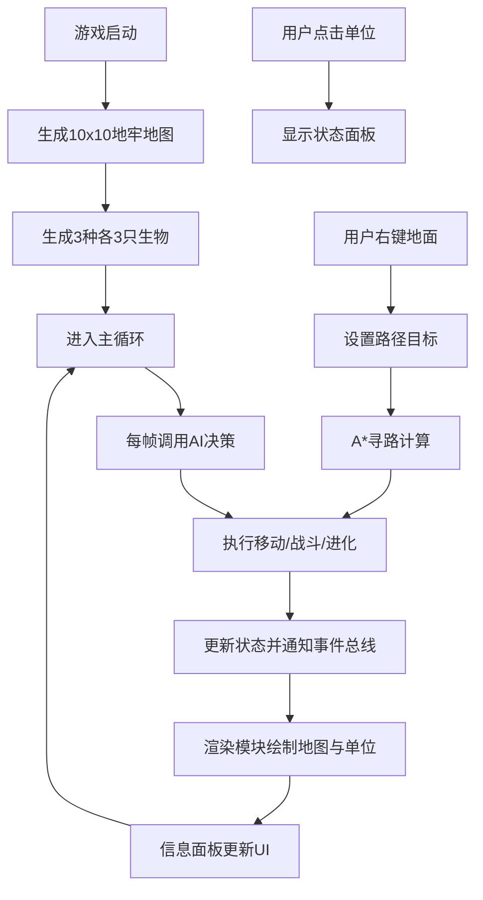

## 1. 产品概述

奇幻生物地牢沙盒是一款基于Canvas 2D的生物模拟游戏，让用户观察龙、精灵、石像鬼三种奇幻生物在随机生成的地牢迷宫中自动探索、战斗与进化的过程。

- 解决传统RPG游戏生物行为单一、地形交互反馈弱的问题，直观展示不同物种在复杂环境中的生存策略与进化路径
- 面向游戏爱好者、AI行为研究者和普通玩家，提供沉浸式的生物进化观察体验

## 2. 核心功能

### 2.1 功能模块

1. **地牢地图生成模块**：10x10网格随机生成，房间走廊连接，障碍物、宝箱、传送门散布
2. **生物AI决策模块**：三种生物独立决策，探索、战斗、逃跑行为逻辑
3. **战斗与进化系统**：实时战斗动画，经验获取，技能进化机制
4. **交互控制系统**：点击查看单位状态，右键标记路径，A*寻路算法
5. **信息面板UI**：属性条展示，技能图标，事件日志，响应式布局

### 2.2 页面详情

| 页面名称 | 模块名称 | 功能描述 |
|---------|---------|----------|
| 游戏主界面 | 地牢地图视口 | 10x10网格地牢渲染，每格50x50像素，单位实时位置显示，动画特效播放 |
| 游戏主界面 | 信息面板 | 选中单位属性条（生命/攻击/速度），技能图标展示，最近10条事件日志滚动 |
| 游戏主界面 | 交互层 | 左键点击选单位，右键标记目标点，选中单位金色边框高亮 |

## 3. 核心流程

游戏启动后自动生成地牢地图和9个初始生物单位。每帧执行：生物AI决策→移动/战斗/进化→状态更新→渲染刷新。用户可随时点击单位查看详情，右键指定移动目标。

## 4. 用户界面设计

### 4.1 设计风格

- **主色调**：暗色地牢风格，背景#1a1a2e，房间#16213e，走廊#0f3460
- **强调色**：#e94560（用于文字、图标高亮、边框）
- **生物配色**：龙-红色，精灵-绿色，石像鬼-紫色
- **布局**：左侧3/4宽度地图视口，右侧1/4信息面板，移动端折叠为顶部横条
- **字体**：像素风格字体，等宽字体用于属性数值

### 4.2 页面设计概述

| 页面名称 | 模块名称 | UI Elements |
|---------|---------|-------------|
| 游戏主界面 | 地牢地图 | 浅灰色网格线，深灰色障碍物填充，32x32像素风图标，金色选中边框，攻击/受击/进化动画特效 |
| 游戏主界面 | 属性面板 | 彩色进度条（生命-红色，攻击-橙色，速度-蓝色），技能图标带徽章，淡入日志动画 |
| 游戏主界面 | 响应式布局 | ≥768px双栏布局，＜768px信息面板折叠为顶部可展开横条 |

### 4.3 响应式设计

- 桌面端（≥768px）：保持双栏布局，左侧地图3/4，右侧信息面板1/4
- 移动端（＜768px）：信息面板自动折叠为顶部横条，点击可展开/收起，触摸优化点击区域
- 触摸设备：支持双指缩放地图，点击选择单位，长按标记路径

### 4.4 动画特效指导

- **战斗动画**：攻击方前冲抖动0.2秒，受击方红白闪烁0.3秒，伤害数字飘字
- **进化动画**：光效包裹，缓慢旋转持续2秒
- **日志淡入**：每条日志0.2秒淡入动画
- **选中高亮**：金色边框呼吸效果
- **移动动画**：单位平滑过渡到目标格子
