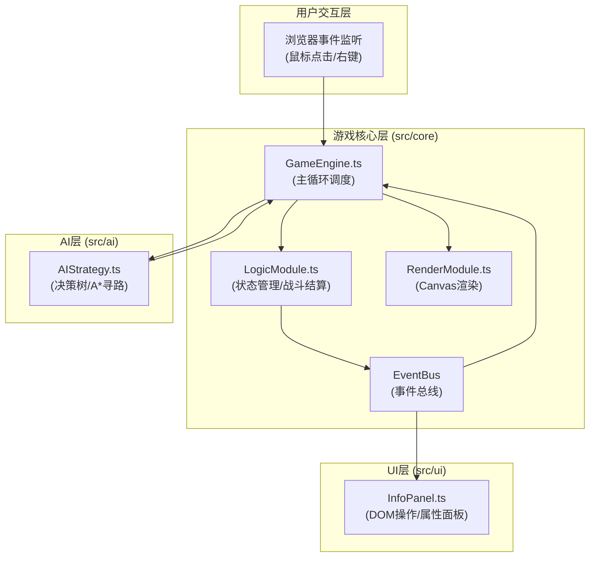
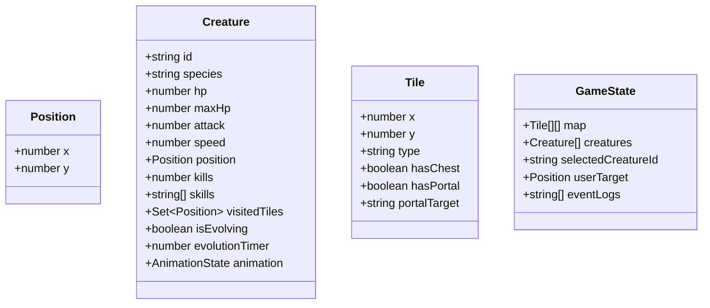

## 1. 架构设计

## 2. 技术描述

- **前端技术栈**：TypeScript 5.x + Vite 5.x + Canvas 2D API
- **构建工具**：Vite
- **第三方依赖**：
  - typescript：类型安全
  - vite：构建与开发服务器
  - canvas-confetti：进化庆祝特效
  - uuid：唯一ID生成
- **无后端服务**：纯前端单机游戏，数据全部内存存储

## 3. 数据模型

### 3.1 核心数据结构

### 3.2 模块职责

| 模块 | 文件 | 核心职责 |
|-----|------|---------|
| 游戏引擎 | [GameEngine.ts](file:///c:/Users/Administrator/Desktop/Pro/tasks/auto38/src/core/GameEngine.ts) | 主循环管理，调度AI、逻辑、渲染，协调整体数据流 |
| 逻辑模块 | [LogicModule.ts](file:///c:/Users/Administrator/Desktop/Pro/tasks/auto38/src/core/LogicModule.ts) | 地图生成、碰撞检测、战斗结算、进化判定、事件分发 |
| 渲染模块 | [RenderModule.ts](file:///c:/Users/Administrator/Desktop/Pro/tasks/auto38/src/core/RenderModule.ts) | Canvas 2D绘制地图、单位、动画特效 |
| AI策略 | [AIStrategy.ts](file:///c:/Users/Administrator/Desktop/Pro/tasks/auto38/src/ai/AIStrategy.ts) | 三种生物决策树、A*寻路算法、战力评估 |
| 信息面板 | [InfoPanel.ts](file:///c:/Users/Administrator/Desktop/Pro/tasks/auto38/src/ui/InfoPanel.ts) | DOM操作、属性条渲染、日志展示、响应式布局 |

## 4. 性能优化策略

### 4.1 渲染性能
- Canvas脏矩形渲染：仅重绘变化区域
- 离屏Canvas预渲染地图背景
- requestAnimationFrame驱动，目标30FPS

### 4.2 计算性能
- A*寻路使用二叉堆优化open list
- 单帧寻路计算限制≤5ms
- 生物决策分帧计算，避免单帧阻塞
- 空间分区碰撞检测（网格索引）

### 4.3 内存管理
- 对象池复用动画状态对象
- 及时移除死亡单位引用
- 事件监听器统一管理与清理

## 5. 事件总线定义

| 事件类型 | 触发时机 | 数据载荷 |
|---------|---------|---------|
| CREATURE_MOVED | 生物移动完成 | { creatureId, from, to } |
| COMBAT_STARTED | 战斗开始 | { attackerId, defenderId } |
| COMBAT_ENDED | 战斗结束 | { winnerId, loserId, damage } |
| CREATURE_EVOLVED | 进化完成 | { creatureId, newSkill } |
| CHEST_OPENED | 宝箱开启 | { position, reward, isTrap } |
| PORTAL_USED | 传送门使用 | { creatureId, from, to } |
| LOG_ADDED | 新增日志 | { message, timestamp } |
| CREATURE_SELECTED | 选中单位 | { creatureId } |
| TARGET_SET | 设置目标点 | { position } |
