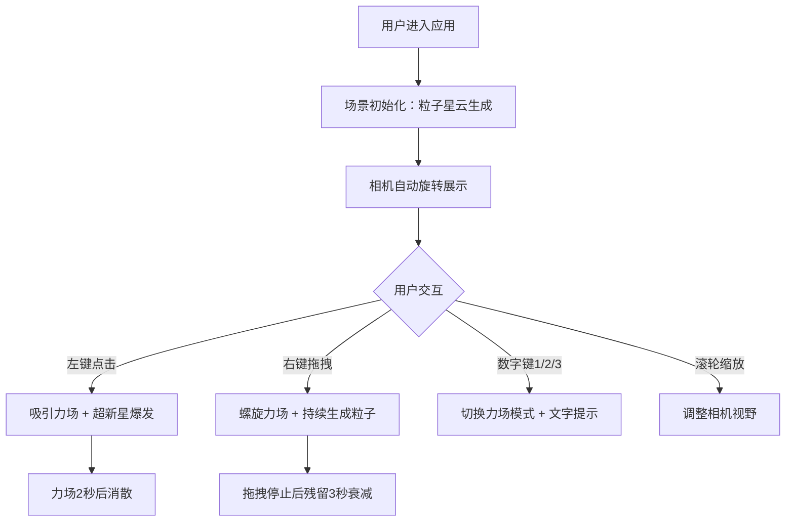

## 1. 产品概述

StellarGarden是一款交互式粒子星云培育应用，用户通过鼠标交互在三维场景中播撒、培育和观察动态粒子星云，创造绚丽的宇宙视觉奇观。
- 面向创意爱好者和视觉艺术家，提供沉浸式的粒子艺术创作体验
- 通过力场交互实现粒子动态演化，打造独特的视觉效果

## 2. 核心功能

### 2.1 功能模块
1. **主场景页面**：三维粒子星云场景、力场交互、UI叠层HUD

### 2.2 页面详情
| 页面名称 | 模块名称 | 功能描述 |
|-----------|-------------|---------------------|
| 主场景页面 | 粒子系统 | 最多15000个粒子，位置/速度/颜色属性管理，基于GPU的高效渲染 |
| 主场景页面 | 力场系统 | 三种力场模式（吸引/排斥/螺旋），鼠标点击和拖拽触发 |
| 主场景页面 | UI叠层 | 粒子数量、力场类型、FPS显示，力场切换文字提示 |

## 3. 核心流程

用户进入应用后，相机围绕原点自动缓慢旋转展示粒子星云场景。用户可通过以下方式交互：
1. 左键点击：在点击位置产生吸引力场，粒子被吸引后超新星爆发弹开
2. 右键拖拽：沿拖拽路径产生螺旋力场，粒子卷入螺旋轨道并持续生成新粒子
3. 数字键1/2/3：切换吸引/排斥/螺旋三种力场模式
4. 鼠标滚轮：缩放场景视野

## 4. 用户界面设计

### 4.1 设计风格
- **主色调**：深空黑色背景（#000000），粒子渐变配色：底部深蓝（#1a237e）→ 中部紫色（#7b1fa2）→ 顶部粉色（#f06292）
- **力场辅助色**：吸引-绿色，排斥-红色，螺旋-蓝色
- **字体风格**：白色半透明无衬线字体，无边框扁平设计
- **粒子效果**：半透明发光叠加（Additive Blending），营造星云辉光效果

### 4.2 页面设计
| 页面名称 | 模块名称 | UI元素 |
|-----------|-------------|-------------|
| 主场景页面 | 粒子星云 | 渐变彩色粒子、发光叠加效果、Y轴波动动画 |
| 主场景页面 | 力场可视化 | 半透明球形轮廓/螺旋线辅助线（透明度0.3） |
| 主场景页面 | HUD信息 | 左上角：粒子数量、力场类型、FPS（每秒更新） |
| 主场景页面 | 模式提示 | 居中淡入淡出文字（3秒显示，从下方滑入） |

### 4.3 响应式
- 全屏Canvas自适应窗口大小
- 桌面端优先，支持鼠标完整交互

### 4.4 3D场景设计
- **环境**：纯黑深空背景，无光源依赖（粒子自发光）
- **相机**：PerspectiveCamera，初始fov 60度，围绕原点自动旋转（10度/秒），支持滚轮缩放（30-100度）
- **粒子材质**：PointsMaterial + AdditiveBlending，半透明发光
- **后处理**：原生渲染，无需额外后处理以保证性能
- **性能目标**：10000-15000粒子时帧率不低于45FPS
