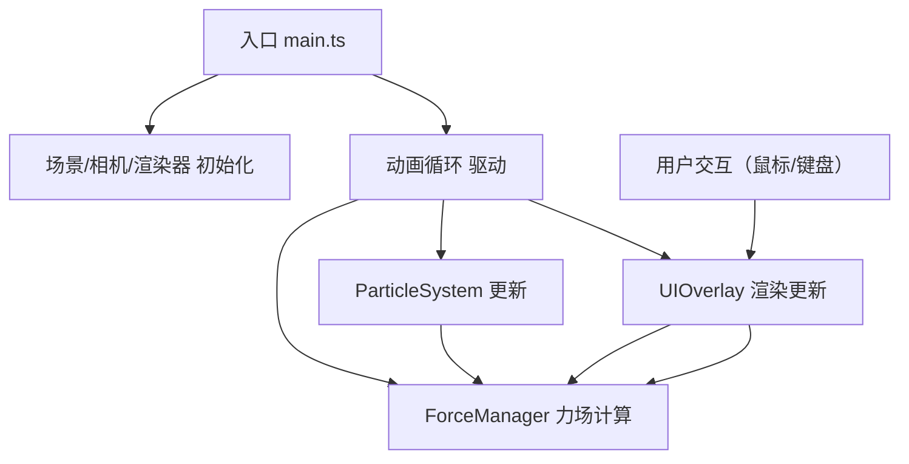

## 1. 架构设计



## 2. 技术描述
- **前端框架**：原生 TypeScript，无UI框架（纯Canvas 3D应用）
- **3D引擎**：Three.js（@types/three类型定义）
- **构建工具**：Vite
- **开发工具**：dat.gui（可选调试面板）

## 3. 项目文件结构

| 文件路径 | 职责说明 |
|---------|---------|
| `package.json` | 依赖管理、启动脚本 |
| `vite.config.js` | Vite配置，路径别名 `@` -> `src` |
| `tsconfig.json` | TypeScript严格模式，ES2020 |
| `index.html` | 入口HTML，全屏挂载点 |
| `src/main.ts` | 应用入口：场景/相机/渲染器初始化，动画循环 |
| `src/particleSystem.ts` | 粒子系统核心：粒子池管理、属性更新、渲染 |
| `src/forceManager.ts` | 力场管理：三种力场定义、加速度计算、力场生命周期 |
| `src/uiOverlay.ts` | UI叠层：鼠标事件监听、HUD显示、模式提示 |

## 4. 核心模块设计

### 4.1 ParticleSystem（粒子系统）
- **粒子池**：最大15000个粒子，使用TypedArray（Float32Array）存储位置/速度/颜色
- **粒子属性**：
  - position: 三维坐标
  - velocity: 速度向量
  - baseY: 基础Y坐标（用于正弦波动）
  - phase: 波动相位偏移
  - size: 基础大小
- **颜色插值**：基于Y轴高度在深蓝(0x1a237e)→紫(0x7b1fa2)→粉(0xf06292)之间渐变
- **大小计算**：基础随机0.05-0.2，与速度大小成反比

### 4.2 ForceManager（力场管理）
- **力场类型**：
  - ATTRACT（吸引）：点击产生，半径2单位，持续2秒，中心爆发
  - REPEL（排斥）：与吸引方向相反
  - SPIRAL（螺旋）：拖拽路径产生，角速度180°/s，半径0.5单位，残留3秒
- **力场数据结构**：
  ```typescript
  interface ForceField {
    type: 'attract' | 'repel' | 'spiral'
    position: Vector3
    path?: Vector3[]  // 螺旋路径点
    radius: number
    strength: number
    lifetime: number
    maxLifetime: number
    hasBurst?: boolean  // 爆发标记
  }
  ```
- **粒子爆发**：到达中心点时，随机方向速度2-4单位/秒

### 4.3 UIOverlay（UI叠层）
- **鼠标事件**：
  - click（左键）：产生吸引力场
  - mousedown + mousemove（右键）：螺旋力场拖拽
  - wheel：缩放相机fov
- **键盘事件**：1/2/3切换力场模式
- **HUD元素**：左上角粒子数/力场类型/FPS
- **模式提示**：居中显示3秒，CSS过渡淡入淡出

## 5. 性能优化策略
- 使用 BufferGeometry + Float32Array 批量存储粒子数据
- 单次 draw call 渲染所有粒子（THREE.Points）
- AdditiveBlending 减少透明排序开销
- 力场计算避免 O(n²) 复杂度，限制每个粒子受力场数量
- 粒子更新使用向量化运算，减少GC压力
