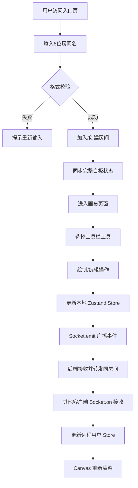

## 1. 产品概述

CollaSketch 是一款面向社区知识分享平台的轻量级实时协作白板工具，支持多人同时在虚拟画布上绘制图形、添加便签和连接箭头，实现思维导图式的协作创作。

- 主要目的：为社区用户提供可视化的实时协作创作空间，降低远程头脑风暴和知识梳理的协作门槛
- 目标用户：知识分享社区用户、远程团队、教育工作者及学生群体
- 市场价值：填补社区平台内嵌协作工具的空白，增强用户粘性与社区活跃度

## 2. 核心功能

### 2.1 用户角色
| 角色 | 注册方式 | 核心权限 |
|------|---------|---------|
| 参与用户 | 输入房间名加入 | 绘制图形、添加便签、编辑内容、撤销重做 |

### 2.2 功能模块
1. **房间入口页面**：房间名称输入框、创建/加入房间按钮、规则提示
2. **主画布页面**：顶部工具栏、无限画布区域、便签列表面板、用户在线提示

### 2.3 页面详情
| 页面名称 | 模块名称 | 功能描述 |
|---------|---------|----------|
| 房间入口 | 房间输入模块 | 输入6位大小写英文字母房间名，校验格式合法性 |
| 房间入口 | 操作按钮区 | 创建/加入按钮，点击跳转画布页，已存在房间自动加入 |
| 主画布 | 工具栏模块 | 颜色选择器、四种绘制模式切换、便签添加、撤销/重做、清空画布 |
| 主画布 | 画布模块 | Canvas 渲染，支持鼠标拖拽绘制、图形选中移动缩放、便签拖拽、连接点生成 |
| 主画布 | 便签面板 | 便签列表展示、文字编辑、颜色切换、位置拖拽、删除 |
| 主画布 | 实时协作模块 | WebSocket 双向通信、房间状态同步、新用户全量同步 |

## 3. 核心流程

用户访问应用 → 输入6位房间名 → 校验通过后创建/加入房间 → 进入画布 → 通过工具栏选择工具 → 绘制/编辑操作 → 本地状态更新 → Socket 事件广播 → 同房间其他用户接收 → 远程状态更新 → 画布重新渲染

## 4. 用户界面设计

### 4.1 设计风格
- 主色调：深色主题背景 `#1e1e2e`，高亮紫色 `#7c3aed`，画布点阵 `#3a3a4a`
- 按钮风格：线性图标按钮，选中态背景半透明紫色 + 图标点亮
- 字体：现代无衬线字体，标题 14px 粗体，正文 12-13px 常规
- 布局：顶部 56px 固定工具栏 + 画布无限滚动 + 侧边便签面板
- 视觉动效：选中呼吸脉动光圈（0.8s 周期）、拖拽放大 1.05 倍（0.1s 缓动）

### 4.2 页面设计概述
| 页面名称 | 模块名称 | UI 元素 |
|---------|---------|--------|
| 房间入口 | 居中卡片 | 半透明毛玻璃卡片、标题、输入框、按钮、背景渐变光晕 |
| 主画布 | 顶部工具栏 | 左侧工具图标组、中间颜色选择器、右侧操作按钮组，56px 高 |
| 主画布 | 画布区域 | 深色点阵网格背景、支持平移、图形选中控制点蓝色方块 |
| 主画布 | 便签元素 | 6 色圆角矩形、2px 圆角、1px 描边、文字自适应颜色、右上角色卡切换 |
| 主画布 | 连接线 | 2px 平滑贝塞尔曲线 + 实心三角箭头、随端点自动弯曲 |

### 4.3 响应式
桌面端优先设计，画布区域支持鼠标滚轮平移缩放，工具栏在最小窗口宽度 1024px 下完整展示。

### 4.4 性能保障
- Canvas 分层渲染：静态图形缓存至离屏 canvas
- 60FPS 帧率：requestAnimationFrame 驱动绘制循环
- WebSocket 事件防抖：连续拖拽操作节流 16ms 发送一次
- 状态局部更新：仅重绘变化区域，避免全量重绘
