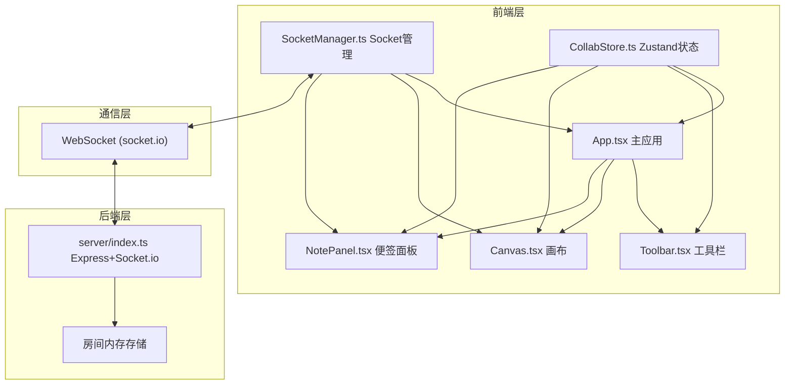
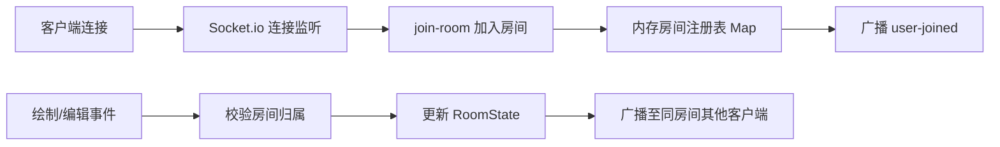

## 1. 架构设计



## 2. 技术说明

- 前端框架：React@18 + TypeScript@5 + Vite@5
- 状态管理：zustand@4（白板状态、工具状态、撤销栈）
- 实时通信：socket.io-client@4 + socket.io@4
- 后端服务：Express@4 + CORS
- 构建工具：Vite + @vitejs/plugin-react（含 proxy 配置转发 API）
- 图标库：lucide-react

## 3. 路由定义
| 路由 | 用途 |
|-----|------|
| / | 房间入口页面，输入6位房间名创建/加入 |
| /room/:roomId | 主画布协作页面 |

## 4. API 与 Socket 事件定义

### 4.1 客户端 → 服务端事件
| 事件名 | 数据类型 | 说明 |
|-------|---------|------|
| join-room | `{ roomId: string; userId: string }` | 加入房间 |
| sync-board | `{ roomId: string }` | 请求完整白板状态 |
| add-shape | `Shape` | 新增图形 |
| update-shape | `Shape` | 更新图形（移动/缩放） |
| delete-shape | `{ id: string }` | 删除图形 |
| add-note | `Note` | 新增便签 |
| update-note | `Note` | 更新便签（文字/颜色/位置） |
| delete-note | `{ id: string }` | 删除便签 |
| clear-board | `{ roomId: string }` | 清空画布 |

### 4.2 服务端 → 客户端事件
| 事件名 | 数据类型 | 说明 |
|-------|---------|------|
| board-state | `{ shapes: Shape[]; notes: Note[] }` | 新用户加入时全量同步 |
| user-joined | `{ userId: string; users: string[] }` | 有用户加入 |
| user-left | `{ userId: string; users: string[] }` | 有用户离开 |
| shape-added | `Shape` | 广播新增图形 |
| shape-updated | `Shape` | 广播更新图形 |
| shape-deleted | `{ id: string }` | 广播删除图形 |
| note-added | `Note` | 广播新增便签 |
| note-updated | `Note` | 广播更新便签 |
| note-deleted | `{ id: string }` | 广播删除便签 |
| board-cleared | `{}` | 广播清空画布 |

### 4.3 核心数据类型
```typescript
type ToolType = 'select' | 'rectangle' | 'circle' | 'pen' | 'arrow';

interface Point { x: number; y: number }

interface Shape {
  id: string;
  type: 'rectangle' | 'circle' | 'pen' | 'arrow';
  x: number; y: number;        // 左上角或起点
  width?: number; height?: number;
  points?: Point[];            // 自由画笔的点集
  startId?: string; endId?: string; // 箭头关联的图形/便签ID
  startPoint?: Point; endPoint?: Point;
  color: string;
  strokeWidth: number;
}

interface Note {
  id: string;
  x: number; y: number;
  width: number; height: number;
  text: string;
  color: string;
}
```

## 5. 服务端架构



服务端采用内存存储 RoomState（shapes + notes + users），支持房间自动清理（最后一个用户离开 10 分钟后销毁）。

## 6. 项目目录结构

```
auto61/
├── package.json              # 前后端统一依赖与 scripts
├── vite.config.ts            # Vite 配置 + /api proxy
├── tsconfig.json             # 前端严格 TS 配置
├── tsconfig.node.json        # 后端 TS 配置
├── index.html                # 前端挂载点
├── server/
│   └── index.ts              # Express + Socket.io 服务端入口
└── src/
    ├── main.tsx              # 前端入口
    ├── App.tsx               # 主应用 + 路由
    ├── pages/
    │   ├── RoomEntry.tsx     # 房间入口页
    │   └── BoardPage.tsx     # 画布页
    ├── components/
    │   ├── Toolbar.tsx       # 工具栏组件
    │   ├── Canvas.tsx        # Canvas 画板组件
    │   └── NotePanel.tsx     # 便签面板组件
    ├── store/
    │   └── CollabStore.ts    # Zustand 全局状态
    ├── utils/
    │   └── SocketManager.ts  # Socket.io 连接管理器
    └── types/
        └── index.ts          # 共享类型定义
```

## 7. 性能与实现策略

1. **Canvas 渲染优化**：requestAnimationFrame 循环 + 脏矩形标记，仅在状态变更时重绘
2. **拖拽节流**：鼠标移动事件 16ms 节流后才发送 socket 事件，本地实时渲染
3. **撤销重做**：zustand 中维护 history[50] + future[] 栈，仅本地操作 push，忽略远程事件
4. **无限画布**：维护 camera offset 状态，所有坐标转换为世界坐标，滚轮平移
5. **贝塞尔曲线**：箭头采用二次贝塞尔，控制点为两端点中点偏移，端点移动时实时重算
