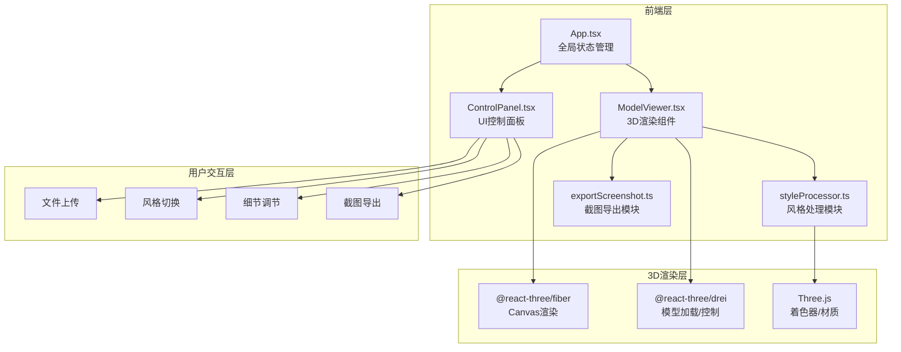

## 1. 架构设计



## 2. 技术说明
- 前端框架: React@18 + TypeScript
- 3D渲染: Three.js + @react-three/fiber + @react-three/drei
- 样式方案: CSS Modules + CSS变量（深色科幻主题）
- 构建工具: Vite
- 状态管理: Zustand（全局风格状态、细节强度、加载状态）
- 无后端: 纯前端应用，所有处理在浏览器内完成

## 3. 路由定义
| 路由 | 用途 |
|------|------|
| / | 主界面，包含3D预览和控制面板 |

## 4. 模块依赖与接口定义

### 4.1 全局状态 (Zustand Store)
```typescript
interface AppState {
  currentStyle: 'lowpoly' | 'toon' | 'wireframe' | 'watercolor';
  detailIntensity: number; // 0-100
  isLoading: boolean;
  modelLoaded: boolean;
  isExporting: boolean;
  setStyle: (style: AppState['currentStyle']) => void;
  setDetailIntensity: (value: number) => void;
  setLoading: (loading: boolean) => void;
  setModelLoaded: (loaded: boolean) => void;
  setExporting: (exporting: boolean) => void;
}
```

### 4.2 styleProcessor.ts 接口
```typescript
interface StyleConfig {
  vertexShader: string;
  fragmentShader: string;
  uniforms: Record<string, { value: unknown }>;
  materialType: 'ShaderMaterial' | 'MeshToonMaterial' | 'MeshBasicMaterial';
}

interface StyleProcessorInput {
  geometry: THREE.BufferGeometry;
  style: AppState['currentStyle'];
  detailIntensity: number;
  transitionProgress: number; // 0-1 风格切换过渡进度
}

function processStyle(input: StyleProcessorInput): StyleConfig;
```

### 4.3 exportScreenshot.ts 接口
```typescript
interface ExportOptions {
  width: 1920;
  height: 1080;
  format: 'png';
}

function exportScreenshot(
  canvas: HTMLCanvasElement,
  options: ExportOptions,
  onComplete: () => void
): void;
```

### 4.4 ModelViewer.tsx Props
```typescript
interface ModelViewerProps {
  file: File | null;
  style: AppState['currentStyle'];
  detailIntensity: number;
  onModelLoaded: () => void;
  onExportRef: React.MutableRefObject<(() => void) | null>;
}
```

### 4.5 ControlPanel.tsx Props
```typescript
interface ControlPanelProps {
  onFileSelect: (file: File) => void;
  currentStyle: AppState['currentStyle'];
  onStyleChange: (style: AppState['currentStyle']) => void;
  detailIntensity: number;
  onDetailChange: (value: number) => void;
  onExport: () => void;
  isModelLoaded: boolean;
  isLoading: boolean;
}
```

## 5. 文件组织结构
```
├── package.json
├── tsconfig.json
├── vite.config.ts
├── index.html
├── src/
│   ├── main.tsx                     # 入口文件
│   ├── App.tsx                      # 主应用组件
│   ├── store/
│   │   └── useAppStore.ts           # Zustand全局状态
│   ├── components/
│   │   ├── ModelViewer.tsx          # 模型加载与渲染
│   │   ├── ControlPanel.tsx         # UI控制面板
│   │   ├── ParticleEffect.tsx       # 粒子消散重组特效
│   │   ├── LoadingSpinner.tsx       # 加载旋转环形动画
│   │   ├── FlashOverlay.tsx         # 导出闪光动画
│   │   └── HintText.tsx             # 操作提示文字
│   ├── utils/
│   │   ├── styleProcessor.ts        # 风格处理模块
│   │   └── exportScreenshot.ts      # 导出截图模块
│   └── styles/
│       ├── global.css               # 全局样式+CSS变量
│       └── ControlPanel.module.css  # 控制面板样式
```

## 6. 关键技术方案

### 6.1 风格切换动画
- 使用 `useFrame` 钩子在每帧插值 `transitionProgress`（0→1，1秒完成）
- 切换开始时触发粒子系统：从模型表面采样点生成200-500个粒子，先向外扩散再收拢
- 粒子使用 THREE.Points + BufferGeometry，动画通过 `useFrame` 更新位置

### 6.2 细节强度调节
- 低值：对几何体执行 Laplacian 平滑（减少法线变化）
- 高值：增强法线贴图或使用边缘检测着色器突出棱角
- 使用 morph targets 或直接修改顶点位置实现实时变形

### 6.3 模型加载
- OBJ: 使用 Three.js OBJLoader
- GLTF: 使用 Three.js GLTFLoader
- 通过 @react-three/drei 的 `useLoader` 钩子加载
- 加载时显示旋转环形动画（THREE.RingGeometry + 旋转动画）

### 6.4 截图导出
- 临时调整渲染器分辨率为1920x1080
- 调用 `renderer.render(scene, camera)` 渲染一帧
- 通过 `canvas.toDataURL('image/png')` 获取图片数据
- 创建 `<a>` 标签触发下载
- 导出完成后恢复原始分辨率
