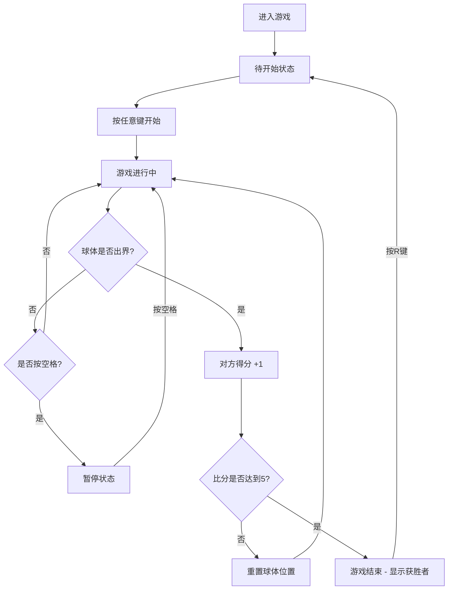

## 1. 产品概述

Pong Battle! 是一款双人本地同屏重力弹球对战游戏，玩家通过键盘控制各自的挡板，击打球体使其在竞技场中反弹。游戏结合策略与反应速度，先获得5分的玩家获胜。

- 核心目标：提供本地多人同屏游戏体验，结合策略布局与快速反应
- 目标用户：休闲游戏玩家、朋友聚会娱乐场景
- 产品价值：经典弹球玩法的现代化重制，加入粒子特效与视觉增强

## 2. 核心功能

### 2.1 用户角色

| 角色 | 注册方式 | 核心权限 |
|------|----------|----------|
| 玩家1 | 键盘W/S控制左挡板 | 控制左挡板移动、得分、获胜 |
| 玩家2 | 键盘上下方向键控制右挡板 | 控制右挡板移动、得分、获胜 |

### 2.2 功能模块

1. **对战逻辑模块**：挡板控制、球体运动、碰撞检测、计分规则
2. **挡板与球体模块**：物理模拟、速度与角度计算
3. **计分与状态管理模块**：比分显示、游戏状态切换、动画效果
4. **特效模块**：粒子效果、闪屏效果、拖尾轨迹

### 2.3 页面详情

| 页面名称 | 模块名称 | 功能描述 |
|----------|----------|----------|
| 游戏主界面 | 竞技场 | 800x500像素矩形游戏区域，深灰色背景 |
| 游戏主界面 | 左右挡板 | 100x20像素渐变挡板，蓝色/红色 |
| 游戏主界面 | 球体 | 半径12像素白色发光球体，带拖尾轨迹 |
| 游戏主界面 | 计分板 | 顶部中央显示双方比分，白色加粗24px |
| 游戏主界面 | 状态提示 | 待开始、暂停、结束状态文字提示 |
| 游戏主界面 | 粒子特效 | 碰撞时生成彩色粒子散开效果 |
| 游戏主界面 | 闪屏特效 | 得分时白色背景闪烁效果 |

## 3. 核心流程

玩家进入游戏后看到待开始界面，按任意键开始游戏。双方玩家通过键盘控制各自挡板，击打球体使其反弹。球体碰到左右边界且未被挡板接住时，对方得1分。先获得5分的玩家获胜，游戏结束并显示获胜者，按R键重新开始。游戏过程中可按空格键暂停/继续。

## 4. 用户界面设计

### 4.1 设计风格

- **主色调**：深灰背景 (#1a1a2e)，蓝色挡板 (#0f3460)，红色挡板 (#e94560)，白色球体 (#ffffff)
- **视觉风格**：深色星空渐变背景，霓虹发光效果，赛博朋克风格
- **字体**：无衬线字体，标题带有光晕动画
- **动效**：比分弹跳动画、粒子爆炸效果、闪屏效果、球体拖尾轨迹
- **布局**：竞技场居中显示，固定尺寸800x500像素，自适应缩放保持比例

### 4.2 页面设计概览

| 页面名称 | 模块名称 | UI元素 |
|----------|----------|--------|
| 游戏主界面 | 标题 | "Pong Battle!" 文字光晕动画，蓝红循环3秒周期 |
| 游戏主界面 | 竞技场 | 深灰背景矩形，上下边界反弹线 |
| 游戏主界面 | 左挡板 | 蓝色渐变，100x20像素 |
| 游戏主界面 | 右挡板 | 红色渐变，100x20像素 |
| 游戏主界面 | 球体 | 白色圆形，发光效果，运动拖尾 |
| 游戏主界面 | 计分板 | 顶部中央，白色加粗24px，缩放弹跳动画 |
| 游戏主界面 | 状态文字 | 居中显示待开始/暂停/结束提示 |

### 4.3 响应性

- 桌面端优先，固定竞技场尺寸
- 整体布局居中于视口，自适应缩放保持比例
- 键盘操作，不支持触屏

### 4.4 性能要求

- 游戏逻辑60FPS恒定帧率，requestAnimationFrame驱动
- 单次粒子生成不超过20个，总粒子数不超过100个
- 球体拖尾长度12个历史点
