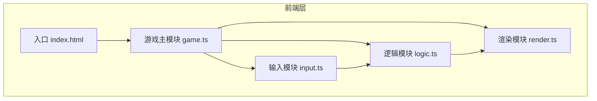

## 1. 架构设计



## 2. 技术描述

- **前端框架**：原生 TypeScript + Canvas 2D API
- **构建工具**：Vite 5.x
- **语言**：TypeScript 5.x（严格模式）
- **渲染方式**：Canvas 2D 原生渲染
- **状态管理**：模块化状态，各模块独立管理内部状态
- **动画驱动**：requestAnimationFrame + 固定时间步长

## 3. 文件结构

```
项目根目录/
├── index.html              # 入口HTML，包含Canvas容器
├── package.json            # 项目配置与依赖
├── tsconfig.json           # TypeScript配置（严格模式）
├── vite.config.js          # Vite配置（路径别名@指向src）
└── src/
    ├── game.ts             # 游戏主循环、状态管理、模块协调
    ├── input.ts            # 键盘输入处理
    ├── logic.ts            # 对战逻辑、物理模拟、碰撞检测
    └── render.ts           # Canvas渲染、特效绘制
```

## 4. 模块定义

### 4.1 game.ts - 游戏主模块

**职责**：
- 初始化Canvas和游戏环境
- 启动requestAnimationFrame循环
- 管理游戏状态（待开始、进行中、暂停、结束）
- 协调输入、逻辑、渲染模块
- 处理全局键盘事件（空格暂停、R键重开）

**数据流**：
```
键盘事件 → input.ts → logic.ts.update(deltaTime) → render.ts.render(ctx, state)
```

**核心接口**：
- `init(canvasId: string): void` - 初始化游戏
- `start(): void` - 启动游戏循环

### 4.2 input.ts - 输入模块

**职责**：
- 监听keydown和keyup事件
- 维护当前按下的键集合
- 提供按键查询方法

**核心接口**：
- `isKeyPressed(key: string): boolean` - 查询某键是否按下
- `setup(): void` - 设置事件监听
- `destroy(): void` - 移除事件监听

### 4.3 logic.ts - 逻辑模块

**职责**：
- 管理挡板位置与移动
- 管理球体运动与速度
- 碰撞检测（上下边界、左右挡板）
- 计分规则与胜负判定
- 粒子系统管理
- 重置游戏状态

**核心接口**：
- `update(deltaTime: number): void` - 更新一帧逻辑
- `reset(): void` - 重置游戏状态
- `getState(): GameState` - 获取当前游戏状态

**状态数据结构**：
```typescript
interface GameState {
  status: 'idle' | 'playing' | 'paused' | 'ended';
  leftPaddle: { x: number; y: number; width: number; height: number };
  rightPaddle: { x: number; y: number; width: number; height: number };
  ball: { x: number; y: number; radius: number; vx: number; vy: number };
  scores: { left: number; right: number };
  particles: Particle[];
  trail: { x: number; y: number }[];
  flashEffect: { active: boolean; alpha: number };
  scoreAnimation: { active: boolean; scale: number; side: 'left' | 'right' };
}
```

### 4.4 render.ts - 渲染模块

**职责**：
- 绘制竞技场背景
- 绘制挡板（渐变效果）
- 绘制球体（发光效果）
- 绘制球体拖尾
- 绘制粒子特效
- 绘制计分板（含弹跳动画）
- 绘制状态提示文字
- 绘制闪屏效果

**核心接口**：
- `render(ctx: CanvasRenderingContext2D, state: GameState): void` - 渲染一帧

## 5. 关键技术点

### 5.1 物理模拟
- 挡板移动速度：600像素/秒
- 球体碰撞挡板：速度增加10%，上限为初始速度2倍
- 碰撞角度：碰撞点离中心越远，反弹角度越大
- 上下边界碰撞：速度不变，垂直方向反转

### 5.2 特效系统
- 粒子系统：对象池模式，总粒子数不超过100
- 拖尾效果：保存最近12个位置点，透明度递减
- 闪屏效果：得分时白色遮罩，0.3秒内透明度从0.6降到0
- 比分动画：0.5秒内从1.2倍缩放回1倍

### 5.3 性能优化
- requestAnimationFrame驱动，60FPS
- 固定时间步长更新逻辑
- 粒子数量限制
- Canvas分层渲染（如需）

## 6. 配置文件说明

### package.json
- 依赖：typescript、vite
- 脚本：npm run dev

### tsconfig.json
- 严格模式（strict: true）
- 目标ES2020
- 路径别名：@/* → src/*

### vite.config.js
- 基础配置
- 路径别名配置
