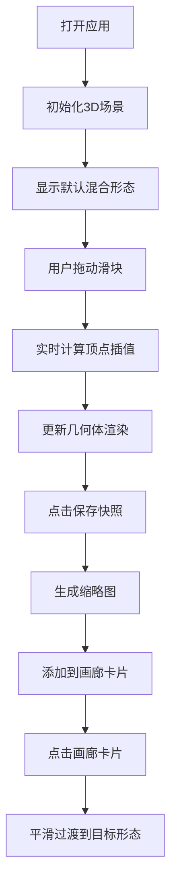

# MorphVault 产品需求文档

## 1. 产品概述

MorphVault 是一个交互式三维形态存档与变形应用，用户可以通过拖拽滑块实时混合多个预设的三维几何体，生成平滑变形的新形态，并可将形态快照保存到画廊中回顾。

- **核心价值**：提供直观的几何形态探索工具，让用户通过简单的交互创造独特的3D形态
- **目标用户**：设计师、艺术家、3D爱好者、教育工作者
- **产品定位**：轻量级、高性能的浏览器端3D形态创作工具

## 2. 核心功能

### 2.1 用户角色

| 角色 | 注册方式 | 核心权限 |
|------|----------|----------|
| 普通用户 | 无需注册，直接使用 | 浏览形态、混合变形、保存快照、恢复形态 |

### 2.2 功能模块

1. **3D场景渲染模块**：实时渲染变形几何体，支持旋转查看
2. **形态混合控制模块**：四个滑块控制基础形状的混合权重
3. **画廊管理模块**：保存、浏览、恢复形态快照

### 2.3 页面详情

| 页面名称 | 模块名称 | 功能描述 |
|----------|----------|----------|
| 主页面 | 3D场景 | 全屏Three.js场景，展示变形几何体，支持鼠标拖拽旋转 |
| 主页面 | 控制面板 | 底部中央透明控制面板，包含四个混合滑块和保存按钮 |
| 主页面 | 画廊侧边栏 | 右侧固定宽度侧边栏，展示保存的形态快照卡片网格 |

## 3. 核心流程

### 主要用户流程
1. 用户打开应用，看到默认混合形态的3D几何体
2. 用户拖动底部滑块，实时观察形态变形效果
3. 用户满意当前形态时，点击"保存快照"按钮
4. 保存的形态以缩略图卡片形式出现在右侧画廊
5. 用户点击画廊中的卡片，场景平滑过渡到该形态
6. 用户可以编辑形态名称，滚动浏览最多20个快照

### 流程图

## 4. 用户界面设计

### 4.1 设计风格

- **主题风格**：深色科技风，深蓝灰背景搭配蓝色高亮
- **主色调**：背景 `#1a1a2e`，高亮 `#00aaff`
- **文字颜色**：白色 `#ffffff`
- **滑块样式**：轨道灰色 `#555`，手柄蓝色 `#00aaff`
- **卡片样式**：圆角8px，阴影 `box-shadow 0 4px 8px rgba(0,0,0,0.3)`
- **动画风格**：所有交互元素0.2秒平滑过渡，悬停有放大或高亮反馈

### 4.2 页面设计概述

| 页面名称 | 模块名称 | UI元素 |
|----------|----------|--------|
| 主页面 | 3D场景 | 全屏Canvas，几何体居中，深色背景，环境光+点光源 |
| 主页面 | 控制面板 | 底部居中，半透明黑色背景，圆角16px，内边距20px，包含四个水平滑块和保存按钮 |
| 主页面 | 画廊侧边栏 | 右侧240px宽，灰色半透明背景，从右侧滑入动画，卡片网格布局，垂直滚动 |

### 4.3 响应式

- 桌面端优先设计
- 画廊侧边栏固定宽度240px
- 控制面板自适应内容宽度
- 3D场景自适应窗口大小

### 4.4 3D场景指导

- **环境与氛围**：深色星空/深空背景，营造科技感和沉浸感
- **光照设置**：环境光 + 两盏点光源，确保几何体各面都有良好的光照表现
- **相机设置**：透视相机，初始距离适中，支持OrbitControls轨道控制
- **构图与焦点**：几何体居中，占据画面主体区域
- **交互与动画**：自动缓慢旋转，鼠标拖拽可手动旋转，形态过渡动画平滑
- **后处理效果**：可选抗锯齿，确保边缘平滑
- **资产来源与性能预算**：纯程序化生成几何体，无外部资源，目标60FPS

## 5. 性能要求

- 场景渲染保持60FPS
- 滑块变化时几何体更新帧延迟不超过16ms
- 快照保存和恢复操作响应时间不超过50ms
- 最多保存20个快照，超出时自动删除最早的
