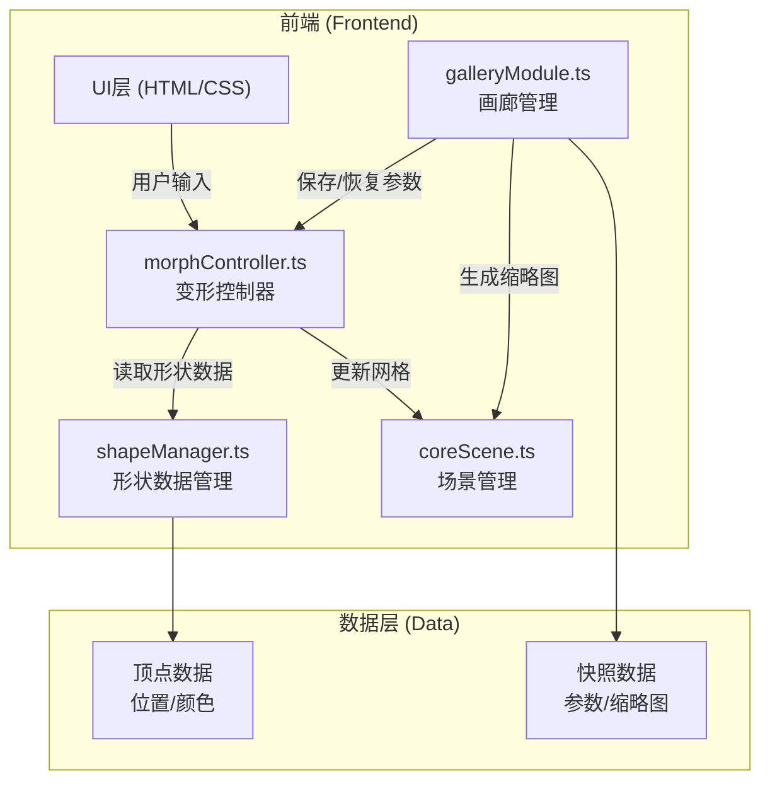

# MorphVault 技术架构文档

## 1. 架构设计



## 2. 技术描述

- **前端框架**：原生 TypeScript (无React/Vue框架，用户明确指定)
- **3D引擎**：Three.js (最新稳定版)
- **构建工具**：Vite
- **UI组件**：原生HTML/CSS + dat.GUI (用户指定依赖)
- **开发语言**：TypeScript 严格模式

### 技术选型说明
用户明确指定使用 TypeScript + Three.js + Vite 技术栈，不使用React/Vue等框架，采用模块化架构设计。

## 3. 文件结构

```
auto69/
├── package.json              # 项目依赖和脚本
├── vite.config.js            # Vite构建配置
├── tsconfig.json             # TypeScript配置
├── index.html                # 入口HTML
└── src/
    ├── coreScene.ts          # Three.js场景、相机、渲染器管理
    ├── shapeManager.ts       # 预设几何体数据管理
    ├── morphController.ts    # 形态混合与变形控制
    ├── galleryModule.ts      # 画廊快照管理
    └── style.css             # 全局样式
```

## 4. 模块定义

### 4.1 coreScene.ts
- **职责**：创建Three.js场景、相机、渲染器，提供场景初始化与渲染函数
- **接口**：
  - `initScene(container: HTMLElement): void` - 初始化场景
  - `render(): void` - 渲染一帧
  - `getScene(): THREE.Scene` - 获取场景对象
  - `getRenderer(): THREE.WebGLRenderer` - 获取渲染器
  - `getCamera(): THREE.PerspectiveCamera` - 获取相机
  - `setMesh(mesh: THREE.Mesh): void` - 设置当前显示的网格
  - `renderThumbnail(width: number, height: number): string` - 渲染缩略图并返回dataURL

### 4.2 shapeManager.ts
- **职责**：管理预设几何体的网格数据，提供顶点和面数据接口
- **预设形状**：球体(Sphere)、立方体(Cube)、环面(Torus)、八面体(Octahedron)
- **接口**：
  - `getShapeVertices(shapeName: string): Float32Array` - 获取形状顶点位置
  - `getShapeColors(shapeName: string): Float32Array` - 获取形状顶点颜色
  - `getShapeIndex(shapeName: string): Uint32Array` - 获取形状索引
  - `getVertexCount(): number` - 获取顶点数量（所有形状统一）

### 4.3 morphController.ts
- **职责**：接收混合比例参数，插值生成变形几何体，更新场景网格
- **数据流向**：从shapeManager读取预设形状数据 → 插值计算 → 更新coreScene中的网格
- **接口**：
  - `setWeights(w1: number, w2: number, w3: number, w4: number): void` - 设置混合权重
  - `getWeights(): [number, number, number, number]` - 获取当前权重
  - `update(deltaTime: number): void` - 每帧更新，处理平滑过渡动画
  - `setTargetWeights(w1: number, w2: number, w3: number, w4: number): void` - 设置目标权重（带动画）

### 4.4 galleryModule.ts
- **职责**：管理形态快照，提供缩略图展示和恢复功能
- **数据流向**：读取morphController的当前参数保存为快照 → 恢复时反向传递参数
- **接口**：
  - `saveSnapshot(name: string): void` - 保存当前形态为快照
  - `restoreSnapshot(id: string): void` - 恢复指定快照形态
  - `deleteSnapshot(id: string): void` - 删除快照
  - `getSnapshots(): Snapshot[]` - 获取所有快照列表
  - `updateName(id: string, name: string): void` - 更新快照名称

## 5. 数据模型

### 5.1 形状数据结构

```typescript
interface ShapeData {
  positions: Float32Array;  // 顶点位置 (x, y, z) * vertexCount
  colors: Float32Array;     // 顶点颜色 (r, g, b) * vertexCount
  indices: Uint32Array;     // 面索引
  vertexCount: number;      // 顶点数量
}
```

### 5.2 快照数据结构

```typescript
interface Snapshot {
  id: string;               // 唯一标识
  name: string;             // 形态名称
  weights: [number, number, number, number];  // 四个形状的权重
  thumbnail: string;        // 缩略图 dataURL
  createdAt: number;        // 创建时间戳
}
```

## 6. 关键技术实现

### 6.1 顶点颜色渐变
- 根据顶点Y轴位置（高度）从蓝色到红色渐变
- 使用 `lerp` 函数在蓝色 `(0, 0, 1)` 和红色 `(1, 0, 0)` 之间插值
- 每个形状单独计算颜色，确保渐变范围匹配形状尺寸

### 6.2 权重归一化
- 四个滑块值总和可能不等于1
- 使用归一化公式：`normalizedWeight = weight / sumOfAllWeights`
- 所有权重为0时，使用默认权重（各0.25）

### 6.3 平滑变形动画
- 使用线性插值 (Lerp) 在当前权重和目标权重之间过渡
- 过渡时间：滑块拖动时0.2秒，画廊恢复时0.3秒
- 每帧更新几何体attributes.position和attributes.color
- 标记 `needsUpdate = true` 触发GPU数据更新

### 6.4 缩略图生成
- 使用离屏Canvas或直接复用主渲染器
- 渲染当前形态到较小尺寸（如120x120）
- 转换为base64 dataURL存储在内存中

### 6.5 性能优化
- 顶点数量统一为足够数量（≥400），避免动态调整
- 使用BufferGeometry，直接修改attribute数组
- 仅在权重变化时更新几何体，静止时不更新
- 缩略图缓存，避免重复渲染

## 7. 构建配置

### Vite配置
- 路径别名：`@` 指向 `src` 目录
- 开发服务器端口：默认5173
- 构建输出：`dist` 目录

### TypeScript配置
- 严格模式 (strict: true)
- 目标：ES2020
- 模块：ES2020
- 模块解析：Bundler
- 路径别名与Vite配置一致
