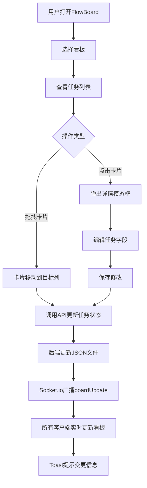

## 1. 产品概述

FlowBoard 是一款轻量级企业级任务看板系统，旨在为团队提供直观的协作与状态流转跟踪工具。通过拖拽式卡片交互和实时同步机制，让团队成员高效管理任务进度，消除沟通延迟，提升项目交付效率。

- 核心问题：团队缺乏轻量级可视化任务管理工具，现有方案过重或缺乏实时协作能力
- 目标用户：中小型研发团队、项目组，需要简洁高效的看板式任务管理

## 2. 核心功能

### 2.1 用户角色

| 角色 | 使用方式 | 核心权限 |
|------|----------|----------|
| 团队成员 | 直接访问 | 查看看板、拖拽任务、编辑任务详情 |
| 团队负责人 | 直接访问 | 所有成员权限 + 创建/管理看板 |

### 2.2 功能模块

1. **看板页面**：看板导航切换、任务列表展示、任务卡片拖拽、任务详情编辑
2. **实时同步**：多用户实时协作、变更Toast通知

### 2.3 页面详情

| 页面名称 | 模块名称 | 功能描述 |
|----------|----------|----------|
| 看板页面 | 顶部导航栏 | 显示所有看板名称标签，点击切换看板，0.3秒渐入动画 |
| 看板页面 | 任务列表面板 | 按列展示任务（待办/进行中/完成），列标题带任务计数徽章 |
| 看板页面 | 任务卡片 | 显示标题、优先级标签（红/黄/绿）、截止日期，支持拖拽 |
| 看板页面 | 详情编辑模态框 | 点击卡片弹出，可编辑标题、描述、优先级、截止日期、负责人 |
| 看板页面 | Toast通知 | 实时同步时显示"XX更新了任务：XXX" |

## 3. 核心流程

用户打开FlowBoard → 选择看板 → 查看任务列表 → 拖拽卡片更新状态 → 其他用户实时收到更新通知。点击卡片 → 弹出详情模态框 → 编辑字段 → 保存 → 列表立即刷新且同步到所有在线用户。

## 4. 界面设计

### 4.1 设计风格

- 主色：#4A90D9（柔和蓝灰），辅色：#E8F0FE（淡蓝背景）
- 按钮/标签：圆角8px，hover时0.15秒颜色过渡
- 字体：标题使用Noto Sans SC Bold，正文使用Noto Sans SC Regular
- 布局：顶部固定导航栏，看板内容区左右排列列
- 卡片：白色圆角矩形带阴影，拖拽时阴影加深
- 图标：使用lucide-react图标库

### 4.2 页面设计概览

| 页面名称 | 模块名称 | UI元素 |
|----------|----------|--------|
| 看板页面 | 顶部导航栏 | 固定定位，蓝灰背景，看板标签按钮带hover高亮，当前看板下划线标识 |
| 看板页面 | 任务列表面板 | 三列并排（桌面），列标题+计数徽章，列间8px间距，列内卡片垂直堆叠 |
| 看板页面 | 任务卡片 | 白色圆角8px卡片，左侧优先级色条，标题加粗，优先级标签+截止日期，hover阴影加深 |
| 看板页面 | 详情模态框 | 居中浮层，半透明遮罩，表单字段纵向排列，保存/取消按钮 |
| 看板页面 | Toast通知 | 右下角弹出，蓝色边框，3秒后自动消失 |

### 4.3 响应式设计

- 桌面端（≥1024px）：三列并排展示
- 平板端（768px-1023px）：两列并排展示
- 手机端（<768px）：单列堆叠展示

### 4.4 动画效果

- 看板切换：0.3秒渐入（opacity + translateY）
- 任务卡片移入列表：0.2秒缩放弹入（scale 0.9→1 + opacity）
- 拖拽卡片：半透明跟随光标，阴影加深
- 所有可交互元素：0.15秒颜色过渡hover效果
