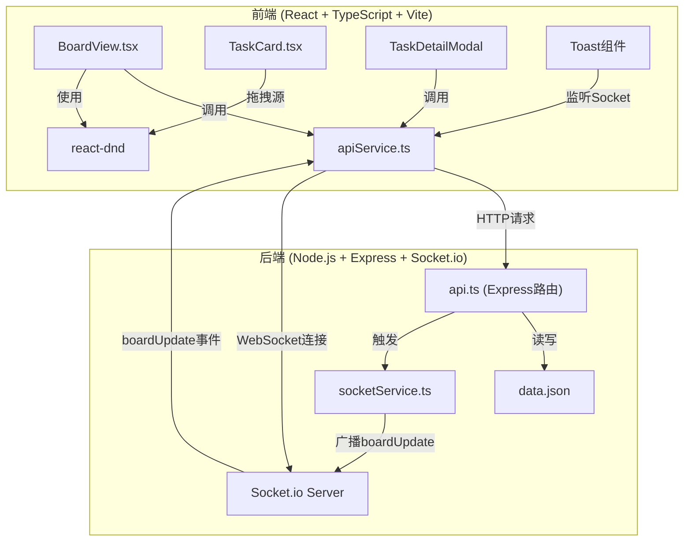
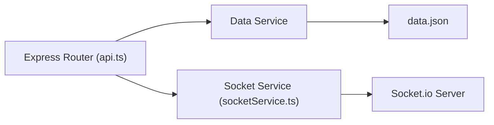
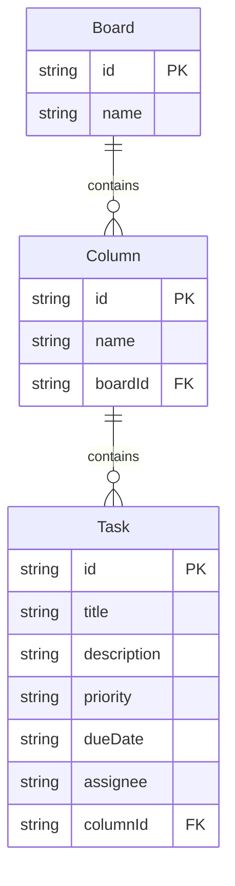

## 1. 架构设计



## 2. 技术说明

- 前端：React@18 + TypeScript + Vite + react-dnd + Socket.io-client + axios + dayjs + zustand + tailwindcss
- 初始化工具：vite-init（react-express-ts模板）
- 后端：Express@4 + Socket.io + cors + uuid
- 数据库：本地JSON文件存储（server/data.json）
- 状态管理：zustand管理前端看板状态
- 实时通信：Socket.io实现多客户端同步

## 3. 路由定义

| 路由 | 用途 |
|------|------|
| / | 主页面，展示看板面板 |

## 4. API定义

### 4.1 TypeScript类型定义

```typescript
interface Task {
  id: string;
  title: string;
  description: string;
  priority: "high" | "medium" | "low";
  dueDate: string;
  assignee: string;
}

interface Column {
  id: string;
  name: string;
  tasks: Task[];
}

interface Board {
  id: string;
  name: string;
  columns: Column[];
}

interface BoardData {
  boards: Board[];
}
```

### 4.2 API端点

| 方法 | 路径 | 请求体 | 响应 | 用途 |
|------|------|--------|------|------|
| GET | /api/boards | - | BoardData | 获取所有看板数据 |
| GET | /api/board/:id | - | Board | 获取单个看板数据 |
| PUT | /api/task/:id | { task: Task, columnId: string, boardId: string } | Task | 更新任务（含状态流转） |
| POST | /api/task | { task: Task, columnId: string, boardId: string } | Task | 创建新任务 |
| DELETE | /api/task/:id | { columnId: string, boardId: string } | { success: boolean } | 删除任务 |

### 4.3 Socket.io事件

| 事件名 | 方向 | 数据 | 用途 |
|--------|------|------|------|
| boardUpdate | Server→Client | { boardId: string, action: string, task: Task, user: string } | 广播看板变更 |

## 5. 服务器架构图



## 6. 数据模型

### 6.1 数据模型定义



### 6.2 初始数据

```json
{
  "boards": [
    {
      "id": "board-1",
      "name": "产品研发看板",
      "columns": [
        {
          "id": "col-todo",
          "name": "待办",
          "tasks": [
            {
              "id": "task-1",
              "title": "用户登录页面设计",
              "description": "完成登录页面的UI设计和交互稿",
              "priority": "high",
              "dueDate": "2026-06-20",
              "assignee": "张三"
            },
            {
              "id": "task-2",
              "title": "API接口文档编写",
              "description": "编写后端API的Swagger文档",
              "priority": "medium",
              "dueDate": "2026-06-22",
              "assignee": "李四"
            }
          ]
        },
        {
          "id": "col-inprogress",
          "name": "进行中",
          "tasks": [
            {
              "id": "task-3",
              "title": "数据库表结构设计",
              "description": "设计用户和订单相关的数据库表",
              "priority": "high",
              "dueDate": "2026-06-18",
              "assignee": "王五"
            }
          ]
        },
        {
          "id": "col-done",
          "name": "完成",
          "tasks": [
            {
              "id": "task-4",
              "title": "需求评审会议",
              "description": "组织团队进行需求评审",
              "priority": "low",
              "dueDate": "2026-06-15",
              "assignee": "赵六"
            }
          ]
        }
      ]
    },
    {
      "id": "board-2",
      "name": "运营管理看板",
      "columns": [
        {
          "id": "col-todo-2",
          "name": "待办",
          "tasks": [
            {
              "id": "task-5",
              "title": "月度运营报告",
              "description": "编写6月份运营数据报告",
              "priority": "medium",
              "dueDate": "2026-06-30",
              "assignee": "钱七"
            }
          ]
        },
        {
          "id": "col-inprogress-2",
          "name": "进行中",
          "tasks": []
        },
        {
          "id": "col-done-2",
          "name": "完成",
          "tasks": []
        }
      ]
    }
  ]
}
```
