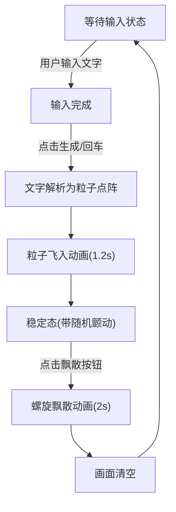

## 1. 产品概述

粒子书法动画生成器是一款沉浸式文字艺术体验应用，将用户输入的中英文文本实时转化为动态粒子书法动画，解决网页静态文字缺乏视觉冲击力的问题。

- 核心目标：让普通文字通过粒子动画获得艺术表现力，提供流畅、可交互的视觉体验
- 目标用户：设计师、创作者、营销人员、艺术爱好者以及所有希望为文字赋予视觉魅力的用户

## 2. 核心功能

### 2.1 功能模块

1. **主画布区域**：粒子动画渲染、FPS 实时显示
2. **文本输入模块**：最多40字符输入框，支持回车键触发生成
3. **动画控制模块**：生成动画按钮、开始飘散按钮、颜色选择器
4. **状态管理模块**：等待态→飞入态→稳定态→飘散态 四态切换

### 2.2 页面详情

| 页面名称 | 模块名称 | 功能描述 |
|-----------|-------------|---------------------|
| 主页面 | 粒子画布 | 使用Canvas 2D渲染粒子动画，支持文字粒子飞入、稳定颤动、螺旋飘散三种动画状态 |
| 主页面 | 输入工具栏 | 毛玻璃半透明工具栏，包含文本输入框、颜色选择器、生成动画按钮、飘散按钮 |
| 主页面 | FPS 计数器 | 画布左下角实时显示当前帧率，便于性能监控 |

## 3. 核心流程

用户在输入框输入文字 → 点击"生成动画"或按回车 → 文字被解析为粒子网格点阵 → 每个粒子从屏幕四角沿三阶贝塞尔曲线飞入 → 粒子颜色从随机亮色渐变至目标色 → 飞入完成后粒子进入稳定颤动状态 → 用户点击"开始飘散" → 粒子沿对数螺旋路径向外扩散 → 透明度渐降为0 → 画面恢复空白等待下一轮输入

## 4. 用户界面设计

### 4.1 设计风格

- **配色方案**：深色渐变背景（#0A0A1A → #1A1A2E），默认粒子目标色浅金色 #FFD700
- **按钮风格**：圆角胶囊形，悬停上浮 translateY(-2px) + 阴影，点击缩放 0.95 回弹
- **字体**：系统默认无衬线字体，确保中英文渲染清晰
- **布局风格**：居中画布 + 底部毛玻璃工具栏，左右各留 16px 安全边距
- **氛围营造**：毛玻璃 backdrop-filter: blur(10px) 工具栏增强沉浸感

### 4.2 页面设计概述

| 页面名称 | 模块名称 | UI 元素 |
|-----------|-------------|-------------|
| 主页面 | 粒子画布 | 宽度100%，高度为宽度的60%（移动端75%），深色渐变背景，Canvas 渲染层 |
| 主页面 | 毛玻璃工具栏 | 固定于画布下方，blur(10px) 半透明效果，圆角设计 |
| 主页面 | 输入框 | 最大40字符提示，深色填充，聚焦发光边框 |
| 主页面 | 操作按钮 | 胶囊形圆角，悬停上浮+阴影，点击回弹动画 |
| 主页面 | 颜色选择器 | 色盘组件，默认值 #FFD700 |
| 主页面 | FPS 显示 | 画布左下角，浅色小号文字 |

### 4.3 响应式设计

- **桌面端（≥768px）**：按钮水平排列，画布高度 = 宽度 × 60%
- **移动端（<768px）**：按钮竖向堆叠，输入框宽度100%，画布高度 = 宽度 × 75%

## 5. 性能与动画规格

| 参数 | 规格要求 |
|------|----------|
| 粒子数/字 | 80-120个（平均100个） |
| 最大总粒子数 | 4000个（40字 × 100个） |
| 目标帧率 | 60 FPS |
| 单次动画CPU占用 | ≤ 30% |
| 飞入动画时长 | 1.2秒 |
| 粒子延迟范围 | 0-0.6秒随机 |
| 飘散动画时长 | 2秒 |
| 稳定颤动幅度 | ±2像素，1.5Hz |
| 粒子直径 | 3像素 |
| 飞入路径 | 三阶贝塞尔曲线（平滑弧线） |
| 飘散路径 | 对数螺旋 R = R₀ × exp(0.3θ) |
| 颜色模式 | HSLA 亮色渐变 → 目标填充色 |
