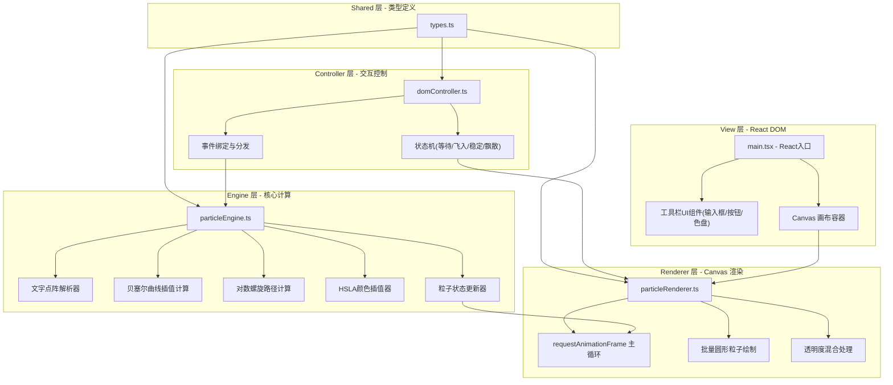

## 1. 架构设计

本项目为纯前端单页应用，采用分层架构设计，将粒子计算、渲染、DOM 交互严格分离，确保高性能与可维护性。



## 2. 技术选型说明

| 层级 | 技术方案 | 选型理由 |
|------|----------|----------|
| 前端框架 | React 18 + TypeScript | 组件化开发，类型安全，与用户需求一致 |
| 构建工具 | Vite 5.x | 极速冷启动，HMR 热更新，开箱即用的 TS/React 支持 |
| 渲染引擎 | Canvas 2D Context | 粒子渲染首选方案，相比 DOM/SVG 性能高 10 倍以上，支持 4000+ 粒子 60FPS |
| 状态管理 | 自定义状态机 (domController) | 4 态切换简单明确，无需引入 zustand 等额外依赖 |
| 样式方案 | 原生 CSS (styles.css) | 用户明确指定，无需 Tailwind |
| 路径算法 | 三阶贝塞尔曲线 | 4 控制点定义平滑弧线，计算量小，视觉效果自然 |
| 飘散算法 | 对数螺旋公式 R=R₀×exp(0.3θ) | 符合书法墨迹飘散的自然形态，数学表达简洁 |
| 颜色插值 | HSLA 线性插值 | 色相/饱和度/亮度/透明度四维插值，渐变平滑无断层 |
| 文字解析 | 离屏 Canvas + 像素采样 | 通用方案，支持任意中英文及符号字符渲染为点阵 |

## 3. 核心文件职责定义

### 3.1 文件清单与职责

| 文件路径 | 职责描述 | 代码量预估 |
|----------|----------|-----------|
| `package.json` | 依赖声明与脚本配置，指定 react/react-dom/typescript/vite/@vitejs/plugin-react | ~30 行 |
| `index.html` | 入口 HTML，挂载 #root 容器，定义全屏画布容器与工具栏 DOM 结构 | ~40 行 |
| `vite.config.js` | Vite 配置，定义 `@` 路径别名指向 `src` 目录 | ~20 行 |
| `tsconfig.json` | TypeScript 严格模式配置，ES2020 模块系统，路径别名映射 | ~50 行 |
| `src/types.ts` | Particle 接口、Word 接口、AppState 枚举、HSLA/RGB 颜色类型 | ~60 行 |
| `src/particleEngine.ts` | 粒子生成、贝塞尔插值、对数螺旋、颜色插值、逐帧状态更新核心计算 | ~280 行 |
| `src/particleRenderer.ts` | requestAnimationFrame 循环、Canvas 2D 批量绘制、透明度混合、FPS 计算 | ~150 行 |
| `src/domController.ts` | 输入框/按钮事件绑定、4 态状态机、动画生命周期管理、FPS DOM 更新 | ~180 行 |
| `src/styles.css` | 深色渐变背景、毛玻璃工具栏、胶囊按钮、悬停/点击动画、响应式断点 | ~180 行 |
| `src/main.tsx` | React 入口、Canvas 挂载、三大模块（Engine/Renderer/DOM）初始化与主循环启动 | ~60 行 |

### 3.2 关键类型定义（types.ts 摘要）

```typescript
// 应用状态枚举
export enum AppState {
  IDLE = 'idle',           // 等待输入
  FLYING_IN = 'flying_in', // 粒子飞入中
  STABLE = 'stable',       // 稳定显示+颤动
  DISPERSING = 'dispersing' // 飘散中
}

// 粒子核心接口
export interface Particle {
  id: number;
  // 当前位置
  x: number;
  y: number;
  // 目标位置（文字点阵位置）
  targetX: number;
  targetY: number;
  // 起始位置（屏幕四角）
  startX: number;
  startY: number;
  // 贝塞尔曲线控制点（三阶，2个控制点）
  cp1x: number;
  cp1y: number;
  cp2x: number;
  cp2y: number;
  // 颜色状态
  currentColor: HSLA;
  startColor: HSLA;
  targetColor: HSLA;
  // 透明度
  opacity: number;
  // 时间控制
  delay: number;      // 0-0.6s 随机延迟
  startTime: number;  // 飞入起始时间戳
  duration: number;   // 飞入时长 1.2s
  // 飘散参数
  spiralAngle: number;
  spiralRadius: number;
  spiralStartAngle: number;
  // 粒子大小
  size: number;
  // 颤动偏移
  tremorPhase: number;
}

// 文字解析结果
export interface Word {
  char: string;
  particles: Particle[];
  centerX: number;
  centerY: number;
}

// HSLA 颜色
export interface HSLA {
  h: number; // 0-360
  s: number; // 0-100 (%)
  l: number; // 0-100 (%)
  a: number; // 0-1
}
```

### 3.3 文字点阵解析算法

1. 创建离屏 Canvas，尺寸 64×64 像素
2. 用 `fillText` 绘制目标字符（粗体，居中）
3. 使用 `getImageData` 获取像素数据
4. 遍历像素矩阵，提取 alpha > 阈值（如 128）的像素坐标
5. 在提取的像素中按等间距采样（步长 2-3px），得到 80-120 个点/字
6. 将相对坐标按画布尺寸和文字排版位置映射为绝对坐标

### 3.4 动画时序公式

**飞入阶段（0 ≤ t' ≤ 1，t' = (now - startTime - delay) / duration）**
```
贝塞尔位置：B(t') = (1-t')³P₀ + 3(1-t')²t'P₁ + 3(1-t')t'²P₂ + t'³P₃
缓动函数：easeInOutCubic(t') = t'<0.5 ? 4t'³ : 1-(-2t'+2)³/2
颜色插值：color = lerpHSLA(startColor, targetColor, easeInOutCubic(t'))
```

**稳定阶段**
```
tremorX = sin(timestamp × 2π × 1.5Hz + tremorPhase) × 2px
tremorY = cos(timestamp × 2π × 1.5Hz + tremorPhase) × 2px × 0.7
```

**飘散阶段（0 ≤ t' ≤ 1）**
```
θ = spiralStartAngle + t' × 4π  (旋转2圈)
R = initialDistance × exp(0.3 × θ × t')
x = targetX + R × cos(θ)
y = targetY + R × sin(θ)
opacity = 1.0 - easeInOutCubic(t')
```

## 4. 性能优化策略

1. **Canvas 尺寸管理**：使用 `devicePixelRatio` 适配高清屏，但限制最大 DPR=2 避免像素过多
2. **批量绘制**：所有粒子共享一次 `beginPath()` + 多次 `arc()` + 单次 `fill()`，减少状态切换
3. **对象池复用**：粒子对象在飘散结束后复用而非重建，减少 GC 压力
4. **离屏预渲染**：文字点阵解析只在用户提交输入时执行一次，不在动画循环中
5. **数学计算缓存**：sin/cos 高频值用查表法，贝塞尔计算展开为多项式避免重复运算
6. **时间戳驱动**：使用 `performance.now()` 基于实际时间计算位置，而非帧计数，保证不同帧率下动画时长一致

## 5. 项目初始化步骤

1. 使用 `npm init vite-init@latest` 创建 React+TS 项目骨架
2. 按用户需求调整 package.json 依赖（去除 tailwind/zustand/router 等未用依赖）
3. 创建用户指定的 9 个核心文件
4. 删除 Vite 模板默认的 App.tsx、assets 等冗余文件
5. 运行 `npm install` 安装依赖
6. 执行 `npm run dev` 验证启动与热更新
