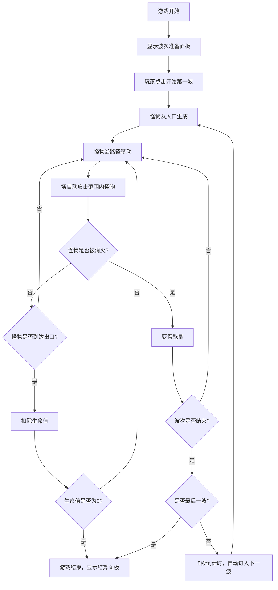

## 1. 产品概述

CrystalSiege是一款基于六边形网格的塔防游戏，玩家通过布置三种元素水晶塔（冰霜、火焰、雷电）来抵御沿路径移动的怪物波次。游戏融合了策略性塔防玩法与精美的粒子特效，为玩家提供沉浸式的塔防体验。

- 核心玩法：在六边形网格上放置防御塔，阻止怪物从入口到达出口
- 目标用户：休闲游戏玩家、塔防游戏爱好者
- 产品价值：提供策略性与视觉观赏性兼具的塔防游戏体验

## 2. 核心功能

### 2.1 功能模块

1. **游戏主界面**：六边形网格地图、塔放置区、怪物路径、UI信息面板
2. **塔防系统**：三种水晶塔的建造、升级、售卖功能
3. **怪物波次系统**：10波怪物生成、移动、生命值管理
4. **战斗系统**：塔攻击逻辑、怪物元素抗性、状态效果（减速、灼烧、麻痹）
5. **资源系统**：能量获取与消耗、生命值管理
6. **视觉特效系统**：粒子效果、动画过渡、界面反馈

### 2.2 页面详情

| 页面名称 | 模块名称 | 功能描述 |
|-----------|-------------|---------------------|
| 游戏主界面 | 六边形网格地图 | 10x8网格，可放置塔或作为路径 |
| 游戏主界面 | 塔交互面板 | 点击空地选择塔类型建造，点击已有塔升级/售卖 |
| 游戏主界面 | 顶部状态栏 | 显示生命值（心形图标）和能量值（水晶图标） |
| 游戏主界面 | 右下角波次面板 | 显示当前波次、倒计时、开始按钮 |
| 游戏主界面 | 游戏结束面板 | 显示结算信息（波次、杀敌数、评分）和重新开始按钮 |
| 游戏主界面 | 波次准备面板 | 显示波次信息和开始按钮 |

## 3. 核心流程

## 4. 用户界面设计

### 4.1 设计风格

- **主色调**：深蓝紫渐变背景（#0a0a2e到#1a1a4e），营造神秘水晶氛围
- **强调色**：
  - 冰霜塔：冰蓝色（#60d0ff）
  - 火焰塔：橙红色（#ff6040）
  - 雷电塔：亮紫色（#c060ff）
  - 路径：金黄色（#f0d060）
  - 生命值：红色（#ff4060）
  - 能量值：青色（#40fff0）
- **按钮风格**：圆角矩形，细微阴影，悬停时放大1.1倍并改变背景色
- **字体**：系统默认无衬线字体，保持清晰可读性
- **布局**：居中布局，16:9比例响应式适配
- **视觉特效**：
  - 塔建造：0.4秒缩放弹入动画
  - 塔升级：0.5秒旋转一圈并闪烁光效
  - 攻击特效：冰霜冰晶粒子、火焰燃烧粒子、雷电白色闪光

### 4.2 页面设计概述

| 页面名称 | 模块名称 | UI元素 |
|-----------|-------------|-------------|
| 游戏主界面 | 六边形网格 | 深灰色格子（#2a2a4e），黄色路径格子（#f0d060），悬停高亮 |
| 游戏主界面 | 顶部状态栏 | 左侧心形图标+红色生命值数字，右侧水晶图标+青色能量数字，半透明圆角背景 |
| 游戏主界面 | 右下角波次面板 | 当前波次/总波数，倒计时数字，开始按钮，半透明圆角背景 |
| 游戏主界面 | 塔建造面板 | 三种塔图标、名称、能量消耗，点击选中，能量不足时灰色禁用 |
| 游戏主界面 | 塔操作面板 | 升级按钮（显示消耗能量）、售卖按钮（返还70%能量） |
| 游戏主界面 | 游戏结束面板 | 全屏半透明黑色遮罩，中央白色圆角结算面板，重新开始按钮 |

### 4.3 响应式设计

- 采用桌面优先设计，视口保持16:9比例
- 使用CSS vmin单位确保游戏画布在不同屏幕尺寸下正确缩放
- 所有UI元素相对画布定位，保持视觉比例一致
- 触摸设备支持点击交互

### 4.4 视觉层次

- 背景层：深蓝紫渐变
- 地图层：六边形网格、路径
- 实体层：塔、怪物
- 特效层：粒子、攻击动画
- UI层：状态信息、按钮、面板
