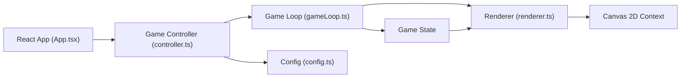

## 1. 架构设计



## 2. 技术描述

- **前端框架**：React@18 + TypeScript
- **构建工具**：Vite@5 + @vitejs/plugin-react
- **渲染引擎**：HTML5 Canvas 2D API
- **状态管理**：React useState + useRef（游戏状态），React Context（UI状态）
- **样式方案**：CSS Modules + CSS Variables

## 3. 核心模块设计

### 3.1 文件结构

| 文件 | 职责 |
|------|------|
| `src/config.ts` | 游戏常量定义：网格尺寸、塔属性、怪物属性、波次配置 |
| `src/gameLoop.ts` | 游戏主循环：帧更新、塔攻击、怪物移动、碰撞检测 |
| `src/renderer.ts` | Canvas渲染：六边形网格、塔、怪物、粒子特效绘制 |
| `src/controller.ts` | 输入处理：鼠标事件、塔放置/升级/售卖交互 |
| `src/App.tsx` | React根组件：画布挂载、UI渲染、生命周期管理 |
| `src/types.ts` | TypeScript类型定义 |
| `src/index.css` | 全局样式 |
| `src/main.tsx` | 应用入口 |

### 3.2 数据结构

#### 六边形坐标系统
```typescript
interface HexCoord {
  q: number; // 列坐标 (0-9)
  r: number; // 行坐标 (0-7)
}
```

#### 塔类型定义
```typescript
type TowerType = 'frost' | 'fire' | 'lightning';
type TowerLevel = 1 | 2 | 3;

interface Tower {
  id: string;
  type: TowerType;
  level: TowerLevel;
  position: HexCoord;
  pixelPosition: { x: number; y: number };
  cooldown: number;
  buildAnimation: number;
  upgradeAnimation: number;
  rangeAnimation: number;
}
```

#### 怪物类型定义
```typescript
type MonsterType = 'normal' | 'elite';
type ElementType = 'frost' | 'fire' | 'lightning' | 'none';

interface Monster {
  id: string;
  type: MonsterType;
  health: number;
  maxHealth: number;
  speed: number;
  baseSpeed: number;
  pathProgress: number;
  position: { x: number; y: number };
  resistances: Record<ElementType, number>;
  effects: {
    frost: { remaining: number; slowFactor: number };
    fire: { remaining: number; damagePerSecond: number };
    lightning: { remaining: number };
  };
  trail: Array<{ x: number; y: number; alpha: number }>;
}
```

#### 粒子系统
```typescript
type ParticleType = 'frost' | 'fire' | 'lightning' | 'build' | 'upgrade' | 'damage';

interface Particle {
  id: string;
  type: ParticleType;
  x: number;
  y: number;
  vx: number;
  vy: number;
  life: number;
  maxLife: number;
  size: number;
  color: string;
}
```

#### 游戏状态
```typescript
interface GameState {
  phase: 'preparing' | 'playing' | 'waveComplete' | 'gameOver' | 'victory';
  currentWave: number;
  totalWaves: number;
  waveCountdown: number;
  lives: number;
  maxLives: number;
  energy: number;
  towers: Tower[];
  monsters: Monster[];
  particles: Particle[];
  path: HexCoord[];
  selectedTowerType: TowerType | null;
  selectedTower: Tower | null;
  hoveredCell: HexCoord | null;
  kills: number;
  totalDamageDealt: number;
}
```

## 4. 核心算法

### 4.1 六边形网格计算
```typescript
// 轴坐标转像素坐标（pointy-top六边形）
function hexToPixel(hex: HexCoord, size: number): { x: number; y: number } {
  const x = size * (Math.sqrt(3) * hex.q + Math.sqrt(3) / 2 * hex.r);
  const y = size * (3 / 2 * hex.r);
  return { x, y };
}

// 像素坐标转轴坐标
function pixelToHex(x: number, y: number, size: number): HexCoord {
  const q = (Math.sqrt(3) / 3 * x - 1 / 3 * y) / size;
  const r = (2 / 3 * y) / size;
  return hexRound({ q, r });
}

// 六边形坐标四舍五入
function hexRound(hex: { q: number; r: number }): HexCoord {
  const s = -hex.q - hex.r;
  let rq = Math.round(hex.q);
  let rr = Math.round(hex.r);
  const rs = Math.round(s);
  
  const qDiff = Math.abs(rq - hex.q);
  const rDiff = Math.abs(rr - hex.r);
  const sDiff = Math.abs(rs - s);
  
  if (qDiff > rDiff && qDiff > sDiff) {
    rq = -rr - rs;
  } else if (rDiff > sDiff) {
    rr = -rq - rs;
  }
  
  return { q: rq, r: rr };
}
```

### 4.2 塔攻击逻辑
```typescript
// 寻找目标
function findTarget(tower: Tower, monsters: Monster[], config: TowerConfig): Monster | null {
  const range = config.range * (1 + (tower.level - 1) * 0.2);
  const rangePixels = range * HEX_SIZE * Math.sqrt(3);
  
  let closest: Monster | null = null;
  let closestProgress = -1;
  
  for (const monster of monsters) {
    const dx = monster.position.x - tower.pixelPosition.x;
    const dy = monster.position.y - tower.pixelPosition.y;
    const distance = Math.sqrt(dx * dx + dy * dy);
    
    if (distance <= rangePixels && monster.pathProgress > closestProgress) {
      closest = monster;
      closestProgress = monster.pathProgress;
    }
  }
  
  return closest;
}
```

### 4.3 怪物路径移动
```typescript
// 根据路径进度获取像素位置
function getPositionOnPath(progress: number, path: HexCoord[], hexSize: number): { x: number; y: number } {
  const totalSegments = path.length - 1;
  const segment = Math.min(Math.floor(progress * totalSegments), totalSegments - 1);
  const segmentProgress = (progress * totalSegments) - segment;
  
  const start = hexToPixel(path[segment], hexSize);
  const end = hexToPixel(path[segment + 1], hexSize);
  
  return {
    x: start.x + (end.x - start.x) * segmentProgress,
    y: start.y + (end.y - start.y) * segmentProgress
  };
}
```

## 5. 性能优化策略

### 5.1 粒子系统优化
- 粒子数量上限：200个，超出时移除最早生成的粒子
- 使用对象池复用粒子对象，减少GC压力
- 粒子更新采用批量处理

### 5.2 渲染优化
- 每帧只重绘变化区域（虽然Canvas需要全帧重绘，但优化绘制顺序）
- 网格背景预渲染到离屏Canvas
- 状态效果使用着色而非逐粒子计算

### 5.3 游戏逻辑优化
- 空间分区：将怪物按网格分区，减少塔搜索目标的范围
- 冷却时间使用增量时间而非固定帧率
- 数组操作优先使用filter/map的不可变更新，但在热路径使用本地缓存

## 6. 配置定义

### 6.1 塔属性配置
```typescript
const TOWER_CONFIGS: Record<TowerType, TowerConfig> = {
  frost: {
    name: '冰霜塔',
    cost: 50,
    damage: 20,
    range: 2.5,
    cooldown: 1.2,
    color: '#60d0ff',
    darkColor: '#2080c0',
    effect: { type: 'slow', factor: 0.5, duration: 2 }
  },
  fire: {
    name: '火焰塔',
    cost: 70,
    damage: 40,
    range: 2,
    cooldown: 2,
    color: '#ff6040',
    darkColor: '#c03020',
    effect: { type: 'burn', damagePerSecond: 10, duration: 3, aoeRadius: 2 }
  },
  lightning: {
    name: '雷电塔',
    cost: 90,
    damage: 80,
    range: 3,
    cooldown: 2.5,
    color: '#c060ff',
    darkColor: '#8030a0',
    effect: { type: 'stun', chance: 0.2, duration: 1 }
  }
};
```

### 6.2 怪物属性配置
```typescript
const MONSTER_CONFIGS: Record<MonsterType, MonsterConfig> = {
  normal: {
    health: 100,
    speed: 1.5,
    reward: 5,
    resistances: { frost: 0, fire: 0, lightning: 0, none: 0 }
  },
  elite: {
    health: 300,
    speed: 1.2,
    reward: 15,
    resistances: { frost: 0.3, fire: 0.3, lightning: 0.3, none: 0 }
  }
};
```

### 6.3 波次配置
```typescript
const WAVE_CONFIGS: WaveConfig[] = Array.from({ length: 10 }, (_, i) => ({
  waveNumber: i + 1,
  monsterCount: 5 + i,
  spawnInterval: 1,
  eliteChance: Math.min(0.1 + i * 0.05, 0.5),
  healthMultiplier: 1 + i * 0.15,
  speedMultiplier: 1 + i * 0.03
}));
```

## 7. 路由定义

这是一个单页游戏应用，无额外路由。

| 路由 | 用途 |
|-------|---------|
| / | 游戏主界面 |
