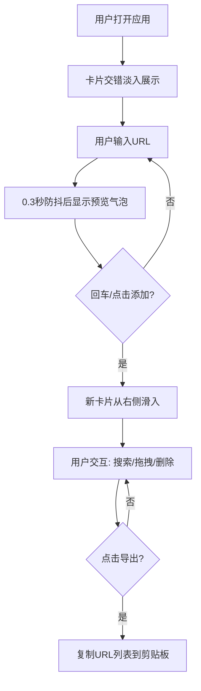

## 1. 产品概述

URL可视化站点预览快照墙应用，解决浏览器收藏夹中书签缺乏直观视觉预览的痛点。用户可快速添加URL链接，以卡片形式展示站点favicon、标题和描述，支持搜索过滤、拖拽排序、一键导出等功能。

- 目标用户：拥有大量书签、需要快速浏览和管理网站收藏的用户
- 产品价值：将枯燥的文字书签转化为可视化的卡片墙，提升查找和管理效率

## 2. 核心功能

### 2.1 功能模块

1. **URL输入模块**：URL输入框、防抖预览气泡、添加按钮
2. **卡片预览墙**：响应式网格布局、卡片展示（favicon/标题/描述）
3. **卡片交互**：悬浮放大、删除动画、拖拽排序
4. **搜索与导出**：实时搜索过滤、一键导出书签到剪贴板

### 2.2 页面详情

| 页面名称 | 模块名称 | 功能描述 |
|-----------|-------------|---------------------|
| 主页 | URL输入区 | 支持http/https协议，回车或点击按钮添加，0.3秒防抖预览气泡显示favicon和域名 |
| 主页 | 搜索与导出栏 | 关键词实时模糊匹配标题和描述，淡入淡出动画；导出按钮复制所有URL到剪贴板 |
| 主页 | 卡片预览墙 | CSS Grid响应式布局，3:2宽高比卡片，磨砂玻璃效果，交错淡入动画 |
| 主页 | 单张卡片 | favicon图标、站点标题、meta描述；悬浮放大1.08倍；右上角删除按钮；HTML5拖拽排序 |

## 3. 核心流程

用户打开应用 → 页面加载时已有卡片交错淡入展示 → 用户粘贴URL → 防抖预览气泡显示 → 回车/点击添加 → 新卡片从右侧滑入 → 用户可搜索过滤（淡入淡出）/拖拽排序（弹性动画）/删除卡片（缩小淡出）→ 点击导出按钮复制所有链接

## 4. 用户界面设计

### 4.1 设计风格

- **主题**：深色主题，背景色 `#1a1a2e`
- **卡片**：磨砂玻璃效果 `rgba(255,255,255,0.08)` + `blur(12px)`，边框 `rgba(255,255,255,0.12)`
- **搜索框**：发光边框 `box-shadow 0 0 8px rgba(100,149,237,0.6)`，输入时过渡到亮蓝色
- **间距**：卡片间距16px，3:2宽高比
- **响应式网格**：`minmax(280px, 1fr)`，1280px→4列，768px→3列，480px→2列

### 4.2 动画效果

- 卡片添加：从屏幕右侧滑入（0.5秒 cubic-bezier）
- 页面加载：卡片交错淡入（每张延迟0.1秒）
- 悬浮放大：scale 1.08，0.2秒 cubic-bezier 过渡
- 删除：缩小淡出（0.3秒）
- 搜索过滤：匹配淡入/不匹配缩小淡出（0.2秒）
- 拖拽排序：松开后弹性缓动重排（0.4秒）

### 4.3 页面设计概览

| 页面名称 | 模块名称 | UI元素 |
|-----------|-------------|-------------|
| 主页 | URL输入区 | 输入框、预览气泡、添加按钮、发光效果 |
| 主页 | 搜索导出栏 | 搜索框（发光边框）、导出按钮（绿色对勾反馈） |
| 主页 | 卡片墙 | 磨砂玻璃卡片网格、favicon、标题、描述、删除图标 |

### 4.4 响应式

- 桌面优先设计
- 断点：1280px（4列）、768px（3列）、480px（2列）
- 移动端触控友好

### 4.5 性能要求

- 50张卡片时，拖拽排序和过滤筛选帧率不低于55fps
