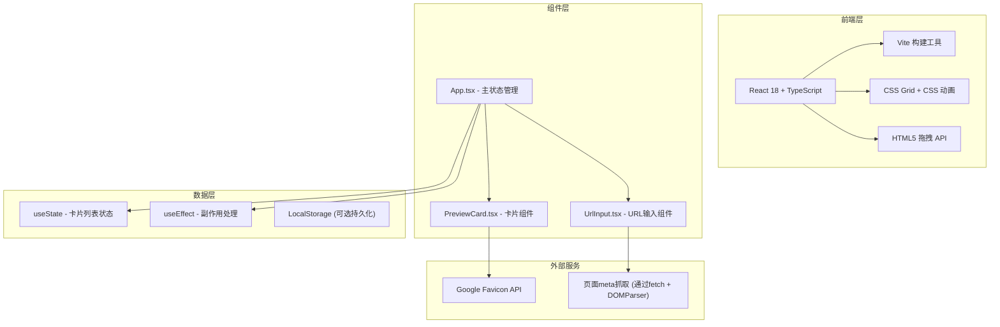

## 1. 架构设计



## 2. 技术描述

- **前端框架**：React 18 + TypeScript
- **构建工具**：Vite
- **样式方案**：原生CSS（含CSS变量、CSS Grid、CSS动画）
- **状态管理**：React useState + useEffect
- **拖拽方案**：原生HTML5 Drag and Drop API
- **Favicon获取**：Google Favicon API (`https://www.google.com/s2/favicons?domain=`)
- **页面元信息抓取**：fetch + DOMParser 解析目标页面的title和meta description

## 3. 项目文件结构

```
auto77/
├── package.json
├── index.html
├── vite.config.js
├── tsconfig.json
└── src/
    ├── main.tsx
    ├── App.tsx
    └── components/
        ├── UrlInput.tsx
        └── PreviewCard.tsx
```

## 4. 核心组件说明

### 4.1 App.tsx
- 管理卡片列表状态（cards: Card[]）
- 管理搜索关键词状态（searchQuery: string）
- 实现搜索过滤逻辑
- 实现拖拽排序逻辑
- 处理卡片添加、删除事件
- 处理书签导出功能

### 4.2 UrlInput.tsx
- 接收 onAdd 回调
- URL输入验证（http/https协议）
- 0.3秒防抖预览气泡
- 回车键和添加按钮触发添加

### 4.3 PreviewCard.tsx
- 展示favicon、标题、描述
- 悬浮放大效果（scale 1.08）
- 删除按钮及缩小淡出动画
- HTML5拖拽事件处理（dragstart, dragover, drop, dragend）

## 5. 数据模型

### 5.1 Card 接口定义

```typescript
interface Card {
  id: string;
  url: string;
  domain: string;
  title: string;
  description: string;
  favicon: string;
}
```

## 6. 关键实现细节

### 6.1 Meta信息抓取
- 使用 fetch 获取目标页面HTML
- 使用 DOMParser 解析 `<title>` 和 `<meta name="description">`
- 处理 CORS 和抓取失败情况，使用默认值

### 6.2 拖拽排序
- 使用 HTML5 Drag and Drop API
- 记录 draggedIndex 和 targetIndex
- 拖拽时添加半透明样式
- 松开后使用 splice 重新排序数组，触发CSS Grid自动重排动画

### 6.3 性能优化
- 使用 CSS transform 和 opacity 实现硬件加速动画
- 搜索过滤使用 CSS display + opacity 而非频繁增删DOM
- 防抖处理输入事件减少不必要的渲染
