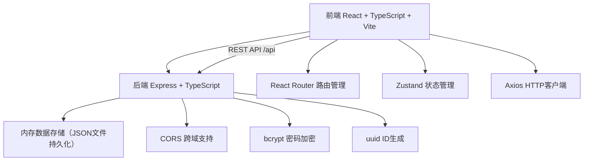
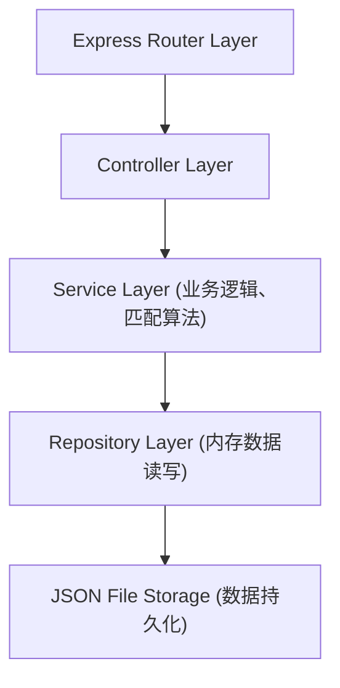
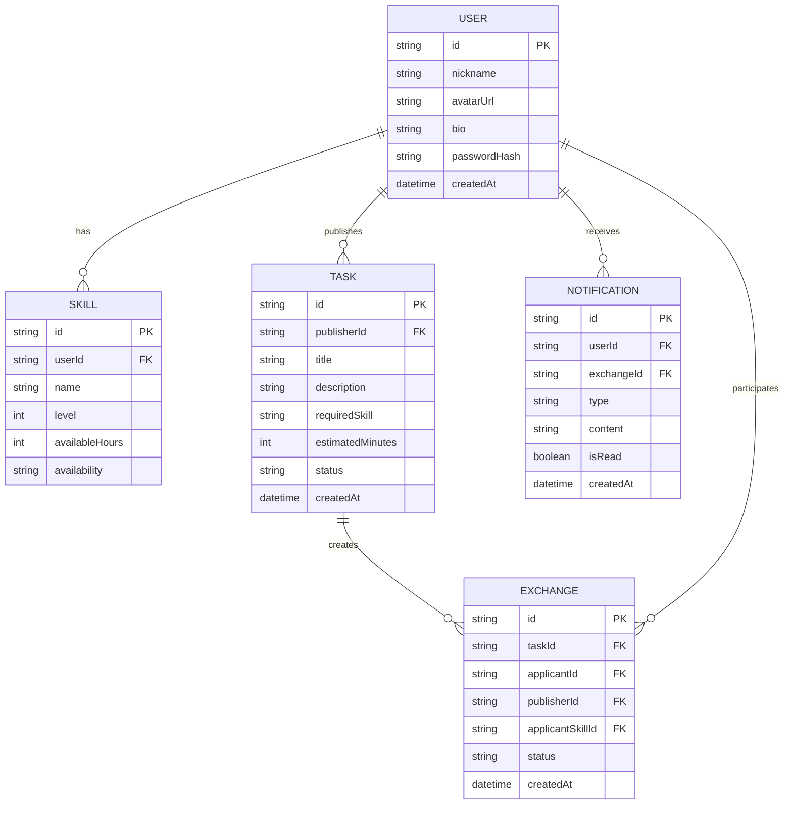

## 1. 架构设计



## 2. 技术说明

- **前端框架**：React 18 + TypeScript
- **构建工具**：Vite
- **路由管理**：react-router-dom v6
- **状态管理**：zustand
- **HTTP客户端**：axios
- **图标库**：lucide-react
- **后端框架**：Express 4 + TypeScript
- **数据存储**：内存存储 + JSON文件持久化
- **安全工具**：bcrypt（密码加密）、uuid（唯一ID生成）

## 3. 路由定义

| 路由路径 | 页面组件 | 用途 |
|----------|----------|------|
| `/login` | LoginPage | 登录页面 |
| `/register` | RegisterPage | 注册页面 |
| `/home` | HomePage | 用户主页（技能管理） |
| `/tasks` | TasksPage | 任务广场 |
| `/exchange/:id` | ExchangeDetailPage | 技能交换详情页 |
| `/` | 重定向到 `/login` 或 `/home` | 根路径 |

## 4. API 定义

### 4.1 用户相关

```typescript
// POST /api/auth/register
interface RegisterRequest {
  nickname: string;
  avatarUrl: string;
  bio: string;
  password: string;
  skills: Array<{
    name: string;
    level: 1 | 2 | 3 | 4 | 5;
    availableHours: number;
    availability: string;
  }>;
}

interface AuthResponse {
  success: boolean;
  token: string;
  user: User;
}

// POST /api/auth/login
interface LoginRequest {
  nickname: string;
  password: string;
}

// GET /api/users/:id
interface GetUserResponse {
  success: boolean;
  user: User;
}

// POST /api/users/:id/skills
interface AddSkillRequest {
  name: string;
  level: 1 | 2 | 3 | 4 | 5;
  availableHours: number;
  availability: string;
}
```

### 4.2 任务相关

```typescript
// GET /api/tasks
interface GetTasksResponse {
  success: boolean;
  tasks: Task[];
}

// POST /api/tasks
interface CreateTaskRequest {
  title: string;
  description: string;
  requiredSkill: string;
  estimatedMinutes: number;
  publisherId: string;
}

// POST /api/tasks/:id/apply
interface ApplyTaskRequest {
  applicantId: string;
  skillId: string;
}

interface ApplyTaskResponse {
  success: boolean;
  matches: SkillMatch[];
  exchangeId?: string;
}

// GET /api/tasks/match/:taskId/:userId
interface MatchResponse {
  success: boolean;
  matches: SkillMatch[];
}
```

### 4.3 通知和交换相关

```typescript
// GET /api/notifications/:userId
interface GetNotificationsResponse {
  success: boolean;
  notifications: Notification[];
  unreadCount: number;
}

// POST /api/notifications/:id/read
interface MarkReadResponse {
  success: boolean;
}

// GET /api/exchanges/:id
interface GetExchangeResponse {
  success: boolean;
  exchange: Exchange;
}

// POST /api/exchanges/:id/accept
// POST /api/exchanges/:id/reject
interface ExchangeActionResponse {
  success: boolean;
  exchange: Exchange;
}
```

## 5. 服务器架构图



## 6. 数据模型

### 6.1 数据模型定义



### 6.2 匹配算法说明

技能匹配度计算公式：
```
matchScore = Σ (applicantSkill.level × (applicantSkill.availableHours / 40)) / count
matchPercentage = min(100, matchScore / 5 × 100)
```

说明：
- 每颗星代表20%基础匹配度
- 可用小时数按每周40小时归一化计算权重
- 取用户所有相关技能的加权平均值
- 匹配度超过50%的技能显示在推荐列表中
