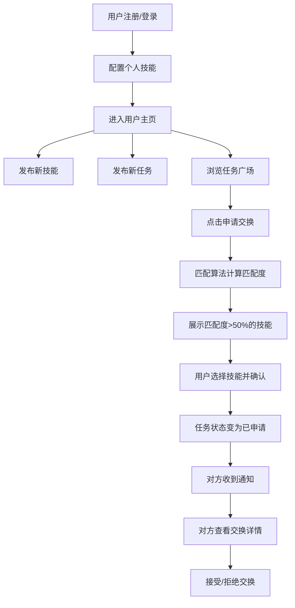

## 1. 产品概述

SkillSwap是一个在线技能交换与任务匹配平台，用户可以发布自身擅长的技能，浏览并申请完成他人发布的小任务，通过双向选择实现技能互换，无需金钱交易。

- **目标用户**：拥有一技之长、希望以技能换取他人服务的自由职业者、学生和技术爱好者
- **核心价值**：打破金钱壁垒，建立基于技能互惠的协作网络，让每个人的专长都能得到价值体现

## 2. 核心功能

### 2.1 用户角色

| 角色 | 注册方式 | 核心权限 |
|------|----------|----------|
| 普通用户 | 昵称+技能列表注册 | 发布技能、发布任务、浏览任务、申请交换、接收通知、管理个人主页 |

### 2.2 功能模块

1. **用户认证模块**：注册（含技能配置）、登录、状态保持
2. **用户主页模块**：个人信息展示、技能管理（增删查）、任务发布
3. **任务广场模块**：任务瀑布流展示、任务搜索筛选、任务申请
4. **智能匹配模块**：技能匹配度算法、匹配结果展示、交换确认
5. **通知系统模块**：消息列表、未读提醒、通知跳转
6. **交换详情模块**：双方技能展示、任务详情、接受/拒绝操作

### 2.3 页面详情

| 页面名称 | 模块名称 | 功能描述 |
|----------|----------|----------|
| 登录/注册页 | 登录表单 | 渐变背景，流动下划线动画，微光扫描按钮 |
| 登录/注册页 | 注册表单 | 昵称、头像、自我介绍、1-5个技能（星级+小时数） |
| 用户主页 | 个人信息区 | 头像、昵称、简介展示 |
| 用户主页 | 技能卡片列表 | 磨砂玻璃效果卡片，星级展示，点击展开详情 |
| 用户主页 | 新增技能表单 | 技能名、星级、可用时间段配置 |
| 用户主页 | 发布任务入口 | 任务标题、描述、期望技能、预计耗时 |
| 任务广场 | 瀑布流列表 | 响应式3/2/1列，状态标签，入场动画 |
| 任务广场 | 任务卡片 | 标题、描述、悬赏技能、申请按钮、涟漪效果 |
| 匹配推荐弹窗 | 匹配列表 | 圆形进度条显示匹配度，50%以上可选择 |
| 通知面板 | 通知列表 | 右侧滑入，任务标题、发起人头像、相对时间 |
| 交换详情页 | 双方信息展示 | 双方技能卡片、任务详情、接受/拒绝按钮 |

## 3. 核心流程

用户注册并配置技能后，可在个人主页发布新技能或发布任务。在任务广场浏览任务，点击申请交换触发智能匹配算法，系统展示匹配度超过50%的个人技能供选择。确认后任务状态变更为已申请，对方收到通知。对方在通知中心点击查看详情，可选择接受或拒绝交换请求。

## 4. 用户界面设计

### 4.1 设计风格

- **主色调**：藏蓝 `#16213e`，金色 `#e8a838`
- **背景色**：暗色主题 `#1a1a2e`
- **卡片样式**：圆角12px，轻微边框 `#2a2a4e`，磨砂玻璃效果 `backdrop-filter: blur(8px)`
- **字体**：现代无衬线字体，标题醒目
- **按钮效果**：涟漪反馈（半径25px，0.4秒消退），悬停放大1.05倍
- **图标**：Lucide React图标库

### 4.2 页面设计概览

| 页面名称 | 模块名称 | UI元素 |
|----------|----------|--------|
| 登录/注册页 | 登录表单 | 深蓝紫渐变背景、白色卡片、流动彩色下划线、微光扫描按钮 |
| 用户主页 | 技能卡片 | 磨砂玻璃、金色实心星级、悬停左倾3°阴影增强、点击展开动画0.4s |
| 任务广场 | 任务卡片 | 瀑布流布局、状态标签（开放/已申请/完成）、申请按钮涟漪效果 |
| 匹配弹窗 | 匹配进度 | 圆形进度条、0.6s动画填充、匹配度百分比展示 |
| 通知面板 | 通知列表 | 右侧滑入动画0.3s ease-out、未读红点数字、相对时间戳 |
| 所有页面 | 入场动画 | 淡入+向上偏移30px，stagger 0.05s延迟 |

### 4.3 响应式设计

- **桌面端（≥1024px）**：任务广场3列瀑布流
- **平板端（768px-1023px）**：任务广场2列布局
- **移动端（<768px）**：任务广场1列布局，底部导航简化
- 触控优化：按钮最小点击区域44px

### 4.4 动效细节

- 表单焦点：输入框底部流动彩色下划线，0.3秒动画
- 按钮悬停：放大至1.05倍 + 微光扫描效果
- 卡片悬停：向左倾斜3°，阴影增强
- 列表滚动：淡入+上移30px入场动画，stagger 0.05s
- 页面切换：fade-in过渡0.3s
- 通知面板：右侧滑入，ease-out缓动0.3s
- 匹配进度条：圆形进度条动画填充0.6s
- 表单错误：边框变红+轻微抖动0.2s（两次抖动）
- 接受/拒绝按钮：弹性动画0.2s
- Loading骨架屏：灰色脉冲动画，1.5s循环
