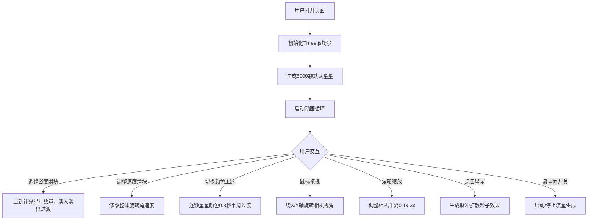

## 1. 产品概述

StarfieldScape 是一个基于浏览器 WebGL 的交互式三维星空生成与漫游工具，用户可以通过滑块和鼠标交互实时调整星空的密度、颜色分布和运动轨迹，同时能够像在宇宙中飞行一样自由旋转和移动视角，创造属于自己的梦幻星空场景。

- **目标用户**：天文爱好者、创意设计师、普通用户寻求沉浸式宇宙体验
- **产品价值**：提供零门槛的星空创作工具，让任何人都能在浏览器中创建独特的宇宙场景

## 2. 核心功能

### 2.1 功能模块
1. **星空生成模块**：随机生成数千颗三维星星，支持密度、大小、颜色主题、整体旋转等参数
2. **交互控制模块**：滑块控制（密度、速度、颜色主题）、鼠标拖拽旋转视角、滚轮缩放、星星点击脉冲效果
3. **动态效果模块**：流星雨效果（开关控制、频率可调、粒子拖尾）、星星脉冲扩散特效
4. **UI 界面**：半透明磨砂玻璃控制面板、响应式布局、移动端适配

### 2.2 功能详情
| 页面名称 | 模块名称 | 功能描述 |
|---------|---------|---------|
| 主场景 | 星空生成 | 球坐标随机分布星星（半径50-500单位），大小0.1-1.0，三色主题渐变，整体绕Y轴旋转 |
| 主场景 | 距离裁剪/LOD | 根据相机距离动态调整星星可见性，优化性能 |
| 主场景 | 视角控制 | 鼠标拖拽绕X/Y轴旋转，滚轮缩放0.1x-3x |
| 主场景 | 流星效果 | 粒子拖尾流星，从屏幕外弧线滑入，频率5-30秒可调 |
| 控制面板 | 密度滑块 | 1000-10000颗，0.5秒淡入淡出过渡 |
| 控制面板 | 速度滑块 | 0-0.1弧度/秒，控制整体自转 |
| 控制面板 | 颜色主题 | 暖色/冷色/随机混合，0.8秒逐颗平滑过渡 |
| 控制面板 | 流星雨开关 | 开启/关闭流星雨，开启后频率提升 |
| 主场景 | 星星点击 | 点击星星触发脉冲扩散粒子效果，持续1.2秒 |

## 3. 核心流程

## 4. 用户界面设计

### 4.1 设计风格
- **主色调**：深空蓝紫渐变背景（#0a0a1a → #1a0a2a）
- **强调色**：紫色渐变（#6a4eff → #a855f7）
- **UI风格**：半透明磨砂玻璃效果（背景模糊10px，边框1px rgba(255,255,255,0.15)，圆角12px）
- **交互反馈**：滑块悬停发光（box-shadow: 0 0 8px rgba(168,85,247,0.4)）
- **动效**：面板收缩展开箭头旋转0.3秒，星星淡入淡出0.5秒，颜色过渡0.8秒

### 4.2 页面设计概览
| 页面名称 | 模块名称 | UI元素 |
|---------|---------|--------|
| 主场景 | 星空画布 | 全屏WebGL Canvas，背景深空渐变，星星闪烁 |
| 主场景 | 流星 | 明亮渐变线条+粒子拖尾，弧线运动 |
| 控制面板 | 标题栏 | StarfieldScape 标题，收缩/展开按钮 |
| 控制面板 | 密度滑块 | 渐变填充轨道，数值显示 |
| 控制面板 | 速度滑块 | 渐变填充轨道，数值显示 |
| 控制面板 | 颜色主题按钮组 | 三个主题按钮，选中态高亮 |
| 控制面板 | 流星雨开关 | Toggle开关，带状态文字 |
| 控制面板 | FPS显示 | stats.js 性能监控 |

### 4.3 响应式设计
- **桌面端**：UI面板固定右下角，宽度280px，可收缩展开
- **移动端**：面板折叠为底部弹出式，点击展开全屏控制
- **触摸优化**：支持双指缩放、单指旋转

### 4.4 3D 场景指引
- **环境**：纯深空渐变背景，无HDRI，营造深邃宇宙感
- **光照**：无额外光源，星星使用自发光材质（PointsMaterial with emissive）
- **相机设置**：PerspectiveCamera，FOV 75°，近裁剪面0.1，远裁剪面1000
- **相机运动**：OrbitControls 绕原点旋转，支持俯仰角限制（避免翻转）
- **构图**：星空球壳分布，相机位于球心，星星环绕四周
- **粒子效果**：流星使用 Points + 自定义 Shader 实现渐变拖尾
- **性能预算**：10000颗星星时 ≥ 20 FPS，普通笔记本 ≥ 30 FPS

## 5. 性能要求
- **目标帧率**：Intel i5 / 8GB / 集成显卡 ≥ 30 FPS
- **极端情况**：10000颗星星 ≥ 20 FPS
- **优化手段**：距离裁剪LOD、共享几何体批量渲染、粒子系统复用
