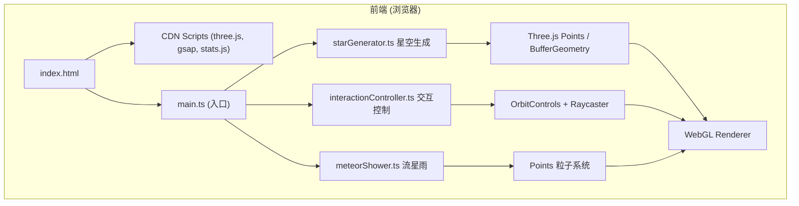

## 1. 架构设计



## 2. 技术说明

- **渲染引擎**：Three.js r152（通过CDN引入，ES Module方式）
- **动画库**：GSAP 3.x（通过CDN引入，用于颜色过渡、淡入淡出动画）
- **性能监控**：stats.js（通过CDN引入，FPS显示）
- **语言**：TypeScript 5.x（严格模式，target ES2020，module ESNext）
- **开发服务器**：http-server（npx http-server -p 8080）
- **无构建工具**：直接使用TypeScript编译输出ES Module，浏览器原生支持importmap

## 3. 文件结构

```
StarfieldScape/
├── package.json              # CDN依赖说明、启动脚本
├── index.html                # 入口页面，Canvas + UI面板 + importmap
├── tsconfig.json             # TS配置（严格模式、ES2020、ESNext模块）
├── src/
│   ├── main.ts               # 场景初始化、动画循环、模块整合
│   ├── starGenerator.ts      # 星空生成、颜色分配、LOD管理
│   ├── interactionController.ts  # 滑块、鼠标、滚轮事件处理
│   └── meteorShower.ts       # 流星粒子系统、拖尾效果
└── dist/ (可选，编译输出)
```

## 4. 模块接口定义

### 4.1 starGenerator.ts

```typescript
export type ColorTheme = 'warm' | 'cool' | 'mixed';

export interface StarFieldOptions {
  count: number;
  minRadius: number;
  maxRadius: number;
  minSize: number;
  maxSize: number;
  theme: ColorTheme;
}

export interface StarField {
  points: THREE.Points;
  updateCount: (newCount: number, duration: number) => void;
  updateTheme: (newTheme: ColorTheme, duration: number) => void;
  updateRotationSpeed: (speed: number) => void;
  updateLOD: (cameraDistance: number) => void;
  getStarAt: (intersect: THREE.Intersection) => THREE.Vector3 | null;
  dispose: () => void;
}

export function createStarField(
  scene: THREE.Scene,
  options?: Partial<StarFieldOptions>
): StarField;
```

**实现要点**：
- 使用 BufferGeometry 存储 position、color、targetColor、size、alpha（用于淡入淡出）attribute
- 每颗星星独立颜色，通过 GSAP 逐颗 tween color attribute 实现平滑过渡
- LOD：根据相机距离动态修改 visible 或使用 drawRange
- 使用 shaderMaterial 自定义 shader，支持 alpha 透明度控制

### 4.2 interactionController.ts

```typescript
export interface ControlCallbacks {
  onDensityChange: (count: number) => void;
  onSpeedChange: (speed: number) => void;
  onThemeChange: (theme: ColorTheme) => void;
  onMeteorToggle: (enabled: boolean) => void;
  onStarClick: (position: THREE.Vector3) => void;
}

export interface Controls {
  orbit: THREE.OrbitControls;
  dispose: () => void;
}

export function setupControls(
  container: HTMLElement,
  canvas: HTMLCanvasElement,
  camera: THREE.PerspectiveCamera,
  starField: StarField,
  callbacks: ControlCallbacks
): Controls;
```

**实现要点**：
- OrbitControls：enableDamping=true，minPolarAngle=0.1，maxPolarAngle=PI-0.1（支持X/Y轴旋转）
- minDistance=50, maxDistance=1500（缩放范围0.1x-3x基于默认距离500）
- Raycaster：检测星星点击，阈值适当放大便于点击
- 滑块事件使用 input 事件实时响应

### 4.3 meteorShower.ts

```typescript
export interface MeteorShowerOptions {
  enabled: boolean;
  minInterval: number;  // 秒
  maxInterval: number;
  theme: ColorTheme;
}

export interface MeteorShower {
  start: () => void;
  stop: () => void;
  setTheme: (theme: ColorTheme) => void;
  setEnabled: (enabled: boolean) => void;
  dispose: () => void;
}

export function createMeteorShower(
  scene: THREE.Scene,
  camera: THREE.PerspectiveCamera,
  options?: Partial<MeteorShowerOptions>
): MeteorShower;
```

**实现要点**：
- 单颗流星使用 50-100 个粒子组成拖尾，Points + BufferGeometry
- 起点从屏幕外（相机视锥外）随机方向生成
- 轨迹为贝塞尔曲线或弧线运动
- 粒子 alpha 随生命周期衰减（头部亮，尾部暗）
- 粒子大小随生命周期衰减
- 对象池复用流星粒子系统，避免频繁GC

### 4.4 main.ts

```typescript
// 主要流程
// 1. 创建 Scene、PerspectiveCamera、WebGLRenderer
// 2. 创建 importmap 引入 three.js、gsap、stats.js
// 3. 初始化 StarField、MeteorShower、Controls
// 4. 启动动画循环（requestAnimationFrame）
// 5. 响应窗口 resize
```

## 5. 性能优化策略

| 优化项 | 实现方式 |
|--------|---------|
| 距离裁剪/LOD | 相机距离 > 阈值时，减少 drawRange 或降低远星渲染尺寸 |
| 批量渲染 | 所有星星共用一个 Points 对象，BufferGeometry 批量处理 |
| 材质复用 | 单 ShaderMaterial 控制所有星星，逐 attribute 差异化 |
| 对象池 | 流星粒子系统预创建，复用避免频繁分配内存 |
| 帧率控制 | stats.js 监控，必要时动态降低粒子数量 |
| 透明度优化 | 使用 additive blending，关闭 depthWrite 减少 overdraw |

## 6. 关键技术决策

1. **CDN + importmap**：避免 node_modules，直接浏览器加载 ES Module
2. **BufferGeometry + ShaderMaterial**：10000颗星星高性能渲染的基础
3. **GSAP Tween 属性**：逐颗星星颜色、透明度平滑过渡
4. **OrbitControls**：成熟的相机控制方案，支持阻尼和角度限制
5. **Points 粒子系统**：流星拖尾使用 Points 而非 LineSegments，实现渐变消散
6. **屏幕外流星生成**：使用相机投影矩阵反推屏幕外坐标，从边缘飞入
