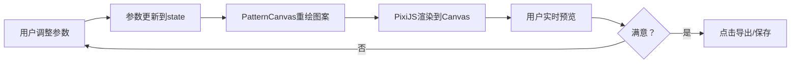
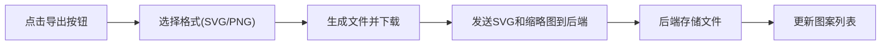
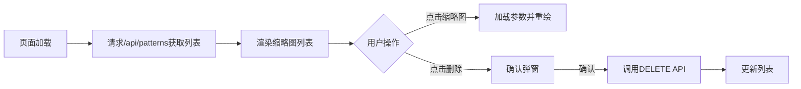

## 1. 产品概述
GeoPatternLab是一款面向数字艺术创作者的在线几何图案生成工具，提供实时参数调节、动画预览、图案导出和管理功能，帮助创作者快速探索和保存独特的几何艺术作品。
- 面向数字艺术创作者、设计师和创意编程爱好者
- 核心价值：通过直观的参数控制和实时预览，降低几何艺术创作门槛，激发创意灵感

## 2. 核心功能

### 2.1 功能模块

| 模块 | 功能描述 |
|------|----------|
| **图案渲染引擎** | 使用PixiJS实现高性能几何图形绘制，支持多种对称类型、基础形状、颜色方案 |
| **参数控制面板** | 滑块、颜色选择器、下拉菜单控制图案生成参数，实时响应 |
| **图案画廊** | 已保存图案的缩略图列表，支持加载、删除操作 |
| **导出系统** | 支持SVG/PNG格式导出，自动同步到后端存储 |
| **交互系统** | 鼠标滚轮缩放、拖拽平移、自动旋转动画 |
| **随机探索** | 一键生成随机参数组合，发现惊喜图案 |

### 2.2 页面详情

| 页面名称 | 模块名称 | 功能描述 |
|---------|----------|---------|
| **主页面** | 画布区域 | 全屏Canvas容器，实时渲染几何图案，支持缩放和平移 |
| **主页面** | 参数面板 | 左侧固定面板，包含对称类型、基础形状、颜色方案、复杂度、旋转速度等控制项 |
| **主页面** | 图案列表 | 底部可收起横向滚动条，展示已保存图案缩略图 |
| **主页面** | 操作按钮区 | 随机、导出、保存、收起/展开等控制按钮 |

## 3. 核心流程

### 3.1 图案生成与调整流程



### 3.2 导出与保存流程



### 3.3 图案管理流程



## 4. 用户界面设计

### 4.1 设计风格
- **主题**：深色科技艺术风，营造专业创作氛围
- **主色调**：背景#0f0f23（深空蓝黑），卡片#1a1a2e（深蓝紫），文字#e0e0e0（浅灰白）
- **强调色**：渐变霓虹蓝紫(#6366f1 → #a855f7)用于按钮hover、滑块激活、交互反馈
- **字体**：标题使用 Space Grotesk（几何感强的无衬线字体），正文使用 JetBrains Mono（等宽编程字体，体现科技感）
- **按钮**：圆角12px，默认半透明背景，hover时渐变蓝紫色填充，0.3秒ease-out过渡
- **滑块**：自定义细条状（2px高度），拖拽时有发光轨迹效果
- **颜色选择器**：12色圆形色块网格布局，选中时有外发光效果
- **阴影**：多层阴影营造深度感，hover时增强阴影并轻微上浮

### 4.2 页面布局

```
┌─────────────────────────────────────────────────────────┐
│  标题栏：GeoPatternLab  [随机] [导出] [保存]            │
├──────────┬──────────────────────────────────┬───────────┤
│          │                                  │           │
│  参数    │                                  │  图案     │
│  面板    │         Canvas画布区域           │  列表     │
│  300px   │        (居中对称图案)           │  150px    │
│  固定    │                                  │  横向     │
│  左侧    │  支持缩放(0.5x-3x)、拖拽平移     │  滚动     │
│          │  自动旋转动画                    │           │
│          │                                  │           │
└──────────┴──────────────────────────────────┴───────────┘
```

### 4.3 响应式设计
- **桌面端（≥1024px）**：参数面板左侧固定300px，图案列表底部横向滚动
- **平板端（768px-1023px）**：参数面板可折叠为汉堡菜单，图案列表保持底部
- **移动端（<768px）**：参数面板折叠为顶部汉堡菜单，图案列表改为底部固定条，画布占满剩余空间
- **触摸优化**：滑块和按钮增大触摸区域（最小44x44px），支持双指缩放

### 4.4 动效设计
- **页面加载**：画布淡入（0.8s ease-out），参数面板从左侧滑入（0.5s ease-out），图案列表从底部滑入（0.6s ease-out，延迟0.2s）
- **参数调整**：滑块拖动时有发光轨迹跟随，颜色选择时色块脉冲放大
- **图案重绘**：平滑过渡而非突然跳转（使用PixiJS的ticker实现插值动画）
- **导出按钮**：点击时波纹扩散效果
- **缩略图hover**：放大1.05倍 + 阴影增强 + 边框发光
- **删除按钮**：hover时灰色变红色 + 轻微旋转（15度）
