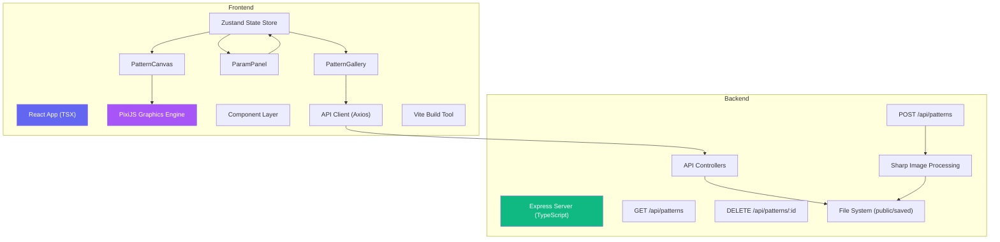
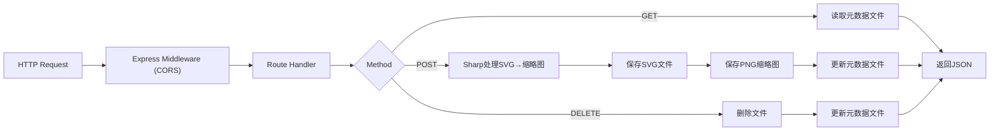

## 1. 架构设计



## 2. 技术描述

### 2.1 技术栈
- **前端框架**：React@18 + TypeScript@5
- **图形引擎**：PixiJS@7（高性能2D WebGL渲染）
- **状态管理**：Zustand（轻量级React状态管理）
- **构建工具**：Vite@5
- **HTTP客户端**：Axios
- **后端框架**：Express@4 + TypeScript
- **图像处理**：Sharp（SVG转PNG缩略图）
- **开发语言**：TypeScript（全栈严格模式）

### 2.2 目录结构

```
auto80/
├── .trae/documents/          # 项目文档
│   ├── PRD.md
│   └── TECH_ARCHITECTURE.md
├── public/                   # 静态资源
│   └── saved/               # 后端存储目录（SVG + 缩略图）
├── server/                  # 后端服务
│   ├── index.ts            # Express服务入口
│   ├── types.ts            # 类型定义
│   └── tsconfig.json
├── src/                     # 前端源码
│   ├── components/         # React组件
│   │   ├── PatternCanvas.tsx   # PixiJS画布组件
│   │   ├── ParamPanel.tsx      # 参数控制面板
│   │   ├── PatternGallery.tsx  # 图案画廊
│   │   ├── ColorPicker.tsx     # 颜色选择器
│   │   └── Slider.tsx          # 自定义滑块
│   ├── hooks/              # 自定义Hooks
│   │   ├── usePixiApp.ts       # PixiJS应用实例管理
│   │   └── usePatternStore.ts  # 图案状态管理
│   ├── utils/              # 工具函数
│   │   ├── patternRenderer.ts  # 图案渲染逻辑
│   │   ├── colorSchemes.ts     # 颜色方案生成
│   │   └── exportUtils.ts      # 导出工具
│   ├── types/              # TypeScript类型定义
│   │   └── pattern.ts
│   ├── App.tsx             # 根组件
│   ├── main.tsx            # 入口文件
│   └── index.css           # 全局样式
├── index.html              # HTML入口
├── vite.config.js          # Vite配置
├── tsconfig.json           # TS配置
├── package.json            # 项目依赖
└── package-lock.json
```

### 2.3 数据流向

```
用户交互 → ParamPanel → Zustand Store → PatternCanvas → PixiJS渲染 → Canvas显示
                ↓
          参数变化触发重绘（<50ms延迟）
                ↓
          导出操作 → exportUtils → 生成文件下载
                ↓
          保存操作 → Axios → Express API → Sharp处理 → 文件系统存储
                ↓
          画廊加载 → Axios GET /api/patterns → 渲染缩略图列表
```

## 3. 路由定义

| 路由 | 用途 |
|------|------|
| `/` | 主应用页面（单页应用，所有功能在此页面） |
| `/api/patterns` [GET] | 获取已保存图案列表 |
| `/api/patterns` [POST] | 保存新图案（SVG + 缩略图） |
| `/api/patterns/:id` [DELETE] | 删除指定图案 |
| `/saved/:filename` | 访问已保存的SVG/PNG文件 |

## 4. API定义

### 4.1 TypeScript类型定义

```typescript
// 图案参数类型
interface PatternParams {
  symmetryType: 'rotation' | 'reflection' | 'translation';
  baseShape: 'circle' | 'triangle' | 'hexagon' | 'spiral';
  colorScheme: 'gradient' | 'complementary' | 'analogous';
  complexity: number; // 1-20
  rotationSpeed: number; // 0-5
  baseColors: string[];
  backgroundColor: string;
}

// 保存的图案元数据
interface SavedPattern {
  id: string;
  params: PatternParams;
  svgUrl: string;
  thumbnailUrl: string;
  createdAt: string;
}

// API请求/响应类型
interface SavePatternRequest {
  svgString: string;
  thumbnailBase64: string;
  params: PatternParams;
}

interface SavePatternResponse {
  success: boolean;
  pattern: SavedPattern;
}

interface PatternListResponse {
  patterns: SavedPattern[];
}
```

### 4.2 API接口详情

| 方法 | 端点 | 请求体 | 响应 | 说明 |
|------|------|--------|------|------|
| GET | `/api/patterns` | - | `{ patterns: SavedPattern[] }` | 按创建时间倒序返回所有保存的图案 |
| POST | `/api/patterns` | `{ svgString, thumbnailBase64, params }` | `{ success, pattern }` | 保存新图案，自动生成文件名 |
| DELETE | `/api/patterns/:id` | - | `{ success: boolean }` | 删除指定ID的图案文件和元数据 |

## 5. 服务器架构



## 6. 数据模型

### 6.1 数据存储设计

由于用户未指定数据库，采用文件系统存储方案：

- **SVG文件**：`public/saved/{id}.svg`
- **缩略图文件**：`public/saved/{id}_thumb.png`
- **元数据索引**：`public/saved/_metadata.json`

### 6.2 元数据JSON结构

```json
{
  "version": "1.0",
  "patterns": [
    {
      "id": "uuid-string",
      "params": {
        "symmetryType": "rotation",
        "baseShape": "circle",
        "colorScheme": "gradient",
        "complexity": 10,
        "rotationSpeed": 2,
        "baseColors": ["#ff6b6b", "#4ecdc4", "#45b7d1"],
        "backgroundColor": "#1a1a2e"
      },
      "svgUrl": "/saved/uuid-string.svg",
      "thumbnailUrl": "/saved/uuid-string_thumb.png",
      "createdAt": "2026-06-13T10:30:00Z"
    }
  ]
}
```

### 6.3 性能优化措施

1. **前端渲染优化**：
   - 使用PixiJS WebGL渲染而非Canvas 2D
   - 图案重绘采用对象池复用Graphics对象
   - 参数防抖（16ms）避免频繁重绘
   - requestAnimationFrame驱动动画循环

2. **导出性能**：
   - PNG导出使用Canvas toBlob异步处理
   - 最大尺寸限制2048x2048
   - 缩略图在前端生成后发送，减轻后端压力

3. **后端优化**：
   - Sharp使用流式处理减少内存占用
   - 元数据文件采用增量更新而非全量重写
   - 静态文件使用Express.static缓存
