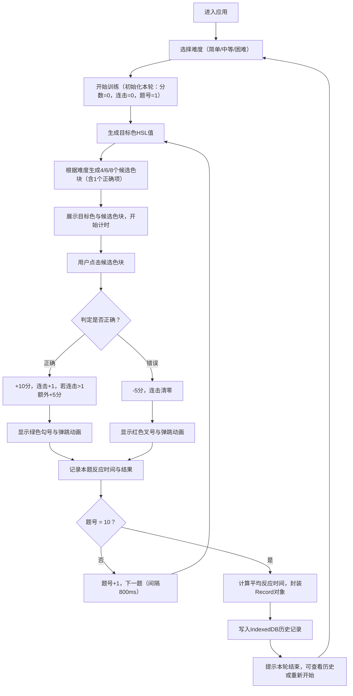

## 1. 产品概述

ColorChord是一款交互式色感训练Web应用，通过游戏化的色彩辨识练习帮助用户提升对颜色细微差别的感知能力。

- 目标用户：设计师、美术从业者、前端开发者及对色彩敏感训练有需求的普通用户
- 核心价值：以轻量游戏形式提供系统化的色感训练，通过即时反馈和历史记录追踪能力提升

---

## 2. 核心功能

### 2.1 用户角色

| 角色 | 注册方式 | 核心权限 |
|------|----------|----------|
| 普通用户 | 无需注册，直接使用 | 进行色感训练、查看历史记录、切换难度 |

### 2.2 功能模块

1. **训练主界面**：目标色块展示、候选色块网格、难度切换、实时评分面板
2. **历史记录面板**：侧边栏历史列表、答题详情展开、色块缩略图展示
3. **游戏核心引擎**：色块生成算法、答题判定、计分连击、反应时间统计

### 2.3 页面详情

| 页面名称 | 模块名称 | 功能描述 |
|----------|----------|----------|
| 训练主界面 | 目标色块区域 | 居中放大显示当前目标色块，带有柔和阴影和圆角 |
| 训练主界面 | 候选色块网格 | 两行均匀排列4/6/8个候选色块，悬停放大、点击波纹反馈 |
| 训练主界面 | 答题反馈 | 选中色块显示绿色勾号或红色叉号，150ms缩放弹跳动画 |
| 训练主界面 | 评分面板 | 右上角实时显示当前得分、连击数，分数动画更新、低分渐变红底 |
| 训练主界面 | 进度指示器 | 显示当前题号/总题数（10题/轮），进度条可视化 |
| 训练主界面 | 难度切换器 | 简单/中等/困难三档切换，影响候选色块偏离幅度和数量 |
| 历史记录面板 | 历史列表 | 按日期倒序展示历史训练记录，显示日期、难度、得分、平均反应时间 |
| 历史记录面板 | 记录详情 | 点击展开查看每题详情：目标色块缩略图、用户选择、对错状态、反应时间 |

---

## 3. 核心流程

用户进入应用后选择难度等级，开始一轮10题的训练。每道题随机生成目标色和候选色块，用户点击选中后获得即时反馈和分数变动。一轮结束后自动将记录存入IndexedDB，用户可在侧边栏查看历史。

---

## 4. 用户界面设计

### 4.1 设计风格

- **主色调**：暗蓝色 `#2C3E50`（标题、按钮文字）、青绿色 `#1ABC9C`（正确反馈、主按钮、点缀）
- **背景色**：浅灰白渐变 `#F8F9FA` → `#E9ECEF`，整体干净清爽
- **辅助色**：红色 `#E74C3C`（错误反馈）、浅红 `#FADBD8`（低分面板底色）
- **按钮风格**：柔和圆角（12px），悬停轻微上浮，150ms过渡
- **字体**：标题使用「思源黑体 Bold」/「PingFang SC Semibold」，正文使用「思源黑体 Regular」/「Segoe UI」，数字（分数/时间）使用等宽字体提升可读性
- **布局风格**：卡片式布局，16px圆角，8px柔和阴影，大留白
- **图标风格**：简洁Line风格SVG图标，勾号/叉号使用粗线条增强辨识度

### 4.2 页面设计概述

| 页面名称 | 模块名称 | UI元素 |
|----------|----------|--------|
| 训练主界面 | 目标色块区域 | 240×240px圆角方块（20px圆角），柔和双层阴影，下方显示HSL值文本，入场缩放动画 |
| 训练主界面 | 候选色块网格 | CSS Grid布局（简单2×2、中等3×2、困难4×2），每块100×100px圆角，悬停scale(1.05)+阴影，点击Ripple波纹 |
| 训练主界面 | 评分面板 | 右上角固定定位卡片，三行显示：总分（大号等宽数字）、连击标签+数值、当前进度条，低分（<30）时背景渐变为浅红色，数字变化使用translateY平移动画 |
| 训练主界面 | 难度切换器 | 顶部居中三态Segmented Control，选中项使用青绿色背景+白色文字，指示器滑动过渡200ms |
| 训练主界面 | 答题反馈 | 选中色块上叠加绝对定位的SVG图标（✓/✗），色块整体scale(1.1)→scale(1.0)弹跳150ms，图标fadeIn+缩放 |
| 历史记录面板 | 侧边栏 | 左侧宽度280px抽屉式面板，可折叠，顶部搜索框+筛选（按难度），列表项卡片展示缩略色块+日期+分数，hover背景色变化 |
| 历史记录面板 | 记录详情 | 列表下方展开区域，每行显示目标色小方块（32px）+用户选择色方块+对错图标+反应时间（ms），10行垂直滚动 |

### 4.3 响应式设计

- **桌面端（≥1024px）**：主内容区居中最大宽度960px，左侧历史面板固定展开，三栏布局稳定
- **平板端（768px-1023px）**：历史面板改为可抽屉展开（点击左上角汉堡按钮），候选色块尺寸缩放至80×80px，目标色缩至200×200px
- **触控优化**：候选色块最小触控区域48×48px，反馈动画延迟调整以适配触控延迟
- **断点策略**：桌面优先，使用CSS Media Query在768px以下调整布局参数

### 4.4 性能指标

| 指标 | 目标值 | 实现策略 |
|------|--------|----------|
| 色块生成+渲染耗时 | ≤100ms | 纯数学计算（HSL→RGB）避免重绘，useMemo缓存ColorItem |
| 点击反馈+评分更新延时 | ≤200ms | CSS动画优先，避免JS阻塞，requestAnimationFrame调度状态更新 |
| 首屏加载时间 | ≤1.5s | Tree-shaking，代码分割，IndexedDB操作异步化 |
| 历史记录渲染（100条） | ≤300ms | 虚拟滚动（超过50条时启用），缩略图懒渲染 |
