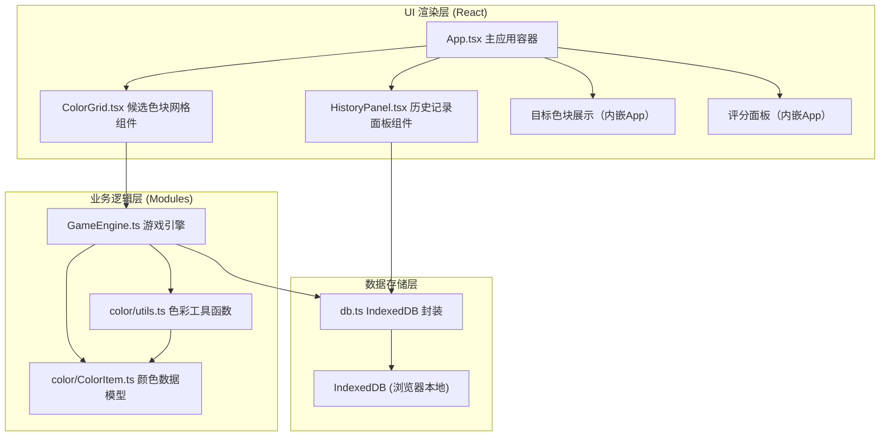
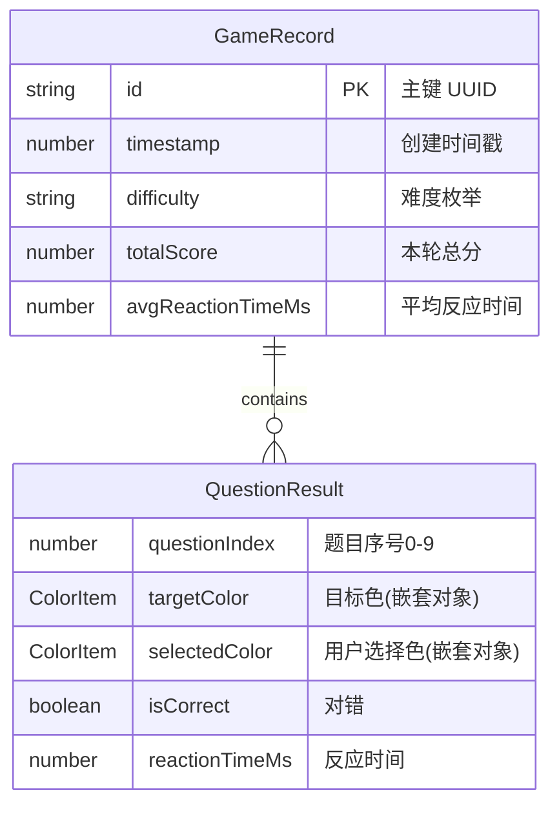

## 1. 架构设计

ColorChord采用前端单页应用（SPA）架构，数据存储完全基于浏览器IndexedDB，无需后端服务。整体遵循分层设计原则，确保模块职责清晰、耦合度低。



---

## 2. 技术栈描述

| 层级 | 技术选型 | 版本 | 用途 |
|------|----------|------|------|
| 构建工具 | Vite | ^5.x | 极速开发服务器、HMR、生产构建 |
| 前端框架 | React | ^18.x | UI组件化渲染、状态管理 |
| 语言 | TypeScript | ^5.x | 类型安全、智能提示、编译期错误检查 |
| 路由 | react-router-dom | ^6.x | （预留）支持未来多页面扩展 |
| DOM操作 | react-dom | ^18.x | React虚拟DOM渲染到真实DOM |
| Vite插件 | @vitejs/plugin-react | ^4.x | React JSX编译、Fast Refresh |
| 数据存储 | IndexedDB API | 原生 | 浏览器本地持久化存储历史记录 |
| 样式方案 | 原生CSS + CSS Variables | - | 主题一致性、动画效果实现 |

**初始化方式**：手动创建项目文件结构（非vite脚手架自动生成），精确控制每个配置项。

---

## 3. 目录结构与路由定义

### 3.1 项目文件结构

```
auto98/
├── package.json              # 依赖与脚本配置
├── tsconfig.json             # TypeScript严格模式配置
├── vite.config.js            # Vite基础构建配置
├── index.html                # 入口HTML（含根容器+全局样式）
└── src/
    ├── main.tsx              # React入口渲染文件
    ├── App.tsx               # 主应用组件（全局状态+布局）
    ├── styles/
    │   └── global.css        # 全局样式（主题变量+动画关键帧）
    └── modules/
        ├── color/
        │   ├── ColorItem.ts  # ColorItem类型定义与工厂函数
        │   └── utils.ts      # HSL/RGB转换、色块偏离、相似度计算
        ├── game/
        │   └── GameEngine.ts # 游戏调度、答题判定、计分、历史封装
        ├── ui/
        │   ├── ColorGrid.tsx    # 候选色块网格+点击反馈+动画
        │   └── HistoryPanel.tsx # 历史列表+详情展开
        └── storage/
            └── db.ts         # IndexedDB增删查封装
```

### 3.2 路由定义

当前版本为单页面应用，暂不启用路由。预留配置以便未来扩展：

| 路由路径 | 页面/组件 | 用途 |
|----------|-----------|------|
| `/` | App.tsx | 色感训练主界面（默认） |

---

## 4. 核心类型定义

### 4.1 ColorItem — 颜色数据对象

```typescript
// src/modules/color/ColorItem.ts
export interface HSL {
  h: number;  // 色相 0-360
  s: number;  // 饱和度 0-100 (%)
  l: number;  // 亮度 0-100 (%)
}

export interface RGB {
  r: number;  // 0-255
  g: number;  // 0-255
  b: number;  // 0-255
}

export interface ColorItem {
  id: string;            // 唯一标识 UUID
  hsl: HSL;
  rgb: RGB;
  hex: string;           // 十六进制 如 "#FF5733"
}

// 工厂函数签名
export function createColorItem(hsl: HSL): ColorItem;
```

### 4.2 难度枚举与游戏状态

```typescript
// src/modules/game/GameEngine.ts
export type Difficulty = 'easy' | 'medium' | 'hard';

export interface QuestionResult {
  questionIndex: number;
  targetColor: ColorItem;
  selectedColor: ColorItem;
  isCorrect: boolean;
  reactionTimeMs: number;
}

export interface GameRecord {
  id: string;
  timestamp: number;         // Date.now()
  difficulty: Difficulty;
  totalScore: number;
  avgReactionTimeMs: number;
  results: QuestionResult[];
}

export interface GameState {
  isPlaying: boolean;
  currentQuestionIndex: number;     // 0-9
  targetColor: ColorItem;
  candidateColors: ColorItem[];
  score: number;
  combo: number;
  questionStartTime: number;
  lastResult: QuestionResult | null;
}
```

### 4.3 难度参数配置

```typescript
export const DIFFICULTY_CONFIG = {
  easy:   { candidateCount: 4, hueDeviation: [15, 30], label: '简单' },
  medium: { candidateCount: 6, hueDeviation: [8, 15],  label: '中等' },
  hard:   { candidateCount: 8, hueDeviation: [3, 8],   label: '困难' },
} as const;
```

---

## 5. 数据模型与IndexedDB设计

### 5.1 ER关系图



### 5.2 IndexedDB Schema

```typescript
// src/modules/storage/db.ts
const DB_CONFIG = {
  name: 'ColorChordDB',
  version: 1,
  stores: {
    records: {
      keyPath: 'id',
      indexes: [
        { name: 'timestamp', keyPath: 'timestamp', unique: false, desc: true },
        { name: 'difficulty', keyPath: 'difficulty', unique: false },
      ],
    },
  },
};
```

### 5.3 IndexedDB操作接口

| 方法 | 签名 | 用途 |
|------|------|------|
| `openDB()` | `Promise<IDBDatabase>` | 打开/初始化数据库，升级时创建Store与索引 |
| `addRecord()` | `(record: GameRecord) => Promise<string>` | 新增一条训练记录，返回主键id |
| `getAllRecords()` | `() => Promise<GameRecord[]>` | 按timestamp倒序查询全部历史记录 |
| `getRecordsByDifficulty()` | `(d: Difficulty) => Promise<GameRecord[]>` | 按难度筛选历史记录 |
| `deleteRecord()` | `(id: string) => Promise<void>` | 删除单条历史记录 |
| `clearAllRecords()` | `() => Promise<void>` | 清空所有历史记录 |

---

## 6. 模块详细设计与职责边界

### 6.1 色彩工具模块（color/utils.ts）— **纯函数、无副作用**

```typescript
// HSL转RGB（色轮算法，输入s/l为百分比0-100）
export function hslToRgb(h: number, s: number, l: number): RGB;

// RGB转十六进制（结果大写，如 "#2C3E50"）
export function rgbToHex(r: number, g: number, b: number): string;

// 在目标色基础上生成偏离色，随机选色相或饱和度偏移
// deviationRange: [min, max] 度数或百分比
export function createDeviatedColor(
  base: HSL,
  deviationRange: [number, number],
  dim?: 'hue' | 'sat' | 'random'
): HSL;

// 判断两个ColorItem是否完全相等（hex字符串比较）
export function isSameColor(a: ColorItem, b: ColorItem): boolean;

// 计算两色在HSL空间的欧氏距离（用于相似度排序，预留）
export function colorDistance(a: HSL, b: HSL): number;
```

### 6.2 游戏引擎（GameEngine.ts）— **核心调度、可单元测试**

```typescript
export class GameEngine {
  private state: GameState;
  private listeners: Set<(s: GameState) => void>;

  constructor(difficulty: Difficulty);

  // 生成下一题（更新 targetColor / candidateColors / questionStartTime）
  nextQuestion(): void;

  // 提交用户答案，返回判定结果，触发listeners
  submitAnswer(selectedId: string): QuestionResult;

  // 检查一轮是否结束（第10题答完）
  isRoundComplete(): boolean;

  // 封装本轮结果为GameRecord对象（不自动存DB，由调用方决定）
  buildRecord(): GameRecord;

  // 重置引擎到初始状态
  reset(newDifficulty?: Difficulty): void;

  // 状态订阅（React组件通过useEffect监听）
  subscribe(fn: (s: GameState) => void): () => void;
}
```

### 6.3 UI组件接口

#### ColorGrid.tsx Props
```typescript
interface ColorGridProps {
  candidates: ColorItem[];
  targetColor: ColorItem;
  onSelect: (id: string) => void;
  feedbackState: { selectedId: string; isCorrect: boolean } | null;
  disabled: boolean;  // 答题反馈期间禁用点击
}
```

#### HistoryPanel.tsx Props
```typescript
interface HistoryPanelProps {
  isOpen: boolean;
  onClose: () => void;
}
// 内部直接调用 storage/db.ts 的查询接口，独立管理加载状态
```

---

## 7. 性能优化策略

| 策略 | 应用位置 | 预期收益 |
|------|----------|----------|
| `useMemo` 缓存ColorItem创建 | ColorGrid渲染、题目生成 | 避免重复HSL→RGB→Hex计算 |
| `React.memo` 包裹ColorBlock子组件 | ColorGrid内部分块渲染 | 候选色块独立更新，避免整网格重绘 |
| CSS变量 + transform动画 | 所有动效（弹跳、缩放、平移） | 走GPU合成层，不触发回流重绘 |
| IndexedDB操作异步化 + 批量 | db.ts所有方法 | UI线程无阻塞 |
| `requestAnimationFrame` 调度评分更新 | App.tsx setState | 与浏览器帧同步，≤16ms响应 |
| 列表虚拟化（≥50条） | HistoryPanel滚动区 | 减少DOM节点，快速渲染 |

---

## 8. 浏览器兼容性与降级策略

- **目标浏览器**：Chrome 90+、Edge 90+、Safari 14+、Firefox 88+
- **IndexedDB降级**：若浏览器不支持IndexedDB，使用localStorage序列化存储（需处理容量限制警告）
- **CSS特性检测**：使用 `@supports` 检测 `backdrop-filter` 等高级特性，不支持时回退到纯色背景
