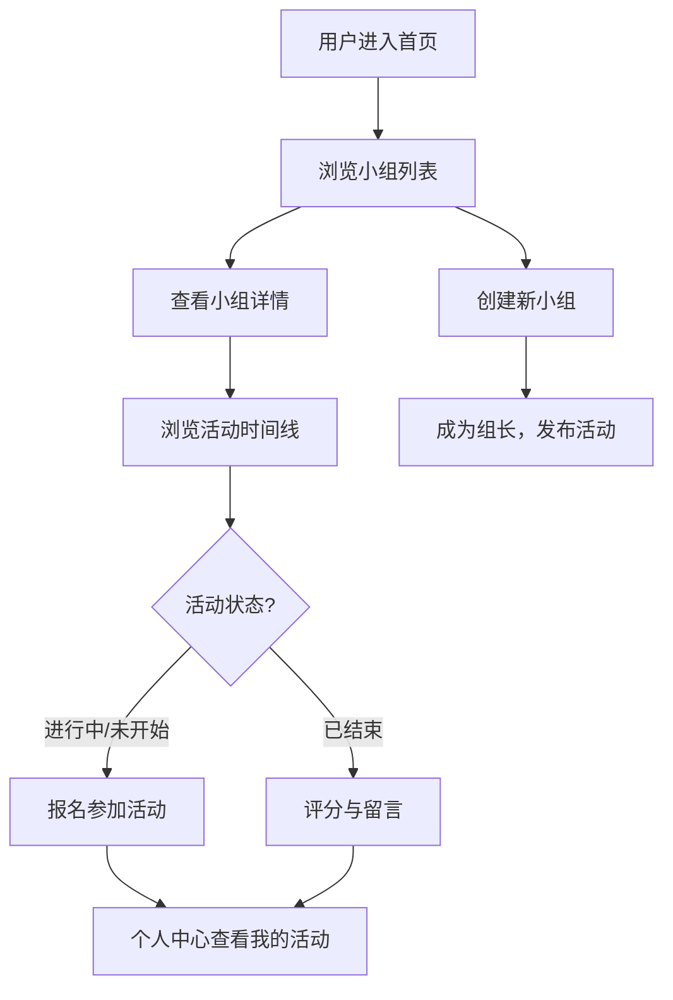

## 1. 产品概述
社区兴趣小组活动管理平台，用于线上兴趣小组的创建、活动组织、成员报名及活动后反馈评分。
- 主要目标：为社区提供统一的兴趣小组活动管理与展示平台，解决活动信息分散、报名统计繁琐、反馈收集困难的问题
- 目标用户：社区组织者、兴趣小组组长、普通组员

## 2. 核心功能

### 2.1 用户角色
| 角色 | 描述 | 核心权限 |
|------|------|----------|
| 组长 | 创建小组的用户 | 创建/编辑/解散小组、发布活动、查看报名情况 |
| 组员 | 注册用户 | 浏览小组、报名/取消活动、评分留言、查看个人中心 |

### 2.2 功能模块
1. **小组管理模块**：小组列表、小组详情、创建小组、编辑小组、解散小组
2. **活动管理模块**：活动发布、活动报名、活动取消、活动评分留言
3. **个人中心模块**：我的小组、我的活动、我的评分
4. **导航模块**：顶部导航、侧边栏、移动端底部Tab栏

### 2.3 页面详情
| 页面名称 | 模块名称 | 功能描述 |
|----------|----------|----------|
| 小组列表页 | 小组卡片列表 | 展示所有兴趣小组卡片，支持筛选、创建小组入口 |
| 小组详情页 | 小组信息、活动时间线 | 展示小组详情、活动列表（分页加载）、发布活动入口 |
| 活动详情页 | 活动信息、报名情况、评分留言区 | 展示活动详情、报名按钮、评分星级、留言列表 |
| 个人中心页 | 我的小组、我的活动、我的评分 | 展示用户创建的小组、参加的活动、历史评分记录 |

## 3. 核心流程
用户浏览小组列表 → 选择感兴趣的小组 → 查看小组活动时间线 → 报名参加活动 → 活动结束后评分留言 → 个人中心查看历史记录

## 4. 用户界面设计
### 4.1 设计风格
- 主色调：暖橙色(#FF7F50)，配合灰白背景
- 卡片式布局，卡片带轻微阴影，悬停上浮动画（transform: translateY(-4px) + box-shadow加深）
- 按钮点击时涟漪反馈动画
- 评分展示五角星图标，已点亮星星使用黄色渐变填充
- 活动列表按时间线排列，已结束活动降低透明度和饱和度

### 4.2 页面设计概览
| 页面名称 | 模块名称 | UI元素 |
|----------|----------|--------|
| 小组列表页 | 小组卡片 | 封面图、小组名称、简介标签、成员数、悬停上浮动画 |
| 小组详情页 | 活动时间线 | 时间线垂直线、活动节点、活动卡片、状态标签 |
| 活动详情页 | 评分组件 | 五角星图标、黄色渐变填充、点击选择、留言输入框 |
| 个人中心页 | Tab切换 | 我的小组/我的活动/我的评分三个Tab切换 |

### 4.3 响应式设计
- 桌面端：多列卡片网格布局 + 侧边导航栏
- 平板端：两列卡片布局
- 移动端（<768px）：单列布局，侧边导航折叠为底部Tab栏

## 5. 性能约束
- 活动列表分页加载，每次请求20条
- 页面滚动到底部自动触发加载下一页（无限滚动）
- 避免一次性渲染大量DOM节点
