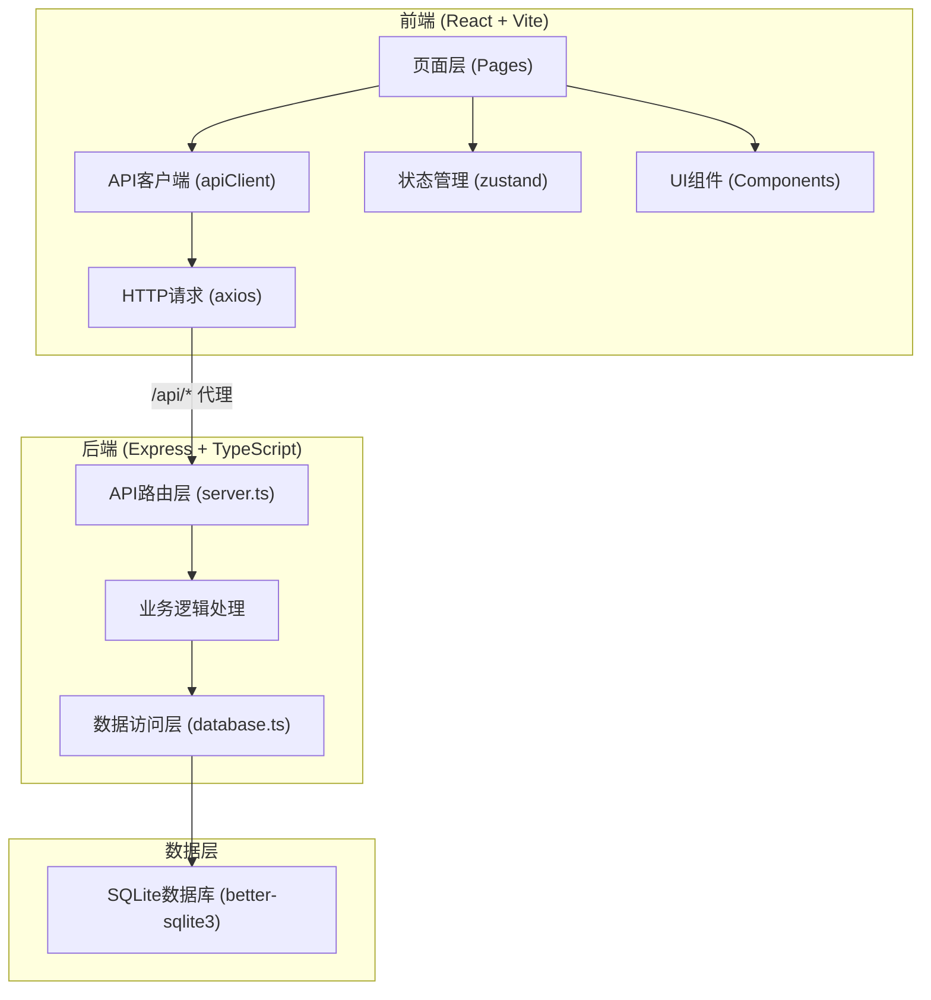
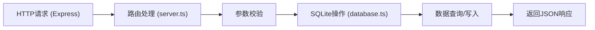
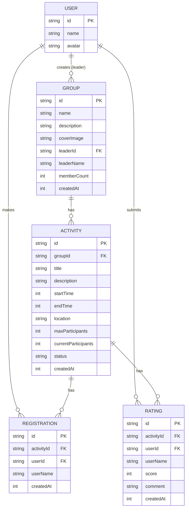

## 1. 架构设计



## 2. 技术选型
- **前端框架**：React@18 + TypeScript
- **构建工具**：Vite
- **路由管理**：react-router-dom
- **HTTP客户端**：axios
- **状态管理**：zustand
- **UI样式**：tailwindcss@3
- **图标库**：lucide-react
- **后端框架**：Express@4 + TypeScript
- **数据库**：SQLite (better-sqlite3)
- **ID生成**：uuid
- **跨域处理**：cors

## 3. 路由定义
| 路由路径 | 页面组件 | 用途 |
|----------|----------|------|
| / | GroupPage | 小组列表首页 |
| /groups/:groupId | GroupPage | 小组详情页 |
| /activities/:activityId | ActivityPage | 活动详情页 |
| /profile | ProfilePage | 个人中心页 |

## 4. API 定义

### 4.1 类型定义
```typescript
// 小组
interface Group {
  id: string;
  name: string;
  description: string;
  coverImage: string;
  leaderId: string;
  leaderName: string;
  memberCount: number;
  createdAt: number;
}

// 活动
interface Activity {
  id: string;
  groupId: string;
  title: string;
  description: string;
  startTime: number;
  endTime: number;
  location: string;
  maxParticipants: number;
  currentParticipants: number;
  status: 'upcoming' | 'ongoing' | 'ended';
  createdAt: number;
}

// 报名
interface Registration {
  id: string;
  activityId: string;
  userId: string;
  userName: string;
  createdAt: number;
}

// 评分
interface Rating {
  id: string;
  activityId: string;
  userId: string;
  userName: string;
  score: number; // 1-5
  comment: string;
  createdAt: number;
}

// 用户
interface User {
  id: string;
  name: string;
  avatar: string;
}
```

### 4.2 端点定义
| Method | Endpoint | 描述 |
|--------|----------|------|
| GET | /api/groups | 获取小组列表（分页） |
| GET | /api/groups/:id | 获取小组详情 |
| POST | /api/groups | 创建小组 |
| PUT | /api/groups/:id | 更新小组信息 |
| DELETE | /api/groups/:id | 解散小组 |
| GET | /api/groups/:groupId/activities | 获取小组活动列表（分页） |
| POST | /api/groups/:groupId/activities | 发布活动 |
| GET | /api/activities/:id | 获取活动详情 |
| POST | /api/activities/:id/register | 报名活动 |
| DELETE | /api/activities/:id/register | 取消报名 |
| GET | /api/activities/:id/ratings | 获取活动评分列表 |
| POST | /api/activities/:id/ratings | 提交评分与留言 |
| GET | /api/users/:id/groups | 获取用户创建的小组 |
| GET | /api/users/:id/activities | 获取用户参加的活动 |
| GET | /api/users/:id/ratings | 获取用户的评分记录 |

## 5. 服务端架构



## 6. 数据模型

### 6.1 ER 图



### 6.2 建表语句

```sql
-- 用户表
CREATE TABLE IF NOT EXISTS users (
  id TEXT PRIMARY KEY,
  name TEXT NOT NULL,
  avatar TEXT
);

-- 小组表
CREATE TABLE IF NOT EXISTS groups (
  id TEXT PRIMARY KEY,
  name TEXT NOT NULL,
  description TEXT NOT NULL,
  cover_image TEXT NOT NULL,
  leader_id TEXT NOT NULL,
  leader_name TEXT NOT NULL,
  member_count INTEGER NOT NULL DEFAULT 1,
  created_at INTEGER NOT NULL,
  FOREIGN KEY (leader_id) REFERENCES users(id)
);

-- 活动表
CREATE TABLE IF NOT EXISTS activities (
  id TEXT PRIMARY KEY,
  group_id TEXT NOT NULL,
  title TEXT NOT NULL,
  description TEXT,
  start_time INTEGER NOT NULL,
  end_time INTEGER NOT NULL,
  location TEXT NOT NULL,
  max_participants INTEGER NOT NULL,
  current_participants INTEGER NOT NULL DEFAULT 0,
  status TEXT NOT NULL DEFAULT 'upcoming',
  created_at INTEGER NOT NULL,
  FOREIGN KEY (group_id) REFERENCES groups(id)
);

-- 报名表
CREATE TABLE IF NOT EXISTS registrations (
  id TEXT PRIMARY KEY,
  activity_id TEXT NOT NULL,
  user_id TEXT NOT NULL,
  user_name TEXT NOT NULL,
  created_at INTEGER NOT NULL,
  UNIQUE(activity_id, user_id),
  FOREIGN KEY (activity_id) REFERENCES activities(id),
  FOREIGN KEY (user_id) REFERENCES users(id)
);

-- 评分表
CREATE TABLE IF NOT EXISTS ratings (
  id TEXT PRIMARY KEY,
  activity_id TEXT NOT NULL,
  user_id TEXT NOT NULL,
  user_name TEXT NOT NULL,
  score INTEGER NOT NULL CHECK(score BETWEEN 1 AND 5),
  comment TEXT,
  created_at INTEGER NOT NULL,
  UNIQUE(activity_id, user_id),
  FOREIGN KEY (activity_id) REFERENCES activities(id),
  FOREIGN KEY (user_id) REFERENCES users(id)
);
```

## 7. 项目文件结构

```
auto10/
├── package.json
├── vite.config.ts
├── tsconfig.json
├── index.html
└── src/
    ├── frontend/
    │   ├── App.tsx
    │   ├── main.tsx
    │   ├── index.css
    │   ├── pages/
    │   │   ├── GroupPage.tsx
    │   │   ├── ActivityPage.tsx
    │   │   └── ProfilePage.tsx
    │   ├── components/
    │   │   ├── GroupCard.tsx
    │   │   ├── ActivityCard.tsx
    │   │   ├── RatingStars.tsx
    │   │   ├── Navbar.tsx
    │   │   ├── Sidebar.tsx
    │   │   ├── BottomTabs.tsx
    │   │   └── Modal.tsx
    │   ├── utils/
    │   │   ├── apiClient.ts
    │   │   └── format.ts
    │   └── store/
    │       └── useUserStore.ts
    └── backend/
        ├── server.ts
        └── database.ts
```
