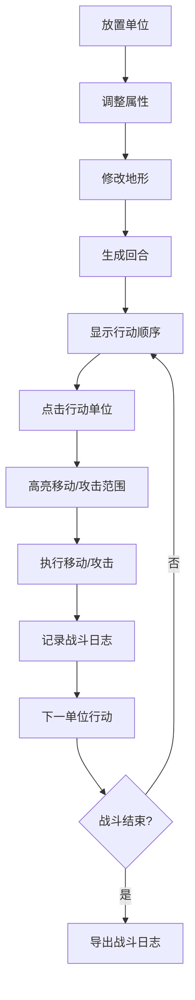

## 1. 产品概述

回合制战棋战斗系统原型工具，帮助独立游戏设计师在浏览器中快速迭代并试玩战术RPG战斗系统，解决纸面推演难以直观感受角色行动顺序、技能范围和地形影响的问题。

- 核心用户：独立游戏设计师、战棋游戏爱好者
- 核心价值：将抽象的战斗平衡数据转化为可视化的可交互原型
- 目标：降低战棋战斗系统的设计验证成本，提升迭代效率

## 2. 核心功能

### 2.1 用户角色
| 角色 | 注册方式 | 核心权限 |
|------|----------|----------|
| 设计师 | 无需注册，直接使用 | 放置单位、调整属性、修改地形、模拟战斗 |

### 2.2 功能模块
1. **战场网格系统**：8x8六边形网格，支持三种地形类型
2. **单位管理系统**：三种职业单位的放置、选择、属性调整
3. **战斗回合系统**：自动计算行动顺序、移动范围、攻击伤害
4. **属性编辑器**：力量、敏捷、智力三维属性滑块调节
5. **战斗日志系统**：实时记录战斗事件，支持导出

### 2.3 页面详情
| 页面名称 | 模块名称 | 功能描述 |
|---------|---------|---------|
| 主界面 | 战场区域 | 3D六边形网格渲染、单位拖拽放置、移动攻击交互 |
| 主界面 | 左侧工具栏 | 单位属性编辑滑块、地形修改入口 |
| 主界面 | 右侧信息面板 | 行动顺序列表、当前回合状态 |
| 主界面 | 底部战斗日志 | 战斗事件记录、清空、导出TXT |

## 3. 核心流程

设计师在左侧工具栏选择单位职业，拖拽到战场网格上放置 → 右键点击格子修改地形 → 通过滑块调整单位属性 → 系统自动计算行动顺序并在右侧面板显示 → 点击当前行动单位 → 高亮可移动范围和可攻击目标 → 点击目标格子执行移动/攻击 → 战斗日志记录事件 → 循环直到战斗结束

## 4. 用户界面设计

### 4.1 设计风格
- **主色调**：深邃暗紫灰 #2d1b3d（背景主色）、深灰蓝 #1a2332（面板底色）
- **强调色**：亮绿 #a0e7a8（交互高亮）、淡金 #f5d782（行动高亮）
- **职业色**：战士红、法师蓝、弓箭手绿
- **地形色**：草地绿、岩石灰、沼泽深绿
- **字体**：现代无衬线字体，清晰易读
- **布局**：三栏式布局，中间战场、左右侧边栏
- **动效**：面板滑入、单位弹入落地震动、伤害飘字、粒子爆炸

### 4.2 页面设计概览
| 页面名称 | 模块名称 | UI元素 |
|---------|---------|-------|
| 主界面 | 战场区域 | 3D六边形网格、圆形单位图标、生命值条、行动顺序标识、移动高亮、攻击闪烁 |
| 主界面 | 左侧工具栏 | 毛玻璃卡片、属性滑块（力量/敏捷/智力）、职业图标、单位选中状态 |
| 主界面 | 右侧信息面板 | 磨砂深色背景、竖排行动顺序列表、头像高亮跳动、回合信息 |
| 主界面 | 战斗日志 | 圆角长条面板、半透明深色、条目淡入动画、清空/导出按钮 |

### 4.3 响应式
- 桌面端（1366px+）：三栏布局，左右面板固定280px，网格居中
- 平板端（1024-1366px）：面板宽度自适应收缩
- 移动端（1024px以下）：左右面板折叠为抽屉，可从底部/顶部滑出

### 4.4 3D场景指引
- **环境**：深色背景，营造策略游戏氛围
- **光照**：柔和环境光 + 方向光，突出六边形网格立体感
- **相机**：固定斜视角，可轻微旋转缩放
- **交互**：点击、拖拽、悬停反馈
- **动效**：单位弹入、移动滑动、攻击抖动、死亡粒子爆炸
- **性能**：网格拖动和滑块响应 < 50ms，回合结算动画 ≤ 3秒
