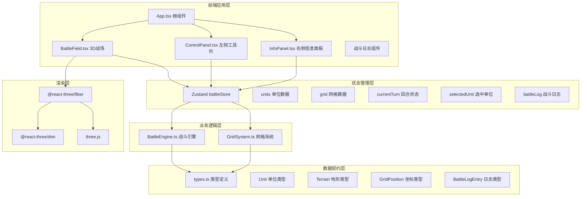

## 1. 架构设计



## 2. 技术说明

- **前端框架**：React 18 + TypeScript
- **构建工具**：Vite 5
- **3D渲染**：three.js + @react-three/fiber + @react-three/drei
- **状态管理**：Zustand
- **UI组件**：Ant Design（按钮、滑动条）
- **图标**：@ant-design/icons
- **唯一ID**：uuid

## 3. 项目结构

```
src/
├── modules/
│   ├── battle/
│   │   ├── types.ts          # 战斗相关类型定义
│   │   └── BattleEngine.ts   # 战斗逻辑引擎
│   ├── grid/
│   │   └── GridSystem.ts     # 网格与地形系统
│   └── ui/
│       └── components/
│           ├── BattleField.tsx   # 3D战场组件
│           ├── ControlPanel.tsx  # 左侧工具栏
│           └── InfoPanel.tsx     # 右侧信息面板
├── store/
│   └── battleStore.ts        # Zustand 全局状态
├── App.tsx                   # 根组件
└── main.tsx                  # 入口文件
```

## 4. 数据模型

### 4.1 核心类型定义

```typescript
// 网格坐标（轴向坐标系）
interface GridPosition {
  q: number;
  r: number;
}

// 地形类型
type TerrainType = 'grass' | 'rock' | 'swamp';

interface Terrain {
  type: TerrainType;
  defenseBonus: number;
  moveCostMultiplier: number;
}

// 职业类型
type UnitClass = 'warrior' | 'mage' | 'archer';

// 单位属性
interface UnitStats {
  strength: number;   // 力量 1-10
  agility: number;    // 敏捷 1-10
  intelligence: number; // 智力 1-10
}

// 战斗单位
interface Unit {
  id: string;
  name: string;
  unitClass: UnitClass;
  position: GridPosition;
  stats: UnitStats;
  maxHp: number;
  currentHp: number;
  moveRange: number;
  attackRange: number;
  isPlayer: boolean;
}

// 战斗日志条目
interface BattleLogEntry {
  id: string;
  timestamp: number;
  message: string;
  type: 'move' | 'attack' | 'damage' | 'death' | 'info';
}

// 回合状态
interface TurnState {
  currentUnitIndex: number;
  turnOrder: string[]; // unit ids
  phase: 'idle' | 'selecting' | 'moving' | 'attacking' | 'ended';
}
```

### 4.2 网格数据结构

8x8 六边形网格使用轴向坐标系 (q, r)，范围：
- q: 0 到 7
- r: 0 到 7

地形数据存储为 Map 或二维数组。

## 5. 核心算法

### 5.1 六边形网格坐标系统
使用轴向坐标系 (axial coordinates)，支持：
- 邻居格子计算
- 距离计算
- 范围内格子查找（BFS算法）

### 5.2 行动顺序计算
按敏捷值从高到低排序，相同敏捷值随机决定先后。

### 5.3 移动范围计算
基于BFS算法，考虑地形移动消耗，计算单位可到达的所有格子。

### 5.4 伤害计算公式
```
基础伤害 = 攻击力 + 力量加成
最终伤害 = 基础伤害 - 防御力 - 地形防御加成
```

### 5.5 路径寻路
A* 算法，考虑地形移动消耗作为权重。

## 6. 性能优化

- 六边形网格使用 InstancedMesh 批量渲染
- 状态更新使用 Zustand selector 避免不必要重渲染
- 动画使用 requestAnimationFrame 或 Three.js 内置动画
- 战斗日志虚拟滚动（条目较多时）
