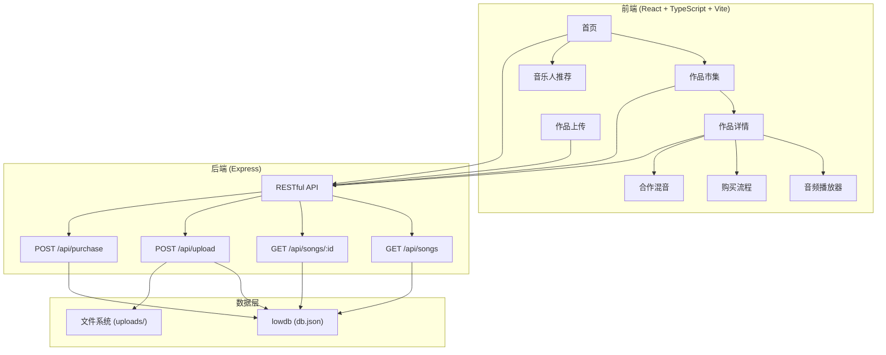
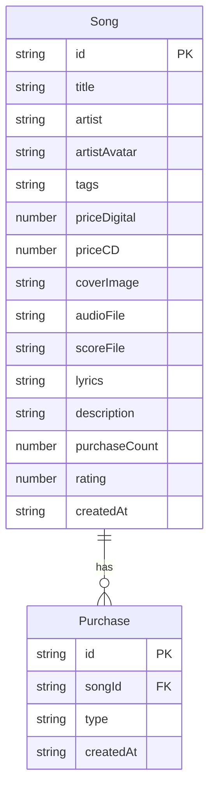

## 1. 架构设计



## 2. 技术说明
- 前端：React@18 + TypeScript + Vite + Tailwind CSS + Zustand
- 初始化工具：vite-init (react-express-ts 模板)
- 后端：Express@4 + multer + sharp + cors + uuid
- 数据库：lowdb (JSON文件存储，db.json)
- 文件处理：multer（上传处理）、sharp（图片处理）
- 音频处理：Web Audio API（混音控制台）

## 3. 路由定义
| 路由 | 用途 |
|------|------|
| / | 首页，展示最新作品、热门排行、音乐人推荐 |
| /marketplace | 作品市集，网格展示所有可购买作品 |
| /song/:id | 作品详情页，播放器、歌词、乐谱、购买、合作 |
| /upload | 作品上传页，表单上传音频+乐谱+歌词 |

## 4. API定义

### 4.1 GET /api/songs
获取所有歌曲列表

```typescript
interface Song {
  id: string;
  title: string;
  artist: string;
  artistAvatar: string;
  tags: string[];
  priceDigital: number;
  priceCD: number;
  coverImage: string;
  audioFile: string;
  scoreFile: string;
  lyrics: string;
  description: string;
  purchaseCount: number;
  rating: number;
  createdAt: string;
}

interface GetSongsResponse {
  songs: Song[];
}
```

### 4.2 GET /api/songs/:id
获取单个歌曲详情

```typescript
interface GetSongDetailResponse {
  song: Song;
}
```

### 4.3 POST /api/upload
上传新作品（multipart/form-data）

```typescript
interface UploadRequest {
  title: string;
  artist: string;
  tags: string;
  priceDigital: string;
  priceCD: string;
  description: string;
  lyrics: string;
  audio: File;
  score: File;
  cover?: File;
}

interface UploadResponse {
  success: boolean;
  song: Song;
}
```

### 4.4 POST /api/purchase
购买作品

```typescript
interface PurchaseRequest {
  songId: string;
  type: 'digital' | 'cd';
}

interface PurchaseResponse {
  success: boolean;
  downloadUrl?: string;
  message: string;
}
```

## 5. 服务器架构

```mermaid
flowchart LR
    "Client Request" --> "Express Router"
    "Express Router" --> "CORS Middleware"
    "CORS Middleware" --> "Multer Middleware"
    "Multer Middleware" --> "Controller"
    "Controller" --> "lowdb Service"
    "lowdb Service" --> "db.json"
    "Controller" --> "File System"
    "File System" --> "uploads/"
```

## 6. 数据模型

### 6.1 数据模型定义



### 6.2 数据定义
- db.json 初始化包含 songs 数组和 purchases 数组
- songs 预填充3-5条示例数据，包含完整的音频/乐谱/封面路径
- uploads/ 目录存储音频、乐谱和封面文件
