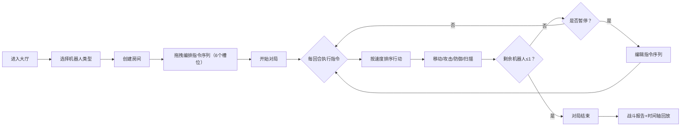

## 1. 产品概述
赛博朋克风格的编程机器人竞技场Web应用，让玩家通过可视化拖拽指令控制机器人进行回合制策略对战，无需掌握实际编程即可体验战术编排的乐趣。

- 主要目的：降低机器人编程竞技的门槛，通过直观的指令序列编排和流畅的战斗动画，为玩家提供兼具策略深度和视觉冲击力的竞技体验
- 目标用户：对编程竞技感兴趣但缺乏编程经验的玩家、策略游戏爱好者、赛博朋克风格审美受众
- 市场价值：填补可视化编程竞技类Web游戏的空白，具有教育意义与娱乐价值的双重属性

## 2. 核心功能

### 2.1 用户角色
| 角色 | 注册方式 | 核心权限 |
|------|----------|----------|
| 玩家 | 无需注册，直接进入 | 选择机器人类型、编辑指令序列、参与对战、查看战斗回放 |

### 2.2 功能模块
1. **对战大厅页面**：机器人类型选择卡片、房间创建入口、功能说明
2. **对战主界面**：8x8网格竞技场、指令编辑器、顶部状态栏、暂停/回放控制
3. **战斗回放系统**：时间轴拖动、分步回放、文字气泡显示行动指令

### 2.3 页面详情
| 页面名称 | 模块名称 | 功能描述 |
|-----------|-------------|---------------------|
| 对战大厅 | 机器人选择卡片 | 3种机器人（侦察/攻击/坦克）立绘展示，属性条可视化，扫光动画+粒子特效，点击选中状态 |
| 对战大厅 | 房间创建 | 创建房间按钮，进入对战主界面 |
| 对战大厅 | 游戏说明 | 指令类型介绍、基础玩法说明 |
| 对战主界面 | 竞技场渲染 | 8x8深空网格背景（青色发光线）、障碍物（金属箱/能量补给）、机器人精灵、能量弹、轨迹线、血条、文字气泡 |
| 对战主界面 | 指令编辑器 | 左侧7种指令库（前进/后退/左转/右转/攻击/防御/扫描），右侧6个序列槽位，拖拽放置、删除、重排序 |
| 对战主界面 | 顶部状态栏 | 当前回合数、剩余机器人数量、倒计时显示 |
| 对战主界面 | 暂停控制 | 暂停按钮点击后场景变灰+旋转暂停图标，可编辑指令序列，变更下一回合生效 |
| 战斗回放 | 时间轴控制 | 可拖动时间轴查看每回合状态，响应延迟<200ms |
| 战斗回放 | 分步回放 | 逐回合展示机器人位置、状态变化，头顶显示行动指令气泡 |
| 战斗回放 | 战斗报告 | 胜负判定、各机器人伤害统计、存活回合数 |

## 3. 核心流程
玩家进入大厅 → 选择机器人类型（侦察/攻击/坦克）→ 创建房间进入对战界面 → 从指令库拖拽指令到6个序列槽位 → 点击开始对局 → 每回合所有机器人按速度排序同时执行指令 → 可随时暂停编辑指令（下一回合生效）→ 当只剩1个机器人时对局结束 → 展示战斗报告，可通过时间轴回放对局全过程

## 4. 用户界面设计

### 4.1 设计风格
- **主色调**：霓虹青（#00FFFF）、暗紫（#8B00FF）、深空灰蓝（#0A0E27 → #1A1033 渐变背景）
- **辅助色**：猩红（#FF0033 攻击）、翡翠绿（#00FF88 补给）、金黄（#FFD700 血条）
- **按钮风格**：锐利倒角（无圆角），悬停边缘霓虹青发光，点击下陷缩放+电音音效模拟
- **字体**：标题使用 Orbitron（赛博朋克字体），正文使用 Rajdhani（锐利无衬线），通过 Google Fonts CDN 引入
- **布局风格**：顶部状态栏 + 中央竞技场（主视觉区）+ 底部可折叠指令编辑器 + 右侧悬浮战斗面板
- **视觉特效**：背景动态脉动网格线、卡片扫光动画、粒子爆发、半透明轨迹残影、阶梯式血条缩减动画

### 4.2 页面设计概览
| 页面名称 | 模块名称 | UI 元素 |
|-----------|-------------|-----------|
| 对战大厅 | 顶部标题栏 | 霓虹青渐变Logo、脉动网格背景、锐利倒角分割线 |
| 对战大厅 | 机器人卡片区 | 3张等宽卡片水平排列，每张含立绘（扫光+粒子）、名称标签、三属性渐变条（生命/速度/攻击） |
| 对战大厅 | 指令说明区 | 7种指令图标+文字说明的网格布局，深色半透明卡片背景 |
| 对战大厅 | 创建房间按钮 | 大号霓虹青发光按钮，悬停时边框流光动画 |
| 对战主界面 | 竞技场 | 正方形8x8网格，深空背景+青色发光线条，机器人带方向指示 |
| 对战主界面 | 指令编辑器 | 深色半透明面板，左侧指令库（竖排7块），右侧序列槽位（横排6格），拖拽时残影跟随 |
| 对战主界面 | 顶部状态栏 | 深色横幅，回合数（霓虹青高亮）、存活数、倒计时（最后3秒红色闪烁） |
| 对战主界面 | 暂停层 | 半透明灰蒙层+旋转发光暂停图标（双竖线） |
| 回放界面 | 时间轴 | 底部长条，可拖动滑块，回合节点标记，当前回合高亮 |
| 回放界面 | 报告面板 | 胜负结果、伤害统计、各机器人数据柱状图 |

### 4.3 响应式设计
- **设计策略**：桌面优先（1280px+），平板适配（768px-1279px）
- **桌面端**：三栏布局，指令编辑器底部展开，状态信息常驻
- **平板端**：指令编辑器折叠为底部抽屉，点击展开，竞技场占主视觉区
- **触控优化**：指令块拖拽区域增大（触控热区），拖拽支持长按触发，按钮最小触控尺寸 44px
- **断点**：1024px（指令编辑器布局切换）、768px（抽屉模式切换）

### 4.4 动画与性能
- **帧率目标**：战斗动画 ≥ 30FPS，使用 CSS transform/opacity 硬件加速
- **时间轴响应**：回放拖动延迟 < 200ms，采用状态快照预缓存策略
- **粒子特效**：爆炸/扫光粒子限制最大数量（≤50），超出后自动回收复用
- **轨迹淡出**：CSS transition 控制透明度，2回合后自动移除DOM节点
